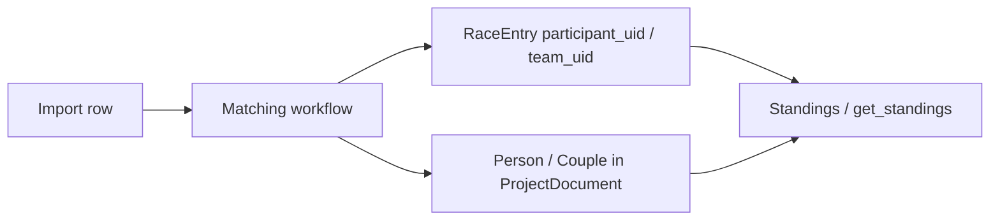

# Canonical participant identity correction (backend-first)

## Current behavior (relevant code)

- **Canonical identity** lives on [`Person`](backend/domain/models.py) (`name`, `yob`, `club`, plus `canonical_given`, `canonical_family`, `club_normalized`) and on [`Couple.member_a` / `member_b`](backend/domain/models.py) for Paarlauf.
- **Standings and GUI tables** resolve labels via [`display_name_for_row`](frontend/... not needed for backend plan) / [`backend/ui_api/mappers.py`](backend/ui_api/mappers.py) — they read **only** `Person`/`Couple`, not raw import rows.
- **Per-import row text** is preserved for explainability on [`RaceEntryMatchMeta`](backend/domain/models.py) (`incoming_*`), but changing display “ground truth” requires mutating the **`Person`** (or team member) row, not the `RaceEntry`.
- **[`apply_match_decision`](backend/ui_api/commands.py)** links entries to UIDs and records `field_resolutions`, but **does not** apply those resolutions to `Person` (grep shows `field_resolutions` only in persistence, not in matching or display).

## What the backend needs

### 1. Core mutation primitive

- **New service function** (e.g. `update_canonical_participant` / `patch_person_identity`) in [`backend/ui_api/commands.py`](backend/ui_api/commands.py) (or a small `backend/domain/identity.py` helper if you prefer separation):
  - Input: `participant_uid` (singles) **or** `team_uid` + `member` (`a` | `b`) for Paarlauf.
  - Allowed fields: `name`, `yob`, `club` (and optionally `gender` only if policy allows; otherwise **immutable**).
  - After edits, **recompute** derived fields using existing helpers from [`backend/matching/normalize.py`](backend/matching/normalize.py) (`parse_person_name`, `normalize_club`) so [`person_parsed`](backend/matching/score.py) and future matching stay consistent.
  - Replace the `Person` in `document.people` (or the member inside `document.couples`) via `dataclasses.replace`, preserving `uid`.
  - Call [`recompute_project_standings`](backend/ranking/engine.py) after mutation (scores are UID-based; **points/distance** should be unchanged; snapshot is refreshed for consistency).

### 2. Validation and invariants

- **Existence**: target UID must exist.
- **YOB**: keep existing validation style (positive int, reasonable range if you already have rules elsewhere).
- **Gender**: recommend **reject changes** unless you have a clear product rule (wrong gender would break category assumptions).
- **Empty name**: reject.

### 3. Matching / import implications (document clearly)

- **Fingerprints** ([`identity_fingerprint`](backend/matching/decisions.py)) are computed from **incoming Excel rows**, not from `Person` — so correcting a typo in `Person` only does **not** invalidate existing `row_fingerprint` / replay keys for unchanged files.
- **Similarity on next import** ([`score_person_match`](backend/matching/score.py)): the scorer compares **incoming** parsed name/YOB/club to the **canonical `Person`**. If the Excel still contains the old typo but `Person` was corrected to the true spelling, **scores may drop** (more review) or, in edge cases, linking behavior may change. The feature plan should state this tradeoff and mitigations (e.g. fix source Excel + reimport, or accept more manual review).
- **YOB**: if `Person.yob` is corrected but the file still has the wrong year, **YOB mismatch penalty** applies until the source is fixed.

### 4. Audit trail and timeline (important gap)

[`get_audit_timeline`](backend/ui_api/queries.py) only includes `matching_decisions` when it can resolve `decision.race_event_uid` to an event in the filtered year. Decisions with a **missing or unknown** `race_event_uid` are **dropped** when `series_year` is set. So a naive “identity-only” `MatchingDecision` with an empty `race_event_uid` would **not appear** in the year timeline.

Pick one approach (recommend **A** or **B**):

| Approach | Idea |
|----------|------|
| **A** | Extend [`MatchingDecision`](backend/domain/models.py) with optional `scope_series_year: int \| None` (or similar). Timeline: if `related_event` is None but `scope_series_year` matches filter, **include** the row. |
| **B** | New small audit type on [`ProjectDocument`](backend/domain/models.py), e.g. `identity_corrections: tuple[IdentityCorrectionAudit, ...]`, with `series_year`, `target_participant_uid`, before/after snapshots, `decided_at`. Timeline reads this list separately. Requires migration in [`backend/storage/schema_v2.py`](backend/storage/schema_v2.py). |
| **C** | Reuse `race_event_uid` from an arbitrary “anchor” event (fragile; not recommended). |

Also adjust [`get_project_state_filtered`](backend/ui_api/queries.py) if you want `matching_decisions` counts to include identity-only audits (currently tied to `race_event_uid` + event year).

### 5. UI API surface

- New method in [`backend/ui_api/service.py`](backend/ui_api/service.py) `_dispatch` handler map, e.g. `update_participant_identity` or `patch_canonical_identity`.
- Document in [`docs/api/ui-api-v1.md`](docs/api/ui-api-v1.md): payload shape, return value (`updated` fields, `decision_uid` if audit appended), error codes.
- **Tests**: extend existing API tests pattern under [`tests/`](tests/) (mirror `apply_match_decision` tests) for: happy path, unknown UID, invalid payload, standings unchanged numerically, derived fields updated, timeline visibility (per chosen audit approach).

### 6. Schema / migration

- If **only** extending `MatchingDecision` with a new `kind` (e.g. `"identity_correction"`) + optional `scope_series_year`: bump serialization in [`schema_v2.py`](backend/storage/schema_v2.py). Backward-compatible reads: default missing fields to `None` / old behavior.
- If **B** (new tuple on `ProjectDocument`): add migration path for older JSON files (empty tuple default).

### 7. Optional CLI (out of scope for GUI but useful for M5)

- Thin wrapper in `main.py` or `scripts/` to patch identity for support scripts — only if you want parity with other tooling; not required for the core feature.

## Feature plan document (deliverable)

Create a new file under [`docs/features/`](docs/features/) (e.g. `F09-canonical-identity-correction.md` — number TBD to avoid conflicts) using [`docs/features/FEATURE_TEMPLATE.md`](docs/features/FEATURE_TEMPLATE.md), covering:

- **Problem**: typo in first import pollutes canonical `Person`; user wants to correct display/truth without deleting the season.
- **Maps to**: R3 (consistent identity), R4/R6 (explainability and human correction), M5 hardening; aligns with F07 name/YOB alignment when comparing to Gesamtwertung.
- **Scope**: backend mutation + audit + API + tests; **Frontend** (German UX for edit form) as a separate phase or same milestone — your call in the doc.
- **Acceptance criteria**: editable canonical fields; audit visible in timeline; standings numbers unchanged; reimport behavior documented.
- **Risks**: matching score drift vs corrected canonical row; timeline filtering bug if audit not scoped by year.
- **Test plan**: unit tests for normalization after patch; API integration tests; optional regression: import fixture twice with typo vs corrected canonical.

## Out of scope (unless you explicitly want it)

- Splitting “display name” vs “matching profile” — large model change; default is **single canonical `Person`**.
- Auto-propagating edits into Excel source files.
- Bulk rename across merged duplicates without explicit UID (would need merge/split tooling).
