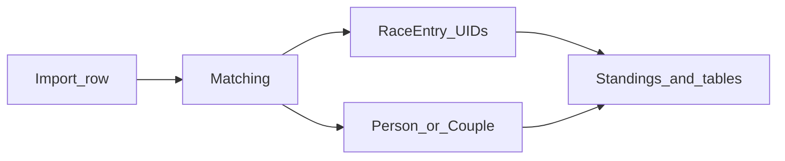

# Canonical participant identity correction (backend + feature doc)

## Product goal

- Users walk the **current standings** (or equivalent entity list), spot wrong **name / club / YOB** on a merged identity, and correct canonical fields without re-importing the season. No production datasets require **reading old project files** with a previous schema shape; **backward compatibility for older JSON** is explicitly **not** a constraint—serialize the new fields directly and keep the implementation simple.

## Requirements mapping

- **R3** (consistent identity across races), **R4/R6** (human correction + explainability), **M5** hardening; aligns with **F07** when comparing corrected names to organizer totals.

## Ground truth today

- **`Person`** ([`backend/domain/models.py`](backend/domain/models.py)) holds `name`, `yob`, `club`, `gender`, and derived `canonical_given`, `canonical_family`, `club_normalized`.
- **Standings/UI** resolve labels from `Person` / `Couple` via mappers ([`backend/ui_api/mappers.py`](backend/ui_api/mappers.py)), not from raw import rows.
- **`RaceEntryMatchMeta`** preserves per-import `incoming_*` for explainability; fixing display “truth” means editing the **`Person`** (or embedded `Couple` member), not the `RaceEntry` row text.
- **`apply_match_decision`** ([`backend/ui_api/commands.py`](backend/ui_api/commands.py)) links entries and stores `field_resolutions` on `MatchingDecision` only; it does **not** apply those resolutions to `Person` (confirmed by usage of `field_resolutions` in persistence only).

## 1. Core mutation (commands layer)

Add a function in [`backend/ui_api/commands.py`](backend/ui_api/commands.py) (or a small [`backend/domain/identity.py`](backend/domain/identity.py) helper called from commands) e.g. `update_participant_identity`:

- **Targets**
  - Singles: `participant_uid` → find in `document.people`, `replace` that `Person` with same `uid`.
  - Paarlauf: `team_uid` + `member` (`"a"` | `"b"`) → find `Couple`, `replace` the couple with updated `member_a` or `member_b` via `dataclasses.replace`, preserving UIDs on both members and the team.
- **Editable fields**: `name`, `yob`, `club` (strings/ints as today). **Gender**: keep **immutable** unless you add an explicit product rule (wrong gender breaks category logic).
- **Recompute derived fields** using the same pipeline as import matching ([`backend/matching/workflow.py`](backend/matching/workflow.py)): `parse_person_name` + `normalize_club` from [`backend/matching/normalize.py`](backend/matching/normalize.py), assigning `canonical_given`, `canonical_family`, `club_normalized` (see existing `Person(...)` construction in workflow ~lines 162–169).
- **Validation**: non-empty trimmed `name`; `yob` positive integer in a reasonable range (define once—e.g. 1900–current_year+1—since ingestion is permissive).
- **After mutation**: call [`recompute_project_standings`](backend/ranking/engine.py) like other mutating commands. UID-keyed results should keep **numeric** points/distance; snapshot refresh is for consistency.

## 2. Audit trail and year-scoped timeline (important)

[`get_audit_timeline`](backend/ui_api/queries.py) (lines 433–436) currently **drops** a `MatchingDecision` when `series_year` is set and `race_event_uid` does not resolve to an event in that year (`related_event is None` → excluded). Identity-only edits have no natural `race_event_uid`.

**Recommended approach (A): extend `MatchingDecision`** in [`backend/domain/models.py`](backend/domain/models.py):

- Add optional `scope_series_year: int | None = None` (name can be tuned).
- Add `kind` literal value `"identity_correction"` (extend the `kind` union).
- For identity corrections, allow **empty** `race_event_uid` / `entry_uid` when `scope_series_year` is set (command must require `series_year` in the API payload and store it on the decision).

**Query changes** in [`backend/ui_api/queries.py`](backend/ui_api/queries.py):

- **`get_audit_timeline`**: include a decision when the year filter matches **either** (existing) resolved event year **or** (`kind == "identity_correction"` and `scope_series_year == series_year`).
- **`get_project_state_filtered`** counts for `matching_decisions` (lines 86–95): apply the **same** inclusion rule so identity corrections count for the selected season.

**Serialization**: [`backend/storage/schema_v2.py`](backend/storage/schema_v2.py) — add `scope_series_year` to `_matching_decision_to_dict` / `_matching_decision_from_dict` and persist it for identity-correction rows. No need to design for missing keys in ancient files.

**Alternative (B)**: new `identity_corrections` tuple on `ProjectDocument` — more explicit, but a second audit stream; only choose if you want strict separation from match decisions.

## 3. Matching / import implications (document in F09)

- **Fingerprints** ([`backend/matching/decisions.py`](backend/matching/decisions.py)) come from **incoming** rows; correcting `Person` alone does not change stored row fingerprints or replay keys.
- **Next import** [`score_person_match`](backend/matching/score.py) compares **incoming** parsed fields to **canonical `Person`**. If Excel still has the old typo, similarity may **drop** until the source is fixed or manually reviewed—state this in the feature doc.
- **YOB**: canonical vs file mismatch continues to incur YOB penalty until the file matches.

## 4. UI API surface

- Register a new method in [`backend/ui_api/service.py`](backend/ui_api/service.py) `_dispatch` (e.g. `update_participant_identity`).
- Document payload/response and errors in [`docs/api/ui-api-v1.md`](docs/api/ui-api-v1.md).
- **Tests**: extend [`tests/test_f08_ui_api.py`](tests/test_f08_ui_api.py) (or add `test_f09_*.py`) mirroring `apply_match_decision`: happy path singles + Paarlauf member; unknown UID; invalid payload; assert standings numerics unchanged; assert derived fields updated; assert timeline + `get_project_state` counts include the correction when `series_year` matches.

## 5. Feature plan document (deliverable)

**After approval**, add [`docs/features/F09-canonical-identity-correction.md`](docs/features/F09-canonical-identity-correction.md) using [`docs/features/FEATURE_TEMPLATE.md`](docs/features/FEATURE_TEMPLATE.md), covering problem, scope (backend + API + tests first; German GUI as follow-up or same milestone—your choice in the doc), acceptance criteria, risks (score drift; timeline filtering), test plan, and Definition of Done (including `docs/ACCOMPLISHMENTS.md` and `PROJECT_PLAN.md` per workspace rules).

## Out of scope (unless explicitly requested)

- Split “display name” vs “matching profile” on `Person`.
- Auto-editing Excel sources.
- Bulk rename without explicit UID.
