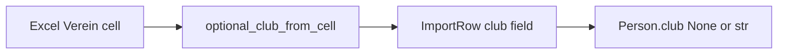

# Club name “no affiliation” normalization (None-based)

## Requirement mapping

Supports **R1** (reliable Excel import) and **R4** (consistent identity): junk Verein cells should not create distinct raw `club` strings or skew duplicate-row detection.

## Simplified approach (your direction)

Today, `_normalize_optional_text` maps **empty** and **exact `-`** to `None`. **Extend** that rule: any stripped cell text that contains **no Unicode alphanumeric** characters maps to `None` (using `str.isalnum()` per character — hyphen, apostrophe, en-dash, dots, underscores alone all become `None`).

- **Storage**: Keep `Person.club: None` for no club (no canonical `"-"` string in the domain).
- **Normalized field**: `normalize_club(None)` stays `""` as today; punctuation-only raw strings that never reach the domain are unnecessary — if any path still passes such a string, existing `normalize_club` already collapses noise; optional follow-up: after cleanup, if no alnum, return `""` (behavior already matches for typical junk).

## Matching note (`None` / empty)

In [`backend/matching/score.py`](backend/matching/score.py), `_ratio` treats **both empty** club strings as `1.0`. Incoming and candidate club norms are built from `normalize_club(...)` and resolve to `""` when club is `None`. **No change required** for scoring if imports consistently yield `club=None` for all no-club variants.

## Current vs target

| Input examples | Today (adapter) | Target |
|----------------|-----------------|--------|
| empty / whitespace | `None` | `None` |
| `-` | `None` | `None` (via no-alnum rule; explicit `-` check optional) |
| `'-`, `–`, `...`, `___` | often non-`None` raw string | `None` |
| `TSV`, `1. FC` | kept (stripped) | kept (stripped) |

## Implementation steps

### 1. Shared helper (ingestion layer)

Add something like `optional_club_from_cell(value: object) -> str | None` in [`backend/ingestion/adapters/common.py`](backend/ingestion/adapters/common.py) (next to `to_text`):

- `text = to_text(value)` (already strips).
- If `not text`: return `None`.
- If `not any(ch.isalnum() for ch in text)`: return `None`.
- Else: return `text` (already stripped).

This **subsumes** the old `text == "-"` special case (hyphen is not alnum).

### 2. Adapters

- [`backend/ingestion/adapters/singles.py`](backend/ingestion/adapters/singles.py) and [`backend/ingestion/adapters/couples.py`](backend/ingestion/adapters/couples.py): for **club** columns only, call the shared helper instead of `_normalize_optional_text`. Remove duplicate `_normalize_optional_text` definitions if nothing else uses them; otherwise keep the old helper only if another column still needs it (grep shows club-only usage today — likely delete both local copies and use the shared helper only).

### 3. Workflow / meta (expected minimal or none)

- [`backend/matching/workflow.py`](backend/matching/workflow.py): With `ImportRow*.club*` already `None` for all no-club spellings, existing `Person(club=club_raw)`, duplicate keys using `(row.club or "").strip().casefold()`, and `incoming_club` `... or None` should already align. **Verify** in implementation; only adjust if any code path still feeds raw junk into `Person.club` without going through the adapter.

### 4. Optional parity: identity / API

- [`backend/domain/identity.py`](backend/domain/identity.py): When applying `person_with_updated_identity`, run incoming `club` through the same “optional club” rule so manual/API identity updates behave like Excel (strip → no alnum → `None`). Either import the helper from ingestion common or move the tiny predicate to a neutral module (e.g. `backend/domain/club.py`) if you want to avoid ingestion → domain dependency — **pick one direction** during implementation.

### 5. Out of scope

- **`normalize_club` signature / return `-`**: not part of this plan.
- **Frontend**: unchanged.
- **JSON migration**: not required; new imports get cleaner `None` club values.

## Tests

- Unit tests for `optional_club_from_cell`: `None`, `""`, whitespace, `-`, `'-`, en-dash, `...`, underscore-only, `"TSV"`, `"1. FC"`, mixed punctuation with letters (keep).

## Documentation / workflow (per repo rules)

- Short note in [`docs/features/`](docs/features/) describing the no-alnum → `None` rule.
- One line in [`docs/ACCOMPLISHMENTS.md`](docs/ACCOMPLISHMENTS.md) after shipping.

