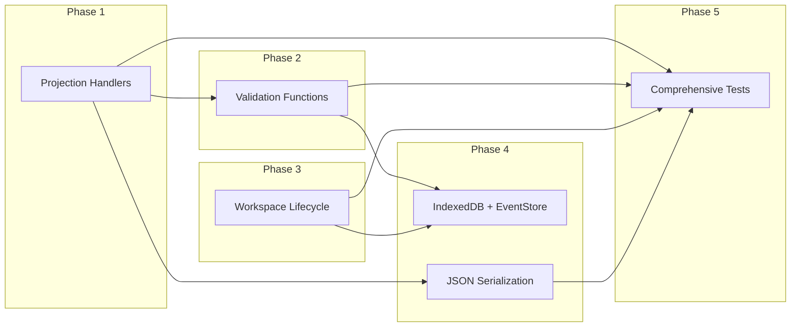

# F-TS01 Event-Sourced Architecture — Implementation Plan

**Milestone:** M-TS1 | **Requirements:** R1, R2, R3, R5, R7

## Current State

The package has working tooling (Vite, Vitest, ESLint, Prettier, React 19, Zustand) and scaffolded type definitions:

- [src/domain/types.ts](packages/stundenlauf-ts/src/domain/types.ts) — All enums, value objects, and `SeasonState` are **fully defined** (127 lines).
- [src/domain/events.ts](packages/stundenlauf-ts/src/domain/events.ts) — All 11 event payload interfaces and the `DomainEvent` discriminated union are **fully defined** (131 lines).
- [src/domain/projection.ts](packages/stundenlauf-ts/src/domain/projection.ts) — `emptySeasonState` and `projectState` exist, but `applyEvent` is a **no-op stub** (returns `state` unchanged for all cases).
- [src/domain/validation.ts](packages/stundenlauf-ts/src/domain/validation.ts), [src/domain/workspace.ts](packages/stundenlauf-ts/src/domain/workspace.ts), [src/storage/db.ts](packages/stundenlauf-ts/src/storage/db.ts), [src/storage/event-store.ts](packages/stundenlauf-ts/src/storage/event-store.ts) — All **empty stubs** (`export {}`).
- Tests: 2 passing projection tests (empty state, empty log), 3 todo validation tests.

## Implementation Steps

### Phase 1: Projection Handlers (core, pure functions)

Implement all 11 `apply*` functions in [src/domain/projection.ts](packages/stundenlauf-ts/src/domain/projection.ts). Each handler takes the current `SeasonState` and returns a new `SeasonState` (immutable updates — new Map/Set instances on the modified collections, shallow copy on unchanged ones).

**Key design decisions:**

- Use **shallow-copy-on-write**: clone only the Map/Set being mutated in each handler, reuse others via spread.
- Add an `UnknownEventTypeError` (custom Error subclass) thrown from the `default` branch of `applyEvent`. The existing exhaustive switch handles this, but a runtime guard is needed for deserialized data that might contain future event types.
- Implement a `categoryKey(cat: RaceCategory): string` utility that produces `"{duration}:{division}"` for use as Map keys in exclusions (no year in TS version, unlike Python's `year:duration:division`).

**Handler summary (per F-TS01 Section 8):**

| Handler | Mutates in SeasonState | Core Logic |
|---|---|---|
| `applyImportBatchRecorded` | `import_batches` | Insert new `ImportBatch` with `state: "active"` |
| `applyImportBatchRolledBack` | `import_batches` | Set batch `state: "rolled_back"`, record rollback metadata |
| `applyPersonRegistered` | `persons` | Insert new `PersonIdentity` |
| `applyPersonCorrected` | `persons` | Merge `updated_fields` into existing person |
| `applyTeamRegistered` | `teams` | Insert new `Team` |
| `applyRaceRegistered` | `race_events` | Insert new `RaceEvent` with entries, `state: "active"`, `imported_at` from envelope `recorded_at` |
| `applyRaceRolledBack` | `race_events` | Set race `state: "rolled_back"`, record rollback metadata |
| `applyRaceMetadataCorrected` | `race_events` | Merge `updated_fields` into race metadata |
| `applyEntryReassigned` | `race_events` | Find entry within race, update its `team_id` |
| `applyEntryCorrected` | `race_events` | Find entry within race, merge `updated_fields` |
| `applyEligibilitySet` | `exclusions` | Add or remove `team_id` from category exclusion set |

**Helper functions needed:**

- `isEffectiveRace(state, raceEventId): boolean` — checks race is active AND its import batch is not rolled back.
- `findEntryInRace(race, entryId)` — locate an entry within a race's entries array.
- `categoryKey(cat)` — `"${cat.duration}:${cat.division}"`.

**File:** All projection logic stays in [src/domain/projection.ts](packages/stundenlauf-ts/src/domain/projection.ts). If it grows past ~300 lines, extract the individual `apply*` functions into a `src/domain/apply/` directory with one file per event group (import-batch, person, team, race, entry, ranking).

---

### Phase 2: Validation Functions

Implement in [src/domain/validation.ts](packages/stundenlauf-ts/src/domain/validation.ts). Each validator takes `(state: SeasonState, event: DomainEvent)` and returns a `ValidationResult` (success or array of error strings).

```typescript
type ValidationResult =
  | { valid: true }
  | { valid: false; errors: string[] };

function validateEvent(state: SeasonState, event: DomainEvent): ValidationResult;
```

**Validation rules per event type (from F-TS01 Section 9):**

- `import_batch.recorded` — no duplicate `import_batch_id`
- `import_batch.rolled_back` — batch exists, not already rolled back
- `person.registered` — no duplicate `person_id`
- `person.corrected` — person exists; if `club` set to null then `club_normalized` must be `""`
- `team.registered` — no duplicate `team_id`; all `member_person_ids` reference registered persons; member count matches `team_kind` (1 for solo, 2 for couple)
- `race.registered` — no duplicate `race_event_id`; no effective race with same `category + race_no`; all entry `team_id` values reference registered teams; all `entry_id` values globally unique
- `race.rolled_back` — race exists and is effective
- `race.metadata_corrected` — race exists and is effective; resulting `(category, race_no)` doesn't collide with another effective race; all entries compatible with new category's team shape
- `entry.reassigned` — entry exists in effective race; `from_team_id` matches current; `to_team_id` registered and matches category shape; no duplicate team in race
- `entry.corrected` — entry exists in effective race
- `ranking.eligibility_set` — team has entries in the given category

**Cross-field checks:**

- `metadata.import_batch_id` consistency with payload `import_batch_id` where both exist.
- `schema_version` must be recognized (currently `1` only).

**Team-shape validation helper:**

```typescript
function requiredTeamKind(division: Division): TeamKind;
// men, women → "solo"; couples_* → "couple"
```

---

### Phase 3: Workspace Season Lifecycle

Implement in [src/domain/workspace.ts](packages/stundenlauf-ts/src/domain/workspace.ts). This is the layer that manages the season registry — CRUD operations on seasons that are NOT events within a season log.

```typescript
interface WorkspaceState {
  seasons: Map<string, SeasonDescriptor>;
}

function createSeason(ws: WorkspaceState, label: string): { ws: WorkspaceState; seasonId: string };
function deleteSeason(ws: WorkspaceState, seasonId: string): WorkspaceState;
function resetSeason(ws: WorkspaceState, seasonId: string): WorkspaceState;
function listSeasons(ws: WorkspaceState): SeasonDescriptor[];
```

These are pure functions operating on an in-memory workspace state. The persistence side (IndexedDB) is wired in Phase 4. UUID generation uses `crypto.randomUUID()`.

---

### Phase 4: Storage Adapter (IndexedDB + JSON)

#### 4a. IndexedDB Schema — [src/storage/db.ts](packages/stundenlauf-ts/src/storage/db.ts)

Use the `idb` library (thin typed wrapper over IndexedDB). Define a database with two object stores:

- **`workspace`** — single record holding the `WorkspaceState` (season registry).
- **`event_logs`** — keyed by `seasonId`, each record stores the full `EventEnvelope[]` array for that season.

Snapshots (optional optimization) deferred — not needed for typical season sizes (<1000 events).

Add `idb` as a dependency (`npm install idb`).

#### 4b. Event Store — [src/storage/event-store.ts](packages/stundenlauf-ts/src/storage/event-store.ts)

```typescript
interface EventStore {
  getEventLog(seasonId: string): Promise<DomainEvent[]>;
  appendEvents(seasonId: string, events: DomainEvent[]): Promise<void>;
  writeEventLog(seasonId: string, label: string, events: DomainEvent[]): Promise<void>;
  deleteEventLog(seasonId: string): Promise<void>;
}
```

- `appendEvents` validates that appended `seq` numbers are contiguous with existing log.
- `writeEventLog` is a bulk-write used by season import (atomic replace).
- Idempotency: reject append if `import_batch_id` already exists in the log.

#### 4c. JSON Import/Export

```typescript
interface SeasonArchive {
  format: "stundenlauf-ts-eventlog";
  format_version: 1;
  season_id: string;
  label: string;
  events: DomainEvent[];
}

function serializeEventLog(seasonId: string, label: string, events: DomainEvent[]): string;
function deserializeEventLog(json: string): SeasonArchive;  // validates format + version
```

This is a pure serialization layer — no IndexedDB dependency. Used by F-TS07 (season portability) but defined here as part of the storage format contract.

---

### Phase 5: Tests

Organized under `tests/domain/` and `tests/storage/`:

#### Projection tests — `tests/domain/projection.test.ts` (expand existing)

- **Per-handler unit tests:** Each `apply*` function tested with minimal pre-state.
  - `person.registered` → person appears in `persons` map
  - `team.registered` → team appears in `teams` map with correct member refs
  - `race.registered` → race with entries appears in `race_events`
  - `import_batch.recorded` → batch in `import_batches` with `state: "active"`
  - `import_batch.rolled_back` → batch state flipped, rollback metadata stored
  - `race.rolled_back` → race state flipped
  - `person.corrected` → person fields updated (only specified ones)
  - `entry.reassigned` → entry's `team_id` changed
  - `entry.corrected` → entry's distance_m/points/startnr updated
  - `race.metadata_corrected` → race date/no/category updated
  - `ranking.eligibility_set` → category exclusion set modified
- **Multi-event integration:** Full import workflow sequence (batch → persons → teams → race) producing expected `SeasonState`.
- **Effective-race logic:** Verify that `isEffectiveRace` correctly handles both race-level and batch-level rollbacks.
- **Unknown event type:** Verify that `applyEvent` throws `UnknownEventTypeError`.
- **Correction precedence:** Verify that multiple corrections on the same entry produce the final expected state.

#### Validation tests — `tests/domain/validation.test.ts` (replace existing todos)

- Duplicate `person_id` rejected
- Team referencing unregistered person rejected
- Duplicate `import_batch_id` rejected
- Race with duplicate `category + race_no` rejected
- Entry reassignment with wrong `from_team_id` rejected
- Entry reassignment violating team shape rejected
- Duplicate team participation in single race rejected
- Valid events accepted (happy path per type)

#### Workspace tests — `tests/domain/workspace.test.ts` (new)

- Create season → appears in registry
- Delete season → removed from registry
- Reset season → descriptor preserved, event log conceptually cleared
- List seasons → returns all descriptors

#### Serialization tests — `tests/storage/serialization.test.ts` (new)

- Round-trip: serialize → deserialize → project → verify identical `SeasonState`.
- Reject unknown `format_version`.
- Reject malformed JSON.

#### Storage tests are deferred for now — IndexedDB tests require `fake-indexeddb` and are better added when wiring up the full stack.

---

## Dependency Changes

- Add `idb` (typed IndexedDB wrapper) — `npm install idb`

## File Summary

| File | Action |
|---|---|
| `src/domain/projection.ts` | Implement all 11 apply handlers + helpers |
| `src/domain/validation.ts` | Implement `validateEvent` + per-type validators |
| `src/domain/workspace.ts` | Implement workspace season lifecycle functions |
| `src/storage/db.ts` | IndexedDB schema + open/upgrade logic |
| `src/storage/event-store.ts` | EventStore implementation over IndexedDB |
| `src/domain/types.ts` | Minor: add `categoryKey` utility if not inline |
| `tests/domain/projection.test.ts` | Expand with full handler tests |
| `tests/domain/validation.test.ts` | Replace todos with real tests |
| `tests/domain/workspace.test.ts` | New file: workspace lifecycle tests |
| `tests/storage/serialization.test.ts` | New file: JSON round-trip tests |
| `tests/helpers/event-factories.ts` | New file: test helper factories for creating valid events |

## Execution Order

Phases 1-2 are the critical path and can be implemented together (projection + validation are tightly coupled). Phase 3 is independent and can be done in parallel. Phase 4 depends on Phase 1-2 types being stable. Phase 5 tests are written alongside each phase.


