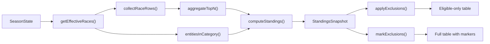

# F-TS04 Ranking Engine Implementation Plan

## Context

- **Requirement:** R5 (compute cumulative distance/points and produce ranking tables using configurable rules)
- **Milestone:** M-TS4 (Ranking engine and standings computation)
- **Python predecessor:** `backend/ranking/` (engine, aggregation, rules) + `backend/ui_api/ranking_display.py` (exclusions)
- **TS foundation:** F-TS01 provides `SeasonState`, `categoryKey()`, `isEffectiveRace()` in [projection.ts](packages/stundenlauf-ts/src/domain/projection.ts); `ranking.eligibility_set` events projected into `SeasonState.exclusions`; the [ranking/engine.ts](packages/stundenlauf-ts/src/ranking/engine.ts) stub is empty (`export {}`)

## Architecture

All ranking logic lives in `src/ranking/` as pure functions over `SeasonState` — no I/O, no framework deps, no side effects. The engine is a **derived view**: never stored, computed on demand.



## File Plan (5 new/modified files under `src/ranking/`)

### 1. `src/ranking/types.ts` (new)

Output types only — no logic.

- `RaceRow` — `{ race_event_id: string; points: number; distance_m: number }`
- `TopNAggregation` — `{ total_points, total_distance_m, selected_race_ids, dropped_race_ids }`
- `RaceContribution` — `{ race_event_id, points, distance_m, counts_toward_total }`
- `StandingsRow` — `{ team_id, total_points, total_distance_m, rank, race_contributions }`
- `CategoryStandingsTable` — `{ category_key, rows: StandingsRow[] }`
- `StandingsSnapshot` — `{ ruleset_version, calculated_at, category_tables }`
- `StandingsRowWithExclusion` — extends StandingsRow with `excluded: boolean; rank: number | null`
- `CategoryStandingsTableWithExclusions` — `{ category_key, rows: StandingsRowWithExclusion[] }`

All types are `readonly`-annotated interfaces.

### 2. `src/ranking/rules.ts` (new)

- `Ruleset` interface: `{ version_id, top_n, distance_decimals, primary_sort, tie_break }`
- `RULESET_STUNDENLAUF_V1` constant: `{ version_id: "stundenlauf_v1", top_n: 4, distance_decimals: 3, primary_sort: "points_desc", tie_break: "distance_desc" }`

### 3. `src/ranking/aggregation.ts` (new)

Single exported function porting `sum_top_n_or_all_points_and_distance`:

```typescript
function aggregateTopN(rows: RaceRow[], n: number, distanceDecimals: number): TopNAggregation
```

**Algorithm (must match Python exactly):**
1. Sort by `(-points, race_event_id asc)` — descending points, ascending ID for determinism
2. Take first `n` (or all if fewer)
3. Sum points and distances of selected; round distance via `Math.round(sum * 10^d) / 10^d`
4. Dropped IDs: remaining rows after selection, preserving sorted order

### 4. `src/ranking/engine.ts` (replace stub)

Internal helpers (not exported):
- `getEffectiveRaces(state)` — filter `state.race_events` by `isEffectiveRace()` (reuse from [projection.ts](packages/stundenlauf-ts/src/domain/projection.ts))
- `discoverCategories(races)` — unique sorted category keys
- `entitiesInCategory(races, catKey)` — collect `team_id`s for a category
- `collectRaceRows(races, catKey, teamId)` — gather `RaceRow[]` per team per category

Main export:

```typescript
function computeStandings(state: SeasonState, ruleset?: Ruleset, calculatedAt?: string): StandingsSnapshot
```

**Sort order (must match Python):** `total_points desc`, then `total_distance_m desc`, then `team_id asc`. Sequential rank 1..n, no shared ranks.

Key difference from Python: no `entity_kind` branching — always `team_id` (universal team model).

### 5. `src/ranking/exclusions.ts` (new)

Three exported functions:

- `exclusionsForCategory(state, categoryKey)` — returns `Set<string>` from `state.exclusions`
- `applyExclusions(table, excludedTeamIds)` — filter + renumber ranks (eligible-only view)
- `markExclusions(table, excludedTeamIds)` — keep all rows; excluded get `rank: null, excluded: true`; eligible get sequential ranks

### 6. `src/ranking/index.ts` (new barrel)

Re-export public API: `computeStandings`, `RULESET_STUNDENLAUF_V1`, `Ruleset`, `applyExclusions`, `markExclusions`, `exclusionsForCategory`, and all output types.

## Test Plan (new directory `tests/ranking/`)

All tests use the existing [event-factories.ts](packages/stundenlauf-ts/tests/helpers/event-factories.ts) to build `SeasonState` via `projectState()`.

### `tests/ranking/aggregation.test.ts`

| Scenario | Key assertion |
|---|---|
| <=4 rows, all selected | `selected_race_ids.length === rows.length`, `dropped_race_ids` empty |
| 5 rows, top 4 by points | lowest-points row dropped |
| 6 rows | 2 dropped |
| tie on points | lower `race_event_id` wins selection |
| distance rounding | `Math.round(sum * 1000) / 1000` matches expected |
| n=1 | only best race |
| empty input | zero totals, empty arrays |
| n < 1 | throws or returns empty (match Python: throws ValueError) |

### `tests/ranking/engine.test.ts`

| Scenario | Key assertion |
|---|---|
| 3 teams, 3 races, 1 category | correct totals and ranks 1/2/3 |
| points tie, distance breaks it | higher distance gets lower rank |
| full tie (points + distance) | lower `team_id` gets lower rank |
| 2 categories | 2 separate tables, independently ranked |
| >4 races for a team | only top 4 count, dropped tracked |
| rolled-back race excluded | race's contributions absent |
| rolled-back batch excluded | all batch's races absent |
| `entry.corrected` changes points | standings reflect corrected value |
| `entry.reassigned` | standings reflect new team |
| team with 0 effective entries | absent from standings |
| empty season | empty snapshot, no tables |
| determinism | same state computed twice produces identical output |

### `tests/ranking/exclusions.test.ts`

| Scenario | Key assertion |
|---|---|
| `applyExclusions` removes excluded team | rows filtered, ranks renumbered 1..n |
| `applyExclusions` with no exclusions | unchanged output |
| `markExclusions` | excluded row has `rank: null, excluded: true`; eligible rows sequential |
| multiple exclusions | multiple excluded rows handled correctly |
| `exclusionsForCategory` with missing key | returns empty Set |

### `tests/ranking/integration.test.ts`

- Build `SeasonState` from a realistic event sequence (persons, teams, import batches, races with entries)
- Compute standings, verify against hand-calculated expected output
- Apply exclusions, verify filtered output
- Rollback a race via event, reproject, recompute, verify changes
- Verify cross-version parity with key Python test values (manually transcribed fixture data)

## Implementation Order

Strict bottom-up: types first, then leaf functions, then composition, then tests. Each step is independently verifiable.

## Completion Checklist

- Code in `src/ranking/` (5 files + barrel)
- Tests in `tests/ranking/` (4 test files)
- `uv run` not needed — all TS: `npx vitest run` passes
- No `any` escapes
- Lint clean (`eslint` + `prettier`)
- Entry added to [ACCOMPLISHMENTS.md](packages/stundenlauf-ts/docs/ACCOMPLISHMENTS.md)
- F-TS04 status updated to "Done" and M-TS4 to "In Progress" in [PROJECT_PLAN.md](packages/stundenlauf-ts/PROJECT_PLAN.md)
