# F-TS05: Import Orchestration Workflow

Supports **R1, R3, R4, R6, R7** and milestone **M-TS2**.

## Context

Three upstream features are implemented and tested:
- **F-TS01** (domain): `EventEnvelope`, `DomainEvent` union, `SeasonState`, `projectState()`, `validateEvent()`, `EventStore.appendEvents()` -- [types.ts](packages/stundenlauf-ts/src/domain/types.ts), [events.ts](packages/stundenlauf-ts/src/domain/events.ts), [projection.ts](packages/stundenlauf-ts/src/domain/projection.ts)
- **F-TS02** (parser): `parseWorkbook(file, fileName, options?) -> ParsedWorkbook` -- [parse-workbook.ts](packages/stundenlauf-ts/src/ingestion/parse-workbook.ts), [types.ts](packages/stundenlauf-ts/src/ingestion/types.ts)
- **F-TS03** (matching): `processSinglesSection(state, section, config)` and `processCouplesSection(state, section, config)` returning `SectionMatchResult` with `resolved_entries`, `review_items`, `new_person_payloads`, `new_team_payloads`, `report` -- [workflow.ts](packages/stundenlauf-ts/src/matching/workflow.ts), [types.ts](packages/stundenlauf-ts/src/matching/types.ts)

An empty stub exists at [orchestrator.ts](packages/stundenlauf-ts/src/import/orchestrator.ts). The module will be implemented in `src/import/`.

## Architecture

```mermaid
flowchart LR
  subgraph parsePhase ["Phase 1: Parse"]
    FileInput["File + fileName"]
    Parser["parseWorkbook (F-TS02)"]
    FileInput --> Parser
  end

  subgraph validatePhase ["Phase 2: Validate"]
    SHA["SHA-256 dedup"]
    CatConflict["Category/raceNo conflict"]
    DupRows["Intra-file dup rows"]
    Parser --> SHA --> CatConflict --> DupRows
  end

  subgraph matchPhase ["Phase 3: Match + Stage"]
    Iterate["Iterate sections"]
    MatchEngine["processSingles/CouplesSection (F-TS03)"]
    Stage["Build staged entries"]
    DupRows --> Iterate --> MatchEngine --> Stage
  end

  subgraph reviewPhase ["Phase 3b: Review"]
    ReviewQueue["Review queue"]
    Resolve["resolveReviewEntry"]
    Stage --> ReviewQueue
    ReviewQueue --> Resolve
    Resolve -->|all resolved| Finalize
  end

  subgraph commitPhase ["Phase 4: Finalize"]
    Finalize["Build event batch"]
    Events["DomainEvent array"]
    Finalize --> Events
  end
```



## Key Design Decisions

**1. Location: `src/import/`** -- matches the existing stub directory; `orchestrator.ts` becomes the barrel export.

**2. Progressive state enrichment** -- when iterating sections, new persons/teams from section N are added to a working copy of `SeasonState` before processing section N+1. This prevents creating duplicate identities when the same person appears in multiple sections of a single file.

**3. Matching engine API boundary** -- the orchestrator calls only `processSinglesSection` / `processCouplesSection` from [workflow.ts](packages/stundenlauf-ts/src/matching/workflow.ts). It never imports scoring, fingerprinting, or blocking internals.

**4. Route-to-method mapping** -- the matching engine's `MatchRoute` (`"auto" | "review" | "new_identity"`) maps to `ResolutionInfo.method` (`"auto" | "manual" | "new_identity"`). Entries routed to `"review"` get `method: "manual"` after the user resolves them.

**5. Immutable session updates** -- all functions return a new `ImportSession` object. No mutation.

**6. Ephemeral session** -- the `ImportSession` lives in memory only. Lost on tab close. Matches Python behavior.

## Module Structure

All files under `packages/stundenlauf-ts/src/import/`:

| File | Purpose |
|------|---------|
| `types.ts` | `ImportSession`, `StagedEntry`, `OrchestratedReviewEntry`, `ImportReport`, `ImportPhase`, `ReviewAction` |
| `validate.ts` | `validateImport()`: SHA-256 dedup, category/raceNo conflict, intra-file duplicate rows |
| `convert.ts` | `distanceKmToMeters()`, `buildIncomingRowData()` for singles and couples |
| `start-import.ts` | `startImport(file, seasonState, options?)`: parse + validate, returns session in `"matching"` phase |
| `run-matching.ts` | `runMatching(session, config)`: iterate sections with progressive state enrichment, populate staging + review queue |
| `review.ts` | `getReviewQueue(session)`, `resolveReviewEntry(session, entryId, action)` |
| `finalize.ts` | `finalizeImport(session)`: build ordered event batch |
| `session.ts` | `canStartImport()`, phase transition helpers |
| `report.ts` | `emptyImportReport()`, report accumulation helpers |
| `orchestrator.ts` | Barrel re-export of public API |

## Detailed Type Design

### `ImportSession` (types.ts)

```typescript
interface ImportSession {
  session_id: string;
  import_batch_id: string;
  source_file: string;
  source_sha256: string;
  parser_version: string;
  phase: ImportPhase;

  parsed: ParsedWorkbook;
  season_state_at_start: SeasonState;

  section_results: OrchestratedSection[];
  review_queue: OrchestratedReviewEntry[];

  accumulated_person_payloads: PersonRegisteredPayload[];
  accumulated_team_payloads: TeamRegisteredPayload[];

  report: ImportReport;
}

type ImportPhase =
  | "parsing" | "validating" | "matching"
  | "reviewing" | "committing" | "done" | "failed";
```

### `OrchestratedSection` (types.ts)

```typescript
interface OrchestratedSection {
  context: ImportRaceContext;
  staged_entries: StagedEntry[];
  all_resolved: boolean;
}
```

### `StagedEntry` (types.ts)

```typescript
interface StagedEntry {
  entry_id: string;
  startnr: string;
  team_id: string | null;       // null while review-pending
  distance_m: number;
  points: number;
  incoming: IncomingRowData;
  resolution: ResolutionInfo | null;
  review_routing: "auto" | "review" | "new_identity";
}
```

### `OrchestratedReviewEntry` (types.ts)

Wraps the matching engine's `ReviewItem` with additional orchestration fields:

```typescript
interface OrchestratedReviewEntry {
  section_index: number;
  entry_index: number;
  entry_id: string;
  status: "pending" | "resolved";
  review_item: ReviewItem;        // from F-TS03
  resolved_team_id?: string;
  resolved_method?: "manual" | "new_identity";
}
```

### `ReviewAction` and `ImportReport` (types.ts)

```typescript
type ReviewAction =
  | { type: "link_existing"; team_id: string }
  | { type: "create_new_identity" };

interface ImportReport {
  auto_links: number;
  review_items: number;
  new_identities: number;
  conflicts: number;
  replay_overrides: number;
  rows_imported: number;
  sections_imported: number;
  events_emitted: number;
}
```

## Implementation Details per File

### `validate.ts`

Three validations against `SeasonState`:

1. **SHA-256 duplicate import**: scan `state.import_batches` for any **active** batch with matching `source_sha256`. Rolled-back-only matches are allowed.
2. **Category/race-no conflict**: for each parsed section, use `categoryKey()` + `race_no` to check against effective races in `state.race_events` (using `isEffectiveRace()` from [projection.ts](packages/stundenlauf-ts/src/domain/projection.ts)).
3. **Intra-file duplicate rows**: for singles, check `(name, yob, club, startnr)` uniqueness per section; for couples, check `(name_a, yob_a, club_a, name_b, yob_b, club_b, startnr)`.

Returns a discriminated result: `{ valid: true }` or `{ valid: false; code: string; message: string }`.

### `convert.ts`

- `distanceKmToMeters(km: number): number` -- `Math.round(km * 1000)`
- `buildSinglesIncomingRowData(row: ImportRowSingles, context: ImportRaceContext): IncomingRowData` -- maps `name` to `display_name`, `yob` to `yob`, `row_kind: "solo"`, etc.
- `buildCouplesIncomingRowData(row: ImportRowCouples, context: ImportRaceContext): IncomingRowData` -- joins `"NameA / NameB"`, `yob_text: "yobA / yobB"`, `row_kind: "team"`, etc.

`sheet_name` and `section_name` sourced from `ImportRaceContext`. `row_index` is the positional index within the section.

### `start-import.ts`

```typescript
async function startImport(
  file: File,
  seasonState: SeasonState,
  options?: { raceNoOverride?: number; sourceType?: "singles" | "couples" },
): Promise<ImportSession>
```

1. Call `parseWorkbook(file, file.name, options)` to get `ParsedWorkbook`.
2. Call `validateImport(parsed, seasonState)` for SHA-256 dedup + conflict checks.
3. If invalid, throw with validation error.
4. Initialize and return `ImportSession` in `"matching"` phase.

### `run-matching.ts`

```typescript
async function runMatching(
  session: ImportSession,
  config: MatchingConfig,
): Promise<ImportSession>
```

1. Start with `workingState = session.season_state_at_start`.
2. For each section (singles then couples):
   a. Call `processSinglesSection(workingState, section, config)` or `processCouplesSection(...)`.
   b. Map each `ResolvedEntry` to a `StagedEntry`:
      - Auto/new_identity: `team_id` = resolved, `resolution` = built from confidence/count/route.
      - Review: `team_id` = null, `resolution` = null.
   c. Build `OrchestratedReviewEntry` from each `ReviewItem`.
   d. **Progressive enrichment**: apply `new_person_payloads` and `new_team_payloads` from this section to `workingState` so the next section can see them.
3. Accumulate all person/team payloads across sections.
4. Set phase to `"reviewing"` if any review entries exist, else `"committing"`.
5. Aggregate matching reports into `ImportReport`.

### `review.ts`

`getReviewQueue(session)` returns all entries with `status: "pending"`.

`resolveReviewEntry(session, entryId, action)`:

- **`link_existing`**: find the staged entry, set `team_id`, set `resolution: { method: "manual", confidence, candidate_count }`.
- **`create_new_identity`**: use the incoming row data to create `PersonRegisteredPayload` + `TeamRegisteredPayload`, add them to session's accumulated payloads, set `team_id` to the new team, set `resolution: { method: "new_identity", confidence: null, candidate_count: 0 }`.

After resolution, check if all review entries are resolved. If so, transition to `"committing"` phase.

For `create_new_identity`, person creation logic:
- Singles: parse name into given/family, use `yob`, `gender` from division, `club` from row. Generate `person_id` and `team_id` UUIDs.
- Couples: create two persons + one couple team with both member IDs.

### `finalize.ts`

```typescript
function finalizeImport(session: ImportSession): DomainEvent[]
```

Constructs the ordered event batch:

1. **`import_batch.recorded`** -- 1 event with `import_batch_id`, `source_file`, `source_sha256`, `parser_version`.
2. **`person.registered`** -- deduplicated across all sections. Person IDs from matching + from review-created identities.
3. **`team.registered`** -- deduplicated. Teams from matching + from review.
4. **`race.registered`** -- 1 per section. Each entry carries `entry_id`, `startnr`, `team_id`, `distance_m`, `points`, `incoming`, `resolution`.
5. **`ranking.eligibility_set`** -- scan `season_state_at_start.exclusions`; for every `(category, team_id)` pair, emit `{ eligible: true }`.

All events get sequential `seq` numbers starting from `existingLogLength` (must be passed in or derived). All carry `metadata.import_batch_id` and `metadata.app_version`.

The caller (UI/store layer) is responsible for appending the returned events to the event log via `EventStore.appendEvents()`.

### `session.ts`

```typescript
function canStartImport(session: ImportSession | null): boolean {
  if (session === null) return true;
  return session.phase === "done" || session.phase === "failed";
}
```

Plus helpers: `isPhase(session, phase)`, `assertPhase(session, expected)`.

### `report.ts`

`emptyImportReport()` factory and `mergeMatchingReport(target, matchingReport)` to fold matching engine reports into the orchestrator's `ImportReport`.

## Test Plan

Tests under `packages/stundenlauf-ts/tests/import/`:

### Unit: `validate.test.ts`
- Active batch with matching SHA-256 -> rejected
- Rolled-back-only batches with matching SHA-256 -> allowed
- Category/race-no collision with effective race -> rejected
- No collision -> allowed
- Duplicate rows within section (singles) -> rejected
- Duplicate rows within section (couples) -> rejected
- Unique rows -> no error

### Unit: `convert.test.ts`
- `distanceKmToMeters(12.5)` -> `12500`
- `distanceKmToMeters(5.123)` -> `5123`
- `distanceKmToMeters(0)` -> `0`
- `buildSinglesIncomingRowData` -> correct field mapping
- `buildCouplesIncomingRowData` -> correct name/yob/club joining

### Unit: `review.test.ts`
- Resolve with `link_existing` -> entry updated with target team_id and `method: "manual"`
- Resolve with `create_new_identity` -> new person(s) + team added, entry updated
- Resolve last pending entry -> session transitions to `"committing"`
- Resolve nonexistent entry_id -> throws

### Unit: `finalize.test.ts`
- Event ordering: `import_batch.recorded` -> `person.registered` -> `team.registered` -> `race.registered` -> `ranking.eligibility_set`
- All events carry correct `metadata.import_batch_id`
- Person/team payloads are deduplicated
- `distance_m` values on entries are integer meters
- Exclusions cleared via `ranking.eligibility_set { eligible: true }`
- Empty exclusions -> no eligibility events

### Integration: `pipeline.test.ts`
- All-auto import (mock matching): parse -> match (all auto) -> finalize -> verify event batch
- Mixed import: parse -> match (some review) -> resolve reviews -> finalize -> verify batch
- First import into empty season: all new identities -> verify person + team + race events
- Progressive state enrichment: multi-section file -> second section sees first section's new identities

### Edge cases in integration tests:
- Re-import after rollback of prior batch -> allowed
- Import with existing exclusions -> cleared in batch
- Session blocking: `canStartImport()` returns false during active session

## Completion Checklist

- Code in `packages/stundenlauf-ts/src/import/`
- Tests in `packages/stundenlauf-ts/tests/import/`
- All tests passing via `uv run` not needed -- this is TS: `npx vitest run`
- No `any` escapes without justification
- Barrel re-export from `orchestrator.ts`
- Entry in `packages/stundenlauf-ts/docs/ACCOMPLISHMENTS.md`
- Update F-TS05 status to "Done" and M-TS2 status in `PROJECT_PLAN.md`
