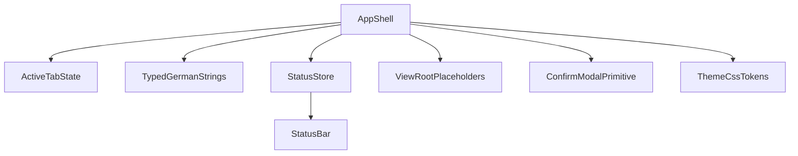

# F-TS06a Detailed Implementation Plan

## Requirement And Milestone Mapping

- Supports requirement **R8** (German-language UI) and milestone **M-TS5** from [packages/stundenlauf-ts/PROJECT_PLAN.md](packages/stundenlauf-ts/PROJECT_PLAN.md).
- Aligns with umbrella boundaries in [packages/stundenlauf-ts/docs/features/F-TS06-ui-framework-german-shell.md](packages/stundenlauf-ts/docs/features/F-TS06-ui-framework-german-shell.md) and executes the scoped foundation slice in [packages/stundenlauf-ts/docs/features/F-TS06a-ui-shell-layout-and-strings.md](packages/stundenlauf-ts/docs/features/F-TS06a-ui-shell-layout-and-strings.md).

## Current Baseline (Why This Plan)

- `App` currently renders harnesses or a placeholder, not a production shell: [packages/stundenlauf-ts/src/App.tsx](packages/stundenlauf-ts/src/App.tsx).
- Foundation primitives are stubs: [packages/stundenlauf-ts/src/components/shared/StatusBar.tsx](packages/stundenlauf-ts/src/components/shared/StatusBar.tsx), [packages/stundenlauf-ts/src/components/shared/ConfirmModal.tsx](packages/stundenlauf-ts/src/components/shared/ConfirmModal.tsx), [packages/stundenlauf-ts/src/stores/status.ts](packages/stundenlauf-ts/src/stores/status.ts).
- German string catalog exists but is minimal and not wired broadly: [packages/stundenlauf-ts/src/strings.ts](packages/stundenlauf-ts/src/strings.ts).
- Formatting helper coverage is narrow (`formatKm` only): [packages/stundenlauf-ts/src/format.ts](packages/stundenlauf-ts/src/format.ts), [packages/stundenlauf-ts/tests/format.test.ts](packages/stundenlauf-ts/tests/format.test.ts).
- Base theme lacks reduced-motion handling: [packages/stundenlauf-ts/src/theme.css](packages/stundenlauf-ts/src/theme.css).

## Implementation Phases

### Phase 1: Foundation Contracts (strings + format)

- Expand `STR` in [packages/stundenlauf-ts/src/strings.ts](packages/stundenlauf-ts/src/strings.ts) into typed sections needed by shell/primitives:
  - shell labels/tabs/title
  - status line labels
  - confirm modal button labels
  - lightweight placeholder-view labels
- Keep dead/bridge-only entries excluded (`bridgeUnavailable`, `desktopApiUnavailable`, dead `tableRaces`).
- Extend [packages/stundenlauf-ts/src/format.ts](packages/stundenlauf-ts/src/format.ts) with:
  - `seasonLabel(year: number | string)`
  - `reviewOpenCount(count: number)` (German pluralization-friendly string)
  - confidence label helper(s) for review surfaces (text-only, no HTML)
- Decide and document `formatKm` contract before 06b integration (meters vs km input and decimal precision), then lock it with tests.

### Phase 2: Production App Shell

- Replace placeholder fallback in [packages/stundenlauf-ts/src/App.tsx](packages/stundenlauf-ts/src/App.tsx) with real shell while preserving dev harness query behavior.
- Add top-level shell structure:
  - Header/title area
  - Tab strip for: Aktuelle Wertung, Lauf Importieren, Historie & Korrektur, Saison wechseln
  - Active view container
  - Global status line mount
- Implement tab switch state in-app (no full reload).
- Render labels from `STR` only; avoid inline German literals in shell surface.

### Phase 3: Shared Primitives And Shell State

- Implement [packages/stundenlauf-ts/src/components/shared/StatusBar.tsx](packages/stundenlauf-ts/src/components/shared/StatusBar.tsx) with deterministic status severity rendering (e.g., info/success/warn/error).
- Implement [packages/stundenlauf-ts/src/stores/status.ts](packages/stundenlauf-ts/src/stores/status.ts) as minimal Zustand slice API:
  - set/clear status
  - timestamp or source metadata optional but stable
- Implement [packages/stundenlauf-ts/src/components/shared/ConfirmModal.tsx](packages/stundenlauf-ts/src/components/shared/ConfirmModal.tsx) supporting:
  - title/body/confirm/cancel props
  - keyboard escape close
  - backdrop click close policy (explicitly defined)
  - focus-safe default button behavior
- Keep primitives workflow-agnostic so 06b/06c can adopt without refactor.

### Phase 4: View Root Placeholders For 06b/06c

- Convert scaffold exports into minimal placeholder components:
  - [packages/stundenlauf-ts/src/components/standings/StandingsView.tsx](packages/stundenlauf-ts/src/components/standings/StandingsView.tsx)
  - [packages/stundenlauf-ts/src/components/import/ImportView.tsx](packages/stundenlauf-ts/src/components/import/ImportView.tsx)
  - [packages/stundenlauf-ts/src/components/history/HistoryView.tsx](packages/stundenlauf-ts/src/components/history/HistoryView.tsx)
  - [packages/stundenlauf-ts/src/components/season/SeasonEntryView.tsx](packages/stundenlauf-ts/src/components/season/SeasonEntryView.tsx)
- Define lightweight props contracts now (status + active season context + callbacks) to reduce downstream churn.

### Phase 5: CSS Token Baseline And Accessibility

- Extend [packages/stundenlauf-ts/src/theme.css](packages/stundenlauf-ts/src/theme.css):
  - motion-safe defaults
  - `@media (prefers-reduced-motion: reduce)` transition/animation suppression
  - shell/layout primitives (header, tabs, container, status strip) via shared class tokens
- Keep styling neutral and reusable by 06b/06c instead of embedding workflow-specific CSS.

### Phase 6: Test And Verification Gates

- Extend helper unit tests in [packages/stundenlauf-ts/tests/format.test.ts](packages/stundenlauf-ts/tests/format.test.ts) for all new format/string helper functions.
- Add component tests for:
  - shell tab rendering and active-tab switching
  - status bar variant rendering
  - confirm modal keyboard/click interactions
- Validate non-harness startup path (`npm run dev`) shows production shell.
- Run package quality gates before declaring done:
  - typecheck
  - unit/component tests
  - lint/format checks

## Proposed Execution Order (Small Verifiable Steps)

1. Strings and format helper contracts + unit tests.
2. App shell skeleton and tab-switch rendering.
3. Status store + `StatusBar` hookup.
4. `ConfirmModal` behavior and tests.
5. Placeholder view roots + shell integration.
6. CSS reduced-motion and shell baseline polish.
7. Final full test/lint/typecheck pass and acceptance checklist audit.

## Interface Diagram (06a foundation)

## Risks, Assumptions, And Mitigations

- Assumption: keep React + Zustand baseline as already chosen in 06 umbrella.
- Risk: helper formatting semantics drift from legacy expectations; mitigate by explicit test vectors and documenting the `formatKm` input contract.
- Risk: shell props contracts overfit current placeholders; mitigate by keeping 06a contracts minimal and workflow-agnostic.
- Risk: harness pathways regress while enabling production shell; mitigate with explicit DEV query-parameter branch tests/manual check.

## Completion Evidence Checklist

- Shell renders all four tabs and status area in German from typed catalog.
- Tabs switch active view without reload.
- `ConfirmModal` supports required interactions including keyboard close.
- Reduced-motion CSS behavior is present.
- New helper and component tests pass.
- 06a docs are updated with implementation notes and outcomes:
  - [packages/stundenlauf-ts/docs/features/F-TS06a-ui-shell-layout-and-strings.md](packages/stundenlauf-ts/docs/features/F-TS06a-ui-shell-layout-and-strings.md)
  - [packages/stundenlauf-ts/docs/ACCOMPLISHMENTS.md](packages/stundenlauf-ts/docs/ACCOMPLISHMENTS.md)
  - [packages/stundenlauf-ts/PROJECT_PLAN.md](packages/stundenlauf-ts/PROJECT_PLAN.md) (status/progress update if 06a lands)