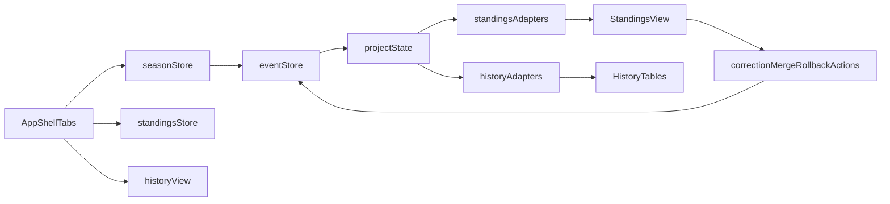

# F-TS06b Detailed Implementation Plan

## Scope and milestone mapping

Supports `M-TS5` and requirements `R2`, `R5`, `R8` as defined in [packages/stundenlauf-ts/PROJECT_PLAN.md](packages/stundenlauf-ts/PROJECT_PLAN.md) and aligns to the F-TS06 umbrella split in [packages/stundenlauf-ts/docs/features/F-TS06-ui-framework-german-shell.md](packages/stundenlauf-ts/docs/features/F-TS06-ui-framework-german-shell.md).

In-scope workflow surfaces from [packages/stundenlauf-ts/docs/features/F-TS06b-season-standings-history-workflows.md](packages/stundenlauf-ts/docs/features/F-TS06b-season-standings-history-workflows.md):
- `Saison wechseln` (list/create/open/reset/delete + import/export action surfaces)
- `Aktuelle Wertung` (category quick-select, imported runs matrix, Gesamtwertung, Laufübersicht, correction/merge flows)
- `Historie & Korrektur` (grouped imports, audit timeline rendering, rollback by source batch)

Out-of-scope guardrail:
- Keep import matching/review queue behavior in `F-TS06c`; TS06b only consumes resulting season data.

## Current baseline and key implementation anchors

- Shell and placeholders are already wired in [packages/stundenlauf-ts/src/App.tsx](packages/stundenlauf-ts/src/App.tsx).
- TS06b target views are stubs in:
  - [packages/stundenlauf-ts/src/components/season/SeasonEntryView.tsx](packages/stundenlauf-ts/src/components/season/SeasonEntryView.tsx)
  - [packages/stundenlauf-ts/src/components/standings/StandingsView.tsx](packages/stundenlauf-ts/src/components/standings/StandingsView.tsx)
  - [packages/stundenlauf-ts/src/components/history/HistoryView.tsx](packages/stundenlauf-ts/src/components/history/HistoryView.tsx)
- State modules are intentionally empty and should be activated now:
  - [packages/stundenlauf-ts/src/stores/season.ts](packages/stundenlauf-ts/src/stores/season.ts)
  - [packages/stundenlauf-ts/src/stores/standings.ts](packages/stundenlauf-ts/src/stores/standings.ts)
- Existing domain/storage APIs to reuse (no bridge layer):
  - [packages/stundenlauf-ts/src/domain/workspace.ts](packages/stundenlauf-ts/src/domain/workspace.ts)
  - [packages/stundenlauf-ts/src/storage/event-store.ts](packages/stundenlauf-ts/src/storage/event-store.ts)
  - [packages/stundenlauf-ts/src/domain/projection.ts](packages/stundenlauf-ts/src/domain/projection.ts)
  - [packages/stundenlauf-ts/src/ranking/engine.ts](packages/stundenlauf-ts/src/ranking/engine.ts)
- The dev harness contains proven adapter logic worth extracting into shared helpers:
  - [packages/stundenlauf-ts/src/devtools/ImportSeasonWalkthroughHarness.tsx](packages/stundenlauf-ts/src/devtools/ImportSeasonWalkthroughHarness.tsx)

## Implementation architecture

## Phase-by-phase plan

### Phase 1: Data access + app wiring foundation

1. Add a small workspace/season data-access module (new `src/services` file) that wraps `openStundenlaufDB()` + `createEventStore()` and exposes:
   - list/create/delete/rename seasons
   - load event log for active season
   - append validated event batches
2. Implement `useSeasonStore` in [packages/stundenlauf-ts/src/stores/season.ts](packages/stundenlauf-ts/src/stores/season.ts):
   - state: `seasons`, `activeSeasonId`, `activeSeasonLabel`, `eventLog`, `seasonState`, `loading/error`
   - actions: `bootstrapWorkspace`, `createSeason`, `openSeason`, `deleteSeason`, `resetSeason`
   - invariant: after every mutation, reload both workspace descriptors and active season projection
3. Update [packages/stundenlauf-ts/src/App.tsx](packages/stundenlauf-ts/src/App.tsx) to:
   - bootstrap the season store on mount
   - pass live `seasonLabel(...)` into all views (keep review count placeholder until TS06c)
   - route user-visible failures through `useStatusStore`

### Phase 2: Season workflow UI (`Saison wechseln`)

1. Replace placeholder in [packages/stundenlauf-ts/src/components/season/SeasonEntryView.tsx](packages/stundenlauf-ts/src/components/season/SeasonEntryView.tsx) with:
   - existing season list (active selection highlighted)
   - create form (German validation messages)
   - open/delete/reset actions using [packages/stundenlauf-ts/src/components/shared/ConfirmModal.tsx](packages/stundenlauf-ts/src/components/shared/ConfirmModal.tsx)
   - import/export action buttons rendered as disabled or “folgt in F-TS07/F-TS08” actions
2. Extend German catalog in [packages/stundenlauf-ts/src/strings.ts](packages/stundenlauf-ts/src/strings.ts) for all new labels/errors.
3. Add CSS sections in [packages/stundenlauf-ts/src/theme.css](packages/stundenlauf-ts/src/theme.css) for season cards/list/actions.

### Phase 3: Standings view models + UI (`Aktuelle Wertung`)

1. Create pure adapter helpers (`src/components/standings/adapters.ts` or `src/view-models/standings.ts`) for:
   - category quick-select model
   - imported runs matrix model (extract from harness logic)
   - Gesamtwertung and Laufübersicht table rows
   - team display labels from `SeasonState`
2. Implement [packages/stundenlauf-ts/src/stores/standings.ts](packages/stundenlauf-ts/src/stores/standings.ts):
   - selected category
   - correction mode / duplicate merge mode state
   - selected survivor/absorbed entities
3. Replace placeholders/components:
   - [packages/stundenlauf-ts/src/components/shared/CategoryGrid.tsx](packages/stundenlauf-ts/src/components/shared/CategoryGrid.tsx)
   - [packages/stundenlauf-ts/src/components/shared/ImportedRunsMatrix.tsx](packages/stundenlauf-ts/src/components/shared/ImportedRunsMatrix.tsx)
   - [packages/stundenlauf-ts/src/components/standings/StandingsTable.tsx](packages/stundenlauf-ts/src/components/standings/StandingsTable.tsx)
   - [packages/stundenlauf-ts/src/components/standings/StandingsView.tsx](packages/stundenlauf-ts/src/components/standings/StandingsView.tsx)
4. Add PDF export controls in standings view as UI surfaces only (action wiring stub for F-TS08 internals).

### Phase 4: Correction and duplicate merge flows

1. Implement [packages/stundenlauf-ts/src/components/standings/IdentityModal.tsx](packages/stundenlauf-ts/src/components/standings/IdentityModal.tsx) for `person.corrected` editing.
2. Reuse/finish [packages/stundenlauf-ts/src/components/import/MergeCorrectModal.tsx](packages/stundenlauf-ts/src/components/import/MergeCorrectModal.tsx) for duplicate merge selection UI in standings context.
3. Add mutation action creators (new `src/domain/commands` helper or colocated utility) for:
   - `person.corrected`
   - `entry.reassigned` (for merge outcomes where required)
   - `ranking.eligibility_set` toggles if exclusions are exposed
4. After each mutation append, force a projection refresh in season store so standings/history views stay consistent.

### Phase 5: History + rollback workflows (`Historie & Korrektur`)

1. Build pure history adapters from `eventLog + seasonState`:
   - group by `import_batch_id`
   - include source file, import timestamp, effective/rolled-back status
   - flatten correction/rollback/audit rows for readable timeline entries
2. Implement:
   - [packages/stundenlauf-ts/src/components/history/ImportHistoryTable.tsx](packages/stundenlauf-ts/src/components/history/ImportHistoryTable.tsx)
   - [packages/stundenlauf-ts/src/components/history/AuditTrailTable.tsx](packages/stundenlauf-ts/src/components/history/AuditTrailTable.tsx)
   - [packages/stundenlauf-ts/src/components/history/HistoryView.tsx](packages/stundenlauf-ts/src/components/history/HistoryView.tsx)
3. Add rollback action per source batch with confirm modal:
   - append `import_batch.rolled_back` plus corresponding `race.rolled_back` events for races in that batch
   - then reload projection and show German success/error status

### Phase 6: Hardening, tests, and docs

1. Test additions:
   - unit: standings adapters, imported-runs matrix model, history grouping model
   - component: season CRUD/reset flow, category switch/table rendering, identity/merge modal flows, rollback confirmation
   - integration: create/open season -> import-backed state visible -> correction/merge/rollback -> projection refresh asserted
2. Update existing shell tests in [packages/stundenlauf-ts/tests/ui/app-shell.test.tsx](packages/stundenlauf-ts/tests/ui/app-shell.test.tsx) to replace placeholder assertions with real workflow assertions.
3. Update docs after implementation:
   - mark progress in [packages/stundenlauf-ts/PROJECT_PLAN.md](packages/stundenlauf-ts/PROJECT_PLAN.md)
   - add outcome entry in [packages/stundenlauf-ts/docs/ACCOMPLISHMENTS.md](packages/stundenlauf-ts/docs/ACCOMPLISHMENTS.md)
   - mark acceptance checklist completion in [packages/stundenlauf-ts/docs/features/F-TS06b-season-standings-history-workflows.md](packages/stundenlauf-ts/docs/features/F-TS06b-season-standings-history-workflows.md)

## Key assumptions

- TS06b will use IndexedDB-backed `EventStore` directly (no temporary in-memory-only mode).
- Event-building for corrections/rollback is implemented in TS06b only for workflows listed in this plan; import review orchestration remains TS06c.
- Export buttons in standings remain UI-level triggers until F-TS08 handlers are finalized.

## Risks and mitigations

- Projection/event-log shaping for history can become brittle.
  - Mitigation: keep all shaping in typed pure adapters with focused tests.
- Cross-view stale state after mutations.
  - Mitigation: centralize post-mutation refresh in `seasonStore`, not per component.
- Scope creep into import-review UI.
  - Mitigation: enforce module boundary (`src/components/import/*` changes only when shared modal reuse is needed).

## Validation checklist before marking TS06b done

- All TS06b acceptance criteria checked in feature doc.
- No `window.confirm()` or `window.prompt()` in season/standings/history workflows.
- German text sourced from `STR` catalog.
- UI actions mutate event log and projection updates are reflected immediately.
- New tests pass in Vitest and cover season + standings + history happy/error paths.