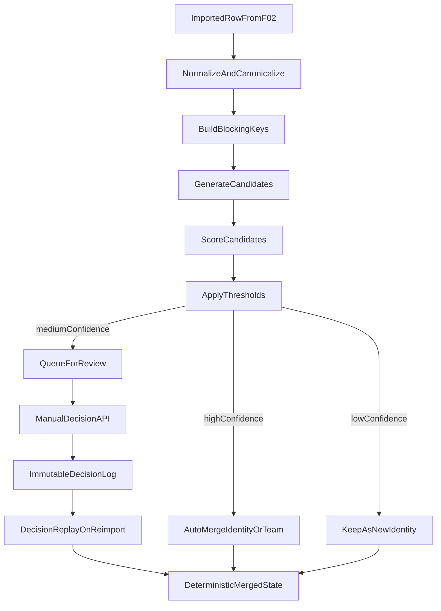

# F03 Participant/Team Matching Implementation Plan

## Scope Alignment

- Supports requirement `R3` (cross-race identity continuity), `R4` (robust typo/order/title handling), and `R6` (interactive review + override workflow).
- Delivers milestone `M3` foundation by adding deterministic matching, confidence routing, and decision persistence on the current ingestion pipeline.
- Keeps German UI text concerns out of this backend-focused slice (deferred to `M4`/F05), while exposing contracts needed by UI.

## Assumptions

- F02 ingestion already produces stable imported rows that can be enriched with canonical/matching metadata.
- Current storage format can accept schema extensions for matching artifacts (or a controlled schema version bump if required).
- YOB is present often enough to be a major disambiguation signal but not mandatory.
- Club names remain noisy and are treated as weak evidence only.

## Target Files and Components

- Core source area for new matching logic in existing backend modules (to be finalized after file-level inventory), with expected additions in:
  - Matching normalization + scoring module(s)
  - Candidate generation/blocking module(s)
  - Pair alignment module(s)
  - Decision persistence/replay service
  - Import/merge orchestration entry point
- Planning and tracking docs:
  - [PROJECT_PLAN.md](PROJECT_PLAN.md)
  - [docs/features/F03-participant-and-team-matching.md](docs/features/F03-participant-and-team-matching.md)
  - [docs/ACCOMPLISHMENTS.md](docs/ACCOMPLISHMENTS.md)

## Architecture and Data Flow

## Implementation Phases

### 1) Inventory + Contract Lock

- Audit existing F01/F02 domain entities, storage schema, and import pipeline seams where matching should attach.
- Lock canonical normalization contract for person/team tokens:
  - name cleanup (casefold, punctuation, whitespace, delimiter handling),
  - title stripping dictionary (`Dr`, `Dr.` initially extensible),
  - club token normalization,
  - provenance metadata (`raw`, `normalized`, transforms).
- Define confidence thresholds and explainability payload schema (feature breakdown per candidate).

### 2) Schema + Domain Extensions

- Add domain/storage structures for:
  - canonicalized participant/team representations,
  - candidate records with feature-level score components,
  - immutable decision log entries,
  - field-level resolution actions (`kept_from`, `manual_value`).
- Introduce schema version migration path if backward compatibility cannot be preserved seamlessly.
- Ensure stable identifiers for identities, teams, decisions, and replay references.

### 3) Participant Matching Engine (Single Athlete)

- Implement deterministic candidate generation with blocking strategy:
  - last-name-prefix + YOB,
  - first-name-prefix + YOB,
  - name-only fallback when YOB missing.
- Add safeguards for oversized candidate pools (cap + telemetry).
- Implement weighted scoring components:
  - first/last/full-name similarity,
  - swapped-name boost,
  - title-insensitive bonus,
  - YOB agreement bonus + disagreement penalty,
  - low-weight club similarity signal.
- Return sorted candidates with explainability payload.

### 4) Team Matching Engine (Paarlauf)

- Build team candidate search via member-level blocking.
- Implement order-insensitive member alignment (best two-member pairing) and aggregate team confidence.
- Prevent unsafe team auto-merges when one member strongly mismatches even if the other is close.
- Include optional team-level club/team-name hint as soft evidence only.

### 5) Threshold Routing + Decision Workflow

- Introduce three-way routing:
  - high confidence -> auto-merge,
  - medium confidence -> review queue,
  - low confidence -> create new identity/team.
- Persist manual decisions (accept/reject/manual-link/manual-field-value) as immutable events.
- Implement replay so re-import/recalculation deterministically reuses prior decisions.
- Add conflict detection signals (same candidate proposed for multiple incoming rows).

### 6) Integration Into Import Pipeline

- Wire matching stage into post-ingestion merge flow (after row normalization, before final identity consolidation).
- Ensure idempotency with repeated imports and recalculation cycles.
- Produce per-import structured matching report (counts by route, unresolved items, candidate stats).

### 7) Test Expansion and Validation

- Unit tests:
  - normalization/title handling/order swaps/club variants,
  - participant scoring weights and penalties,
  - pair alignment invariance and mismatch protection.
- Integration tests:
  - multi-race continuity with typos/title changes/missing YOB,
  - pair stability across multiple races,
  - decision replay determinism.
- Edge/performance tests:
  - combined-noise cases,
  - near-collision identities,
  - season-scale candidate generation bounded by blocking.
- Validation pass against curated historical set to tune defaults toward KPI trajectory (`>=95%` precision target, top-candidate coverage emphasis).

### 8) Documentation and Project Tracking Updates

- Update feature status/progress in [docs/features/F03-participant-and-team-matching.md](docs/features/F03-participant-and-team-matching.md) from planned to implemented-increment state.
- Add outcome-focused implementation entry to [docs/ACCOMPLISHMENTS.md](docs/ACCOMPLISHMENTS.md).
- Update [PROJECT_PLAN.md](PROJECT_PLAN.md) milestone/requirement progress for `M3` and `R3/R4/R6` as evidence is completed.

## Risks and Mitigations

- False-positive merges corrupt standings:
  - conservative auto threshold + mandatory review band + strong YOB mismatch penalty.
- Candidate explosion / runtime drift:
  - strict blocking keys, capped candidate sets, and per-import metrics.
- Ambiguous pair matching:
  - member-level pruning and explicit no-auto rules under asymmetric confidence.
- Drift in manual decisions after schema changes:
  - immutable decision event model + replay compatibility tests.

## Delivery Checkpoints

- Checkpoint A: Normalization/spec + schema extension merged with unit coverage.
- Checkpoint B: Participant matcher integrated with threshold routing + review queue contract.
- Checkpoint C: Pair matcher + decision replay completed with integration tests.
- Checkpoint D: KPI-oriented validation report, docs/accomplishments/project plan updates complete.

## Test Plan (Execution)

- Run full backend test suite after each checkpoint; gate merge on green tests.
- Add fixture-driven regression packs for known historical typo/order/title/club anomalies.
- Track and review:
  - auto-merge count,
  - review queue size,
  - unresolved count,
  - false-positive sample audits.
- Manually verify a few ambiguous records through review decision flows and replay after re-import.
