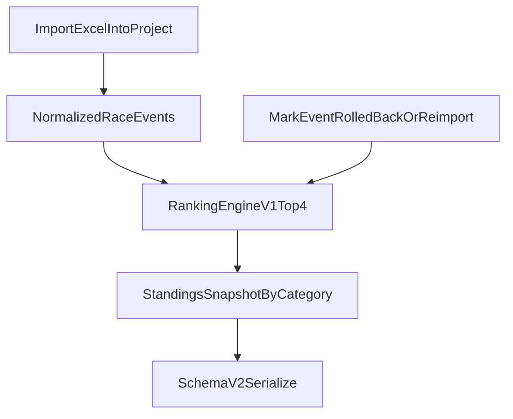

# F04 Implementation Plan: Ranking Rules and Standings

## Requirement Mapping

- Supports `R5` (cumulative points/distance and ranking tables with configurable rules) and advances `M3` (matching workflow and ranking engine).
- Aligns with current project status in [c:\Users\andre\VSCode_Projects\stundenlauf\PROJECT_PLAN.md](c:\Users\andre\VSCode_Projects\stundenlauf\PROJECT_PLAN.md) and feature baseline in [c:\Users\andre\VSCode_Projects\stundenlauf\docs\features\F04-ranking-rules-and-standings.md](c:\Users\andre\VSCode_Projects\stundenlauf\docs\features\F04-ranking-rules-and-standings.md).

## Current-State Integration Points

- Domain entities for ranking input already exist in [c:\Users\andre\VSCode_Projects\stundenlauf\backend\domain\models.py](c:\Users\andre\VSCode_Projects\stundenlauf\backend\domain\models.py): `RaceEvent`, `RaceEntry`, `EntryResult`, identity UIDs, category dimensions.
- Import pipeline normalization point is [c:\Users\andre\VSCode_Projects\stundenlauf\backend\ingestion\service.py](c:\Users\andre\VSCode_Projects\stundenlauf\backend\ingestion\service.py) (`import_excel_into_project`).
- Persistence and migration hooks are [c:\Users\andre\VSCode_Projects\stundenlauf\backend\storage\schema_v2.py](c:\Users\andre\VSCode_Projects\stundenlauf\backend\storage\schema_v2.py), [c:\Users\andre\VSCode_Projects\stundenlauf\backend\storage\migrations.py](c:\Users\andre\VSCode_Projects\stundenlauf\backend\storage\migrations.py), and [c:\Users\andre\VSCode_Projects\stundenlauf\backend\storage\repository.py](c:\Users\andre\VSCode_Projects\stundenlauf\backend\storage\repository.py).
- CLI entrypoint orchestration is [c:\Users\andre\VSCode_Projects\stundenlauf\main.py](c:\Users\andre\VSCode_Projects\stundenlauf\main.py).

## Proposed Design

- Add new package `backend/ranking/` with pure computation layer:
  - `rules.py`: ruleset contract + `v1_legacy_top4` registration.
  - `aggregation.py`: reusable top-N selectors and rounded totals.
  - `engine.py`: category grouping, deterministic sorting, placement assignment, explainability output.
- Extend domain model in [c:\Users\andre\VSCode_Projects\stundenlauf\backend\domain\models.py](c:\Users\andre\VSCode_Projects\stundenlauf\backend\domain\models.py):
  - `StandingsSnapshot` (per category standings rows + metadata).
  - `StandingsRow` (entity UID, totals, place, selected/dropped contributions, event trace).
  - `ruleset_version` and `calculated_at` metadata.
- Persist snapshots in schema v2 via [c:\Users\andre\VSCode_Projects\stundenlauf\backend\storage\schema_v2.py](c:\Users\andre\VSCode_Projects\stundenlauf\backend\storage\schema_v2.py), defaulting missing data during load.
- Maintain backward compatibility through migration updates in [c:\Users\andre\VSCode_Projects\stundenlauf\backend\storage\migrations.py](c:\Users\andre\VSCode_Projects\stundenlauf\backend\storage\migrations.py) to introduce empty standings + default ruleset for older project files.

## Implementation Steps

1. Add ranking abstractions and deterministic engine
- Create `backend/ranking/` package with:
  - top-N utility (`sum_top_n_or_all(values, n=4)`), null filtering, and distance rounding to 2 decimals.
  - category-scoped computation using active events only.
  - stable ordering by `(punkte_gesamt desc, distanz_gesamt desc, stable_input_order)`.
  - sequential placement assignment starting at 1 (no shared places in v1).

2. Introduce standings model objects
- Extend [c:\Users\andre\VSCode_Projects\stundenlauf\backend\domain\models.py](c:\Users\andre\VSCode_Projects\stundenlauf\backend\domain\models.py) for snapshot and row data.
- Ensure explainability includes:
  - contributing race values,
  - dropped race values,
  - source `race_event_uid` list,
  - resolved `participant_uid` or `team_uid`.

3. Persist standings and ruleset version
- Update [c:\Users\andre\VSCode_Projects\stundenlauf\backend\storage\schema_v2.py](c:\Users\andre\VSCode_Projects\stundenlauf\backend\storage\schema_v2.py) to serialize/deserialize standings snapshots.
- Update [c:\Users\andre\VSCode_Projects\stundenlauf\backend\storage\migrations.py](c:\Users\andre\VSCode_Projects\stundenlauf\backend\storage\migrations.py) to default legacy data to `ruleset_version = v1_legacy_top4` and empty standings.

4. Wire recalculation triggers
- In [c:\Users\andre\VSCode_Projects\stundenlauf\backend\ingestion\service.py](c:\Users\andre\VSCode_Projects\stundenlauf\backend\ingestion\service.py), recompute standings after successful import/merge before save completion.
- In [c:\Users\andre\VSCode_Projects\stundenlauf\backend\storage\repository.py](c:\Users\andre\VSCode_Projects\stundenlauf\backend\storage\repository.py), ensure rollback paths trigger or expose explicit recalculation hook (called by service layer) so corrected reimports produce deterministic snapshots.

5. Optional CLI exposure for explicit recompute/inspection
- Extend [c:\Users\andre\VSCode_Projects\stundenlauf\main.py](c:\Users\andre\VSCode_Projects\stundenlauf\main.py) with optional command to force recalculation/report standings (if needed for operator workflow).

6. Add comprehensive tests
- Create [c:\Users\andre\VSCode_Projects\stundenlauf\tests\test_f04_ranking.py](c:\Users\andre\VSCode_Projects\stundenlauf\tests\test_f04_ranking.py) following current unittest style.
- Unit tests:
  - top4 all-available (`<=4`),
  - top4 selection (`>4`),
  - null handling,
  - distance rounding,
  - rank ordering with tie-break,
  - deterministic equal-key stability,
  - sequential place numbering.
- Integration tests:
  - season replay equivalent to legacy expectations,
  - recompute after new import,
  - recompute after rollback,
  - recompute after corrected reimport,
  - category isolation.

7. Documentation + project tracking completion
- Update feature status and implementation notes in [c:\Users\andre\VSCode_Projects\stundenlauf\docs\features\F04-ranking-rules-and-standings.md](c:\Users\andre\VSCode_Projects\stundenlauf\docs\features\F04-ranking-rules-and-standings.md).
- Add outcome-focused entry in [c:\Users\andre\VSCode_Projects\stundenlauf\docs\ACCOMPLISHMENTS.md](c:\Users\andre\VSCode_Projects\stundenlauf\docs\ACCOMPLISHMENTS.md).
- Update milestone/requirement progress in [c:\Users\andre\VSCode_Projects\stundenlauf\PROJECT_PLAN.md](c:\Users\andre\VSCode_Projects\stundenlauf\PROJECT_PLAN.md).

## Assumptions

- Legacy top-4 behavior is the official v1 baseline.
- Input events are already normalized/matched by F02/F03 before ranking.
- Standings are project-document state (persisted), not transient-only runtime output.

## Risks and Mitigations

- Mid-season rule changes may create dispute over historical results.
  - Mitigation: immutable snapshot metadata + explicit `ruleset_version`.
- Behavior drift from legacy spreadsheet logic.
  - Mitigation: golden replay assertions against curated legacy outputs.
- Determinism regressions under equal sort keys.
  - Mitigation: stable-sort tests and explicit deterministic tiebreak fallback.

## Verification Plan

- Run `python -m unittest tests/test_f04_ranking.py`.
- Run broader regression subset covering dependencies:
  - `python -m unittest tests/test_f01_storage.py tests/test_f02_ingestion.py tests/test_f03_matching.py tests/test_f04_ranking.py`.
- Validate KPI-related expectation informally for typical dataset (`<2s`) via local timing on ranking recompute path.