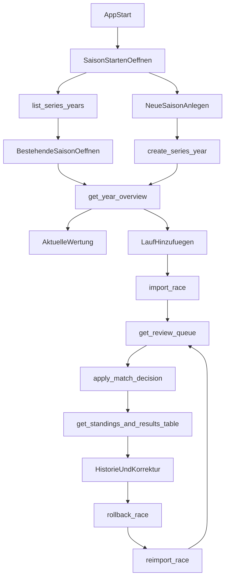

# F05 Frontend Implementation Plan (Reactive German GUI)

## Requirement and Milestone Mapping
- Supports **R6** (interactive review/override before merge) and **R8** (German GUI), and reinforces **R1/R3/R4/R5** via guided workflows.
- Primary milestone impact: **M4** (German UI integration), with hardening gates for **M5**.
- Source alignment:
  - [c:\Users\andre\VSCode_Projects\stundenlauf\PROJECT_PLAN.md](c:\Users\andre\VSCode_Projects\stundenlauf\PROJECT_PLAN.md)
  - [c:\Users\andre\VSCode_Projects\stundenlauf\docs\features\F05-german-ui-and-review-workflow.md](c:\Users\andre\VSCode_Projects\stundenlauf\docs\features\F05-german-ui-and-review-workflow.md)
  - [c:\Users\andre\VSCode_Projects\stundenlauf\docs\api\ui-api-v1.md](c:\Users\andre\VSCode_Projects\stundenlauf\docs\api\ui-api-v1.md)

## Product Principles for Elderly, Non-Technical Users
- Keep one clear primary action per screen section (no dense control clusters).
- Use plain German labels and short helper text directly near inputs/actions.
- Prefer stable layout and predictable positions over dynamic rearrangements.
- Minimize required typing; default to selection buttons and guided steps.
- Use high-contrast, large base typography, generous row heights, and explicit feedback states (`Lädt...`, `Erfolgreich`, `Bitte prüfen`).

## UX and Layout Strategy (FHD-first, scalable)
- Default viewport target: `1920x1080` full-screen desktop.
- 3-zone app shell:
  - Header: season/year context, global status, simple navigation.
  - Main: tabular content and workflows.
  - Side panel/drawer: contextual details and hints.
- Responsive scaling rules:
  - FHD baseline with CSS `clamp()` for font/spacing to scale up gracefully for higher resolutions.
  - Max readable content width and sticky table headers/first columns for large datasets.
  - Avoid tiny icon-only actions; always pair icon with text.

## Information Architecture and Navigation
- Startup entry point (before main shell):
  - `Saison starten/öffnen` (landing screen)
  - primary actions: `Bestehende Saison öffnen` and `Neue Saison anlegen`
  - only after season selection/creation does user enter main app views
- Top-level views:
  - `Aktuelle Wertung`
  - `Lauf hinzufügen`
  - `Historie & Korrektur`
- Persistent quick context in header:
  - selected `series_year`
  - active category
  - open review count (`Prüfungen offen`)
- Preserve in-progress state when switching views (especially merge review queue progress).

## Frontend Architecture and Technology Plan
- Build a web frontend (TypeScript, component-based reactive UI) embedded in pywebview.
- Add a thin frontend API client that only talks to the v1 envelope contract (`api_version`, `request_id`, `method`, `payload`).
- Adopt a central state layer for:
  - workspace/year overview
  - active category tables
  - import + review wizard state
  - timeline and rollback/reimport actions
- Introduce shared design tokens for typography, spacing, contrast, focus states, and table density.

## API-Driven Screen Flows
- Startup/season lifecycle:
  - `list_series_years()` to show available year-series datasets
  - `create_series_year(series_year, display_name?)` to initialize new empty season
  - `get_year_overview(series_year)` after open/create to bootstrap shell
- Initial load:
  - `get_year_overview(series_year)`
  - optional `list_categories(series_year)` for fast refreshes
- Standings/table views:
  - `get_standings(category_key)`
  - `get_category_current_results_table(category_key, max_races?)`
- Review workflow:
  - `import_race(file_path, series_year, source_type?)`
  - `get_review_queue(race_event_uid?)`
  - `get_match_candidate(candidate_uid)`
  - `apply_match_decision(...)`
- Correction workflow:
  - `get_year_timeline(series_year, limit?)` and `get_audit_timeline(...)`
  - `rollback_race(race_event_uid, reason?)`
  - `reimport_race(previous_race_event_uid, file_path, series_year)`

## Detailed UI Modules
- `AppShell`
  - Full-screen layout, navigation tabs, persistent status strip.
- `SeasonEntryView`
  - launch screen with two large actions: open existing season or create new season.
  - simple German helper text explaining that a season includes both singles and couples results.
  - clear empty-state guidance when no season exists yet (`Neue Saison anlegen` as only primary CTA).
- `YearDashboardHeader`
  - Year totals, review queue badge, last import indicator.
- `StandingsTableView`
  - Sortable/filterable ranking table with wide-tabular readability.
  - Inline explanation row: how totals/points are derived.
- `CurrentResultsMatrix`
  - Race columns (`lauf_1..lauf_n`) + cumulative totals.
  - Sticky header and first identity columns (`Name`, `Jahrgang`, `Verein`).
- `ImportWizard`
  - Step 1 file selection, Step 2 import result, Step 3 review queue.
- `MergeResolutionDialog`
  - Field-by-field choose left/right/manual value for typo correction.
  - Preview block: `Vorher` vs `Nachher` with explicit confirm button.
- `HistoryTimelinePanel`
  - Imports, decisions, rollbacks, reimports with UID trace links.
- `RollbackReimportDialog`
  - Impact summary before rollback and guided reimport immediately after.

## “Add New Race Data” Workflow (Detailed)
- Preconditions:
  - user has opened an existing season or created a new one from `SeasonEntryView`.
- User enters `Lauf hinzufügen` and selects file path.
- Show immediate pre-check hints:
  - expected file type and year
  - what happens next in simple German
- On `import_race` success:
  - If no review queue: show success and auto-refresh standings.
  - If review required: open queue with confidence grouping (`hoch`, `mittel`, `niedrig`).
- Queue UX details:
  - one candidate card at a time + progress indicator (`3 von 12`).
  - always-visible `Überspringen` and `Jetzt übernehmen` actions.
  - keyboard optional, mouse-first default.

## “Merge Typoed Participants” Workflow (Detailed)
- For each review item, fetch details via `get_match_candidate(candidate_uid)`.
- Show side-by-side fields:
  - Existing identity (left)
  - New import row (right)
- Per field (`Name`, `Verein`, optional `Jahrgang`) user can:
  - keep left value
  - keep right value
  - enter manual correction text
- Require explicit confirmation with short rationale choices (`Schreibfehler`, `Verein aktualisiert`, `anderes`).
- Submit via `apply_match_decision(...)`, then immediately remove item from queue and load next.
- Provide undo guidance at workflow level: if wrong merge impacts race, use race rollback/reimport from history.

## Season Entry and Lifecycle Workflow (Detailed)
- Launch app into `SeasonEntryView` every session.
- Path A (`Bestehende Saison öffnen`):
  - show list from `list_series_years()` with year, latest update timestamp, race count, open review count.
  - user selects season and presses `Öffnen`; app loads `get_year_overview(series_year)` and enters shell.
- Path B (`Neue Saison anlegen`):
  - ask only for required `Jahr` and optional display name.
  - on confirm, call `create_series_year(series_year, display_name?)`.
  - after creation, route user directly to `Lauf hinzufügen` with first-import helper text.
- Empty-system case:
  - if `list_series_years()` returns none, show a single clear CTA for creating first season.
- Guardrails:
  - no implicit season switching; require explicit user action from header season picker.
  - show unsaved review warning before changing season context.

## Text and Hint System (German Copy Guidance)
- Use short, direct UI copy patterns:
  - action-first button labels (`Lauf importieren`, `Zusammenführung bestätigen`)
  - concise helper lines (1 sentence max near controls)
- Add contextual “Was bedeutet das?” micro-hints for:
  - confidence levels
  - points and distance totals
  - rollback consequences
- Standardize error-to-message-key mapping from API errors (`VALIDATION_ERROR`, `MATCH_CONFLICT`, etc.) to plain German remediation text.

## Final German UI Copy (Review Draft)
- Tone and style rules:
  - Use formal polite address (`Sie`), short sentences, and action-first wording.
  - Prefer common words over technical terms; avoid abbreviations where possible.
  - Keep confirmation prompts explicit about impact and next step.

- App title and startup:
  - App title: `Stundenlauf-Auswertung`
  - Startup headline: `Saison öffnen oder neu anlegen`
  - Startup helper: `Wählen Sie eine vorhandene Saison oder legen Sie eine neue Saison an.`
  - Existing season card title: `Bestehende Saison öffnen`
  - Existing season button: `Saison öffnen`
  - New season card title: `Neue Saison anlegen`
  - New season button: `Neue Saison erstellen`
  - Empty-state headline (no seasons): `Noch keine Saison vorhanden`
  - Empty-state helper: `Legen Sie zuerst eine Saison an, um Läufe zu importieren und Auswertungen anzuzeigen.`
  - Empty-state CTA: `Erste Saison anlegen`

- Header and navigation:
  - Year label: `Saison`
  - Review badge label: `Prüfungen offen`
  - Last import label: `Letzter Import`
  - Nav tab 1: `Aktuelle Wertung`
  - Nav tab 2: `Lauf hinzufügen`
  - Nav tab 3: `Historie & Korrektur`
  - Season switch action: `Saison wechseln`
  - Unsaved-review warning title: `Prüfung noch nicht abgeschlossen`
  - Unsaved-review warning body: `Sie haben noch nicht übernommene Prüfungen. Möchten Sie die Saison trotzdem wechseln?`
  - Unsaved-review buttons: `Trotzdem wechseln` / `Abbrechen`

- Season creation dialog:
  - Dialog title: `Neue Saison anlegen`
  - Year field label: `Jahr`
  - Year field hint: `Beispiel: 2026`
  - Optional name label: `Bezeichnung (optional)`
  - Optional name placeholder: `z. B. Stundenlauf 2026`
  - Confirm button: `Saison anlegen`
  - Cancel button: `Abbrechen`
  - Validation (year missing): `Bitte geben Sie ein Jahr ein.`
  - Validation (year invalid): `Bitte geben Sie ein gültiges Jahr ein.`
  - Success toast: `Saison wurde angelegt. Sie können jetzt den ersten Lauf importieren.`

- Standings view (`Aktuelle Wertung`):
  - View headline: `Aktuelle Wertung`
  - Category selector label: `Kategorie`
  - Table empty title: `Noch keine Ergebnisse vorhanden`
  - Table empty helper: `Importieren Sie einen Lauf, damit die Wertung angezeigt werden kann.`
  - Column labels: `Platz`, `Name`, `Jahrgang`, `Verein`, `Gesamtdistanz (km)`, `Gesamtpunkte`
  - Detail drawer title: `Details zur Wertung`
  - Detail labels: `Teilnehmer-ID`, `Team-ID`, `Verwendete Läufe`, `Regelwerk`, `Zuletzt berechnet`
  - Inline explainer trigger: `Was bedeuten Punkte und Distanz?`
  - Inline explainer text: `Die Gesamtwertung basiert auf den importierten Läufen und dem aktuellen Regelwerk.`

- Current results matrix:
  - Section title: `Laufübersicht je Kategorie`
  - Header pattern: `Lauf {n}`
  - Cell no-value placeholder: `—`
  - Cell not-counted hint: `Zählt nicht zur Gesamtwertung`
  - Footer hint: `Alle Werte werden nach jeder Änderung automatisch neu berechnet.`

- Add race (`Lauf hinzufügen`) workflow:
  - View headline: `Lauf hinzufügen`
  - Step 1 title: `1. Datei auswählen`
  - File label: `Ergebnisdatei`
  - File button: `Datei auswählen`
  - Source type label: `Lauftyp`
  - Source type options: `Einzel` / `Paare` / `Automatisch erkennen`
  - Precheck hint: `Bitte wählen Sie die Ergebnisdatei des aktuellen Laufs aus.`
  - Import button: `Lauf importieren`
  - Import in progress: `Import läuft...`
  - Import success no-review: `Import abgeschlossen. Keine Prüfung erforderlich.`
  - Import success with-review: `Import abgeschlossen. Bitte prüfen Sie offene Zuordnungen.`
  - Import summary labels: `Importierte Zeilen`, `Betroffene Läufe`, `Offene Prüfungen`

- Review queue and candidate handling:
  - Queue headline: `Zusammenführungen prüfen`
  - Queue progress: `Prüfung {current} von {total}`
  - Confidence labels: `Hohe Übereinstimmung`, `Mittlere Übereinstimmung`, `Niedrige Übereinstimmung`
  - Confidence explainer trigger: `Was bedeutet die Übereinstimmung?`
  - Confidence explainer text: `Die Übereinstimmung zeigt, wie wahrscheinlich eine korrekte Zuordnung ist. Bitte prüfen Sie jeden Vorschlag sorgfältig.`
  - Candidate section titles: `Vorhandener Eintrag` / `Neuer Eintrag`
  - Actions: `Überspringen`, `Als gleich übernehmen`, `Nicht gleich`
  - Queue empty title: `Keine offenen Prüfungen`
  - Queue empty helper: `Alle Zuordnungen sind abgeschlossen.`

- Merge resolution dialog:
  - Dialog title: `Zusammenführung bestätigen`
  - Dialog helper: `Wählen Sie pro Feld den richtigen Wert oder geben Sie eine Korrektur ein.`
  - Field chooser labels: `Wert links behalten`, `Wert rechts behalten`, `Manuell eingeben`
  - Manual input placeholder name: `Korrigierten Namen eingeben`
  - Manual input placeholder club: `Korrigierten Verein eingeben`
  - Rationale label: `Grund`
  - Rationale options: `Schreibfehler`, `Verein aktualisiert`, `Namensänderung`, `Sonstiges`
  - Rationale free text placeholder: `Optionaler Hinweis`
  - Preview title: `Vorschau`
  - Preview labels: `Vorher`, `Nachher`
  - Confirm button: `Zusammenführung bestätigen`
  - Secondary button: `Zurück zur Prüfung`
  - Validation name missing: `Bitte geben Sie einen Namen an.`
  - Success toast: `Zusammenführung wurde übernommen.`

- History and correction:
  - View headline: `Historie & Korrektur`
  - Timeline title: `Änderungsverlauf`
  - Timeline filters: `Alle Ereignisse`, `Importe`, `Prüfentscheidungen`, `Rücknahmen`, `Erneute Importe`
  - Event labels: `Lauf importiert`, `Prüfentscheidung gespeichert`, `Lauf zurückgenommen`, `Lauf erneut importiert`
  - Race detail labels: `Lauf-ID`, `Zeitpunkt`, `Kategorie`, `Status`
  - Rollback action: `Lauf zurücknehmen`
  - Reimport action: `Korrigierten Lauf importieren`

- Rollback/reimport dialog:
  - Rollback title: `Lauf wirklich zurücknehmen?`
  - Rollback body: `Die Ergebnisse dieses Laufs werden aus der Wertung entfernt und anschließend neu berechnet.`
  - Rollback impact label: `Auswirkungen`
  - Rollback impact text: `Betroffene Wertungen werden sofort aktualisiert. Der Vorgang wird in der Historie protokolliert.`
  - Rollback confirm: `Ja, Lauf zurücknehmen`
  - Rollback cancel: `Abbrechen`
  - Rollback success: `Lauf wurde zurückgenommen.`
  - Reimport prompt: `Möchten Sie jetzt eine korrigierte Datei importieren?`
  - Reimport confirm: `Ja, jetzt importieren`
  - Reimport later: `Später`

- Global statuses and empty/error/loading states:
  - Loading: `Lädt...`
  - Saving: `Speichert...`
  - Recalculating: `Wertung wird neu berechnet...`
  - Generic success: `Erfolgreich gespeichert.`
  - Generic error title: `Aktion konnte nicht abgeschlossen werden`
  - Generic retry: `Bitte versuchen Sie es erneut.`
  - Not found (file): `Datei wurde nicht gefunden. Bitte wählen Sie die Datei erneut aus.`
  - Validation error: `Eingaben sind unvollständig oder ungültig.`
  - Conflict error: `Es gibt einen Konflikt in den Zuordnungen. Bitte prüfen Sie die betroffenen Einträge.`
  - Race not found: `Der ausgewählte Lauf wurde nicht gefunden. Bitte aktualisieren Sie die Ansicht.`
  - Internal error: `Ein unerwarteter Fehler ist aufgetreten.`

- Accessibility-oriented copy details:
  - Keep button labels at most 3-4 words when possible.
  - Avoid ambiguous verbs like `OK`; use explicit actions (`Importieren`, `Bestätigen`, `Zurücknehmen`).
  - Use repeated phrasing patterns for confidence and confirmation to reduce cognitive load.

## Performance, Reliability, and Accessibility Targets
- UI latency target after command completion: standings refresh perceived within ~2 seconds on typical dataset.
- Prevent duplicate submissions with disabled-in-flight actions and clear spinner labels.
- Keep table interactions smooth for larger seasons (virtualization if needed after profiling).
- Accessibility baseline:
  - high contrast,
  - large focus outlines,
  - minimum clickable target sizes,
  - readable default text sizing suitable for older eyes.

## Implementation Phases
- Phase 1: Implement season entry/lifecycle screen and API support (`list_series_years`, `create_series_year`), then scaffold shell + bridge client + global state.
- Phase 2: Deliver read-only views (`Aktuelle Wertung`, results matrix, overview header).
- Phase 3: Deliver import + review + merge dialog workflow end-to-end.
- Phase 4: Deliver history timeline + rollback/reimport guided flow.
- Phase 5: UX hardening for elderly users, copy pass, and performance tuning.
- Phase 6: Integration regression testing and release-readiness docs updates.

## Validation and Test Plan
- Component/state tests:
  - startup flow routes correctly for open existing vs create new season
  - no-season empty state shows single primary create action
  - navigation state persistence
  - table rendering by category
  - merge dialog field resolution payload integrity
- Integration tests with API fixtures:
  - create season -> first import -> standings bootstrap
  - open existing season with singles + couples data preloaded
  - import -> review -> decision -> standings refresh
  - rollback -> reimport -> queue continuity
  - year timeline and UID trace visibility
- UAT/manual checks with target users:
  - complete common tasks without guidance
  - complete import + review in KPI target window (< 5 min typical case)
  - confirm clarity of German hint texts and error messages

## Risks, Assumptions, and Mitigations
- Assumption: pywebview desktop shell remains target runtime.
- Risk: Users misinterpret merge confidence.
  - Mitigation: explicit explanatory text and no silent auto-merge in review route.
- Risk: rollback anxiety/confusion.
  - Mitigation: impact preview + guided immediate reimport path.
- Risk: table density overwhelms users.
  - Mitigation: progressive disclosure (basic default, details on demand).

## Documentation and Project Workflow Updates Required at Completion
- Update [c:\Users\andre\VSCode_Projects\stundenlauf\docs\features\F05-german-ui-and-review-workflow.md](c:\Users\andre\VSCode_Projects\stundenlauf\docs\features\F05-german-ui-and-review-workflow.md) from planned to implemented, including final UI decisions.
- Add outcome-focused entry to [c:\Users\andre\VSCode_Projects\stundenlauf\docs\ACCOMPLISHMENTS.md](c:\Users\andre\VSCode_Projects\stundenlauf\docs\ACCOMPLISHMENTS.md).
- Update requirement/milestone progress in [c:\Users\andre\VSCode_Projects\stundenlauf\PROJECT_PLAN.md](c:\Users\andre\VSCode_Projects\stundenlauf\PROJECT_PLAN.md) (R6/R8, M4/M5 status).