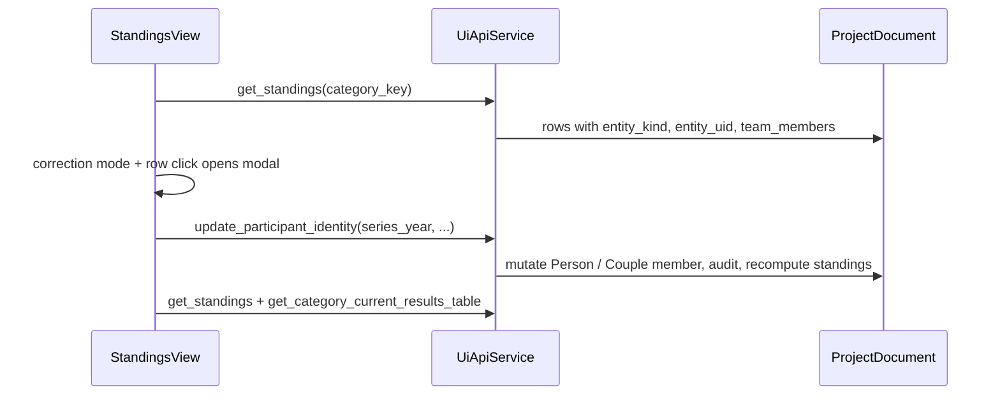

# F10: Standings identity correction (single modal, stacked forms)

## Requirements mapping

- Supports [PROJECT_PLAN.md](c:\Users\andre\VSCode_Projects\stundenlauf\PROJECT_PLAN.md) **R6** / **R8** and **M5**; implements [docs/features/F10-standings-identity-correction-ui.md](c:\Users\andre\VSCode_Projects\stundenlauf\docs\features\F10-standings-identity-correction-ui.md) with your UX choice: **one modal**, **two stacked sub-forms** for couples.

## Architecture (data flow)

## 1. Backend: enrich `get_standings` rows for teams

**Goal:** The GUI must not parse `"1987 / 1992"` or `"Name A / Name B"` strings. F10 already recommends a structured payload.

**Where:** [backend/ui_api/queries.py](c:\Users\andre\VSCode_Projects\stundenlauf\backend\ui_api\queries.py) in `_table_by_category_key`, where each row dict is built (today: `platz`, `entity_kind`, `entity_uid`, `display_name`, `yob`, `club`, totals, `contribution_by_race`).

**Change:**

- When `row.entity_kind == "team"` (verify exact enum/string used in `StandingsRow`—same as existing `display_name_for_row` branch), resolve `Couple` via `teams_by_uid(document)[row.entity_uid]` and set:

  `team_members`: ordered list, e.g. `[{ "member": "a", "name", "yob", "club" }, { "member": "b", ... }]` using the live `Person` objects on the couple (`None` club as empty string or omit—pick one and document).

- When `entity_kind` is participant, **omit** `team_members` (or `null`) to keep payload small.

**Docs:** Extend [docs/api/ui-api-v1.md](c:\Users\andre\VSCode_Projects\stundenlauf\docs\api\ui-api-v1.md) under `get_standings` / response rows with the new optional field.

**Tests:** Add or extend a case next to [tests/test_f08_ui_api.py](c:\Users\andre\VSCode_Projects\stundenlauf\tests\test_f08_ui_api.py) `test_get_standings_returns_member_yobs_for_couples` to assert `team_members` length 2, correct `member` keys, and names/YOB/clubs match the fixture couple. Run `uv run pytest` (project rule).

**Reuse:** Prefer using existing [backend/ui_api/mappers.py](c:\Users\andre\VSCode_Projects\stundenlauf\backend\ui_api\mappers.py) `teams_by_uid` / `people_by_uid` rather than duplicating lookup logic inline.

## 2. Frontend shell: modal host + styles

**Gap:** [frontend/index.html](c:\Users\andre\VSCode_Projects\stundenlauf\frontend\index.html) has no dialog; [frontend/styles.css](c:\Users\andre\VSCode_Projects\stundenlauf\frontend\styles.css) has cards/tables but no overlay.

**Add a persistent modal scaffold** (recommended over pure `innerHTML` on `#app` so z-index and focus stay predictable):

- In `index.html`, inside `#app` (e.g. after `main`): a `div` root such as `id="identityCorrectionModal"` with class `hidden`, containing:
  - backdrop (click closes)
  - panel with title area, body (forms injected by JS), footer with **Schließen** / **Abbrechen**
- In `styles.css`: tokens consistent with existing `--surface`, `--border`, `--accent`, `--danger`; fullscreen semi-transparent backdrop; centered panel with `max-width`, scrollable body, stacked sections.

**Behavior (implement in JS):** `openIdentityModal()` / `closeIdentityModal()`; backdrop + close button call close; **Escape** key listener when open (register once, guard with `modal.classList.contains("hidden")`).

## 3. Strings (German only in catalog)

**Where:** [frontend/strings.js](c:\Users\andre\VSCode_Projects\stundenlauf\frontend\strings.js) under a new object e.g. `standingsIdentity` or nested under `standings`:

- Mode toggle: e.g. “Identität korrigieren” / “Korrekturmodus beenden”
- Modal title, member headings (“Läufer A”, “Läufer B”), field labels (reuse `standings.thName` etc. if appropriate or alias), hints (F09 Excel mismatch one-liner), buttons (“Speichern”, “Abbrechen”), success line (“Änderung gespeichert.”), client validation messages (empty name, YOB not integer, YOB out of range)
- Optional: `yobRangeHint` using template with min/max—**min/max should match** [backend/domain/identity.py](c:\Users\andre\VSCode_Projects\stundenlauf\backend\domain\identity.py) `yob_bounds()` (1900 … `currentUTCYear + 1`). JS can use `new Date().getUTCFullYear() + 1` for parity with server.

## 4. State and `renderStandingsView` changes

**Where:** [frontend/app.js](c:\Users\andre\VSCode_Projects\stundenlauf\frontend\app.js) — `state` object (~line 39) and `renderStandingsView` (~555–633).

**State additions:**

- `standingsCorrectionMode: boolean` (default `false`)
- Optional: `identityModalContext: null | { kind, entityUid, teamUid, rowsSnapshot }` only if needed; alternatively pass context only when opening modal from click payload.

**Correction mode toggle:**

- Render a control in the **Aktuelle Wertung** card header (next to title/hint): `button` or `label`+checkbox that flips `standingsCorrectionMode` and re-renders. When `true`, set status hint or subtle banner using strings (non-blocking).

**Standings table rows:**

- After `get_standings`, each row already includes `entity_kind`, `entity_uid` from API; **persist full row objects** in a parallel array or attach via `data-*` JSON (escape carefully) — simplest robust approach: **event delegation** on `tbody` using `data-row-index` on `<tr>` and a closure array `lastStandingsRows` set during render (avoids huge attributes).

- When `standingsCorrectionMode` is true: add a class on `<tr>` for pointer cursor + hover; **ignore clicks** when false.

**Click handler:** On row click in correction mode, read indexed row, call `openIdentityModal(row)`.

## 5. Modal content: singles vs stacked couple forms

**Singles (`entity_kind === "participant"`):**

- One `<fieldset>` (or section) with inputs: name (text), club (text), yob (number input).
- Single primary **Speichern** → `update_participant_identity` with `{ series_year: state.seriesYear, participant_uid: row.entity_uid, name, yob, club }` where `club` is trimmed string or omitted if empty per API (F09: empty clears—match [docs/api/ui-api-v1.md](c:\Users\andre\VSCode_Projects\stundenlauf\docs\api\ui-api-v1.md)).

**Teams (`entity_kind === "team"`):**

- **Two stacked sub-forms** in one modal (same panel, vertical stack):
  - Section “Läufer A”: name, club, yob + **Speichern** button scoped to `member: "a"`
  - Section “Läufer B”: same for `member: "b"`
- Pre-fill from `row.team_members` (required after backend change). If `team_members` missing (old backend), show error in modal or disable save—should not happen once shipped.

**Per-section save (recommended):** Each **Speichern** issues **one** API call with `{ series_year, team_uid: row.entity_uid, member: "a"|"b", name, yob, club }`. On success: `setStatus` success string, **optional** refresh of that member’s inputs from response is unnecessary if you immediately call `await renderStandingsView()` to reload tables (closes modal or leaves open—**recommend close modal** after any successful save for simpler state; user re-opens for second member if needed). Alternative: keep modal open and refresh snapshot from new `get_standings` for the same row index—more work; **v1: close on success** is acceptable per F10 (“two calls only if user edits both members sequentially”).

**Client validation before API:** Non-empty `name`; `yob` integer in `[1900, utcYear+1]`; show German errors in modal inline or via `setStatus(..., true)`.

**Server errors:** Reuse [getApiErrorMessage](c:\Users\andre\VSCode_Projects\stundenlauf\frontend\app.js) (~166); extend mapping if `VALIDATION_ERROR` messages are too English—prefer mapping known `error.code` in `strings.js` if needed.

## 6. Refresh after mutation

After successful `update_participant_identity`:

- `await renderStandingsView()` so standings + **Laufübersicht** table both refresh (same function already loads `get_category_current_results_table`).
- Preserve `state.selectedCategory` and `standingsCorrectionMode` across re-render.

## 7. Definition of done (repo hygiene)

When implementing (post-review):

- Mark [F10-standings-identity-correction-ui.md](c:\Users\andre\VSCode_Projects\stundenlauf\docs\features\F10-standings-identity-correction-ui.md) status **Done** and check off acceptance criteria.
- Add entry to [docs/ACCOMPLISHMENTS.md](c:\Users\andre\VSCode_Projects\stundenlauf\docs\ACCOMPLISHMENTS.md).
- Update [PROJECT_PLAN.md](c:\Users\andre\VSCode_Projects\stundenlauf\PROJECT_PLAN.md) current phase / delivery line to mention F10 GUI shipped.

## Out of scope (per F10)

- `get_category_current_results_table` row `entity_uid` (optional follow-up).
- Undo beyond audit timeline; gender edit.
