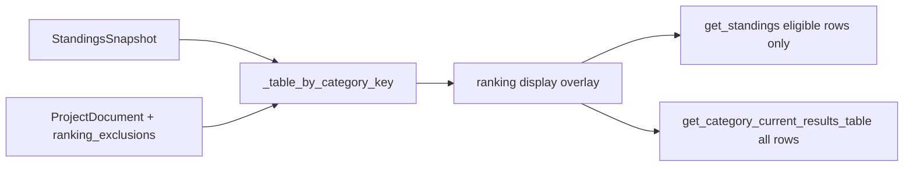

# F15: Ranking eligibility (Außer Wertung) — execution plan

Use this document when implementing F15. It merges the original technical plan with the **revised two-table UX** (final table = eligible only; overview = everyone + checkboxes).

---

## Product intent (authoritative for implementation)

- **Außer Wertung** = excluded from **official final placement** (Endwertung), not removed from result data.
- **Table 1 — Aktuelle Wertung:** **Only** ranking-eligible entities. **Excluded entities do not appear** (no row, no Platz, no checkbox).
- **Table 2 — Laufübersicht je Kategorie:** **All** entities in the category (per-race + cumulative). **Außer Wertung** checkboxes **only** here. Eligible rows get sequential **Platz** among eligible only; excluded rows show **no ranking Platz** (`null` in JSON → e.g. **"—"** or **"a. W."** in UI — pick one in `frontend/strings.js`).

Informal wording like “excluded from voting” means this **ranking exclusion**, not a separate voting feature.

**Spec sync:** [docs/features/F15-ranking-eligibility-exclusions.md](docs/features/F15-ranking-eligibility-exclusions.md) currently assumes the same placement logic on both tables. **Update that doc on delivery** so acceptance criteria match this plan.

---

## Requirements / milestones

- [PROJECT_PLAN.md](PROJECT_PLAN.md): **R5** (rankings), **R8** (German GUI), **M5** hardening.

---

## Architecture

- **Standings snapshot unchanged:** `compute_standings_snapshot` / `recompute_project_standings` stay as today.
- **Exclusions are a thin overlay** on the project document, applied only when building UI DTOs (no recompute on checkbox toggle).
- **Persistence:** optional `ranking_exclusions` on `ProjectDocument`; JSON-friendly `dict[str, list[str]]` on disk (`category_key` → excluded `entity_uid`s).

---

## API contract (target)

| Method | Row set | `platz` | Other row fields |
|--------|---------|---------|------------------|
| `get_standings` | **Eligible only** | `1..n` over returned rows | Existing fields + keep `entity_uid`, `entity_kind`, `team_members` as today |
| `get_category_current_results_table` | **All** in category | Eligible: `1..n` among eligible; excluded: `null` | Add `entity_uid`, `entity_kind`, `ausser_wertung` (checked ⇒ excluded) |

**New command:** `set_ranking_eligibility`

- Payload: `category_key` (required), `entity_uid` (required), `ausser_wertung` (required bool). **`true`** = excluded (checkbox checked).
- Load doc → update exclusion set for `category_key` → save. **No** standings recompute.

**Reset on import:** After a **successful** merge in [`import_excel_into_project`](backend/ingestion/service.py) (right before `repo.save`), clear **`ranking_exclusions` entirely** for that project file (one year per file → full map clear). Covers GUI `import_race`, CLI, and `reimport_race`’s final import. **Do not** clear on rollback-only saves unless product changes.

**F12 season zip:** Export embeds full project JSON → **`ranking_exclusions` travels with backup** automatically. Document in `docs/api/ui-api-v1.md`. **Do not** strip on import unless explicitly decided otherwise.

**Unknown UIDs** in stored map: ignore at query time; optional log on load (per F15).

---

## Code touch list

| Area | Files |
|------|--------|
| Domain | [backend/domain/models.py](backend/domain/models.py) — `ProjectDocument.ranking_exclusions` |
| Persistence | [backend/storage/schema_v2.py](backend/storage/schema_v2.py) — `ranking_exclusions` key round-trip |
| Overlay | New e.g. [backend/ui_api/ranking_display.py](backend/ui_api/ranking_display.py) **or** helpers in [backend/ui_api/queries.py](backend/ui_api/queries.py) |
| Queries | [backend/ui_api/queries.py](backend/ui_api/queries.py) — `get_standings`, `get_category_current_results_table`, `_table_by_category_key` integration |
| Commands | [backend/ui_api/commands.py](backend/ui_api/commands.py) — `set_ranking_eligibility` |
| Service | [backend/ui_api/service.py](backend/ui_api/service.py) — register method |
| Import | [backend/ingestion/service.py](backend/ingestion/service.py) — clear exclusions before save on successful import |
| Tests | [tests/test_f08_ui_api.py](tests/test_f08_ui_api.py) and/or new module; schema round-trip if needed |
| Frontend | [frontend/app.js](frontend/app.js), [frontend/strings.js](frontend/strings.js), [frontend/styles.css](frontend/styles.css) |
| Docs | [docs/api/ui-api-v1.md](docs/api/ui-api-v1.md), [docs/features/F15-ranking-eligibility-exclusions.md](docs/features/F15-ranking-eligibility-exclusions.md), [docs/ACCOMPLISHMENTS.md](docs/ACCOMPLISHMENTS.md), [PROJECT_PLAN.md](PROJECT_PLAN.md) |

---

## Implementation order

1. **Domain + schema:** Add field with default empty; `to_dict` / `from_dict`; backward compatible missing key → `{}`. Small round-trip test.
2. **Pure overlay:** From ordered snapshot rows + exclusion set for `category_key`: compute `ausser_wertung`, effective `platz` for full list; derive eligible-only list with `platz` 1..n. Unit tests: none / one / many excluded; tie order preserved; all excluded (overview still has rows, `platz` all `null`; standings returns `[]` or empty rows).
3. **`get_standings`:** Use overlay → **filter out** excluded → return.
4. **`get_category_current_results_table`:** Use overlay → return **all** rows with `entity_uid`, `entity_kind`, `ausser_wertung`, effective `platz`.
5. **`set_ranking_eligibility`:** Validate category; optionally validate `entity_uid` appears in category standings; persist.
6. **`import_excel_into_project`:** `ranking_exclusions = {}` (or equivalent) before `repo.save` on success path only.
7. **Frontend:** Table 1 — render API rows as today (no checkbox). Table 2 — add **Außer Wertung** column (header **"a. W."** + full term in `title`/`aria-label`); checkbox → `set_ranking_eligibility` → refresh; `platz === null` → sentinel. Optional muted style for excluded rows.
8. **Docs + changelog:** API doc, F15 feature doc, accomplishments, PROJECT_PLAN delivery line for F15.

---

## F10 identity correction (scope note)

Correction mode is tied to **Aktuelle Wertung** (table 1). Excluded athletes **only** appear in table 2.

- **Ship default:** Document that operators **uncheck Außer Wertung** to bring the row back into table 1 for identity correction.
- **Follow-up (optional):** Row action on table 2 to open the same modal without toggling exclusion.

---

## Risks (from F15)

- CLI / exports that read raw snapshot `platz` may disagree with GUI until they use the same rules — document.
- Season restore restores exclusions with data — intentional if backup includes them.

---

## Definition of done

- [ ] Code + tests (`uv run pytest`) green  
- [ ] `docs/api/ui-api-v1.md` updated  
- [ ] `docs/features/F15-ranking-eligibility-exclusions.md` aligned with two-table behavior  
- [ ] `docs/ACCOMPLISHMENTS.md` entry  
- [ ] `PROJECT_PLAN.md` mentions F15 in delivery / changelog if appropriate  

---

## Execution checklist (todos)

- [ ] Domain + schema: `ranking_exclusions` + round-trip test  
- [ ] Overlay helper + unit tests (eligible-only vs full annotated rows)  
- [ ] `get_standings` (eligible-only, Platz 1..n) + `get_category_current_results_table` (all + `ausser_wertung` + Platz)  
- [ ] `set_ranking_eligibility` + `service.py` registration  
- [ ] Clear `ranking_exclusions` on successful `import_excel_into_project`  
- [ ] Frontend: table 2 checkbox column, strings, styles, API wiring; sentinel for null Platz  
- [ ] Integration tests: subset/superset row sets, Platz consistency, toggle + import reset  
- [ ] API doc, F15 feature doc, ACCOMPLISHMENTS, PROJECT_PLAN; identity-correction note  
