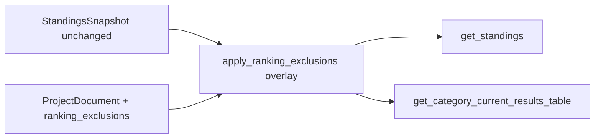

# F15: Ranking eligibility (Außer Wertung) — implementation plan

## Mapping to project goals

- **[PROJECT_PLAN.md](PROJECT_PLAN.md):** Supports **R5** (transparent, configurable presentation of rankings) and **R8** (German GUI). Fits **M5** hardening / first production use.
- **Feature spec:** [docs/features/F15-ranking-eligibility-exclusions.md](docs/features/F15-ranking-eligibility-exclusions.md) — canonical requirements and acceptance criteria.

## Current baseline (code)

- [`ProjectDocument`](backend/domain/models.py) has no exclusion field; standings live in `standings` only.
- [`_table_by_category_key`](backend/ui_api/queries.py) builds rows with snapshot `platz` plus `entity_uid` / `entity_kind`; [`get_category_current_results_table`](backend/ui_api/queries.py) **drops** `entity_uid` / `entity_kind` when mapping to API rows (lines 188–197) — F15 requires adding them back.
- Persistence: [`schema_v2.to_dict` / `from_dict`](backend/storage/schema_v2.py) — add optional top-level key (e.g. `ranking_exclusions`).
- Successful merge always persists via [`import_excel_into_project`](backend/ingestion/service.py) (`repo.save` after `recompute_project_standings`) — single hook for **reset exclusions** on real import (covers GUI `import_race`, CLI, and `reimport_race` after rollback save).
- Season zip is **raw project JSON** in [`export_series_year`](backend/ui_api/workspace.py); once the field is on `ProjectDocument` + schema, it **travels with backup** unless explicitly stripped — recommend **include and document** (simplest, matches portable backup expectations).

## Design decisions (lock these in)

| Topic | Choice |
|--------|--------|
| Storage shape | `ranking_exclusions: dict[str, frozenset[str]]` on `ProjectDocument` (category_key → excluded entity_uids); JSON: `{"cat_key": ["uid", ...]}` |
| API semantics | `ausser_wertung: true` = excluded from final placement (matches checkbox checked). Also expose `ranking_eligible: bool` **or** only `ausser_wertung` — pick **one** in implementation; recommend **`ausser_wertung`** + effective `platz` to avoid double negation in UI. |
| `platz` in API | **Effective** placement: integer `1..n` for eligible rows; **`null`** for excluded (frontend renders **"—"** or **"a. W."** per F15 — choose one string in [`frontend/strings.js`](frontend/strings.js) for consistency). |
| Reset scope | Clear **entire** `ranking_exclusions` map on **successful** [`import_excel_into_project`](backend/ingestion/service.py) save (project file is per season year; matches F15 “new data ⇒ fresh operator decisions”). **Do not** clear on rollback-only paths unless product asks later. |
| F12 season zip | **Include** `ranking_exclusions` in exported JSON; document in [`docs/api/ui-api-v1.md`](docs/api/ui-api-v1.md) season export section. |
| Unknown UIDs in file | On load, optional log warning; at query time ignore UIDs not in category standings rows (per F15). |

## Implementation steps

1. **Domain + schema**
   - Add `ranking_exclusions` to [`ProjectDocument`](backend/domain/models.py) with default empty.
   - Extend [`schema_v2`](backend/storage/schema_v2.py): serialize/deserialize `ranking_exclusions`; missing key → empty.
   - Add/adjust a small round-trip test (existing schema or repository tests if present).

2. **Pure overlay helper + unit tests**
   - New module e.g. [`backend/ui_api/ranking_display.py`](backend/ui_api/ranking_display.py) (or colocated in `queries.py` if kept tiny): input ordered rows (with snapshot `platz` / `entity_uid`), exclusion set for `category_key`; output rows with `platz` = sequential among eligible only, `null` for excluded; preserve relative order; handle edge case **all excluded** (no `1..n` ranks).
   - Unit tests: 0/1/many exclusions, tie order stability, unknown UID in exclusion set ignored.

3. **Wire queries**
   - Refactor [`_table_by_category_key`](backend/ui_api/queries.py) or post-process its rows through the helper using `document.ranking_exclusions.get(category_key, frozenset())`.
   - [`get_standings`](backend/ui_api/queries.py): return effective `platz`, `entity_uid`, `entity_kind`, `ausser_wertung` (and keep existing fields).
   - [`get_category_current_results_table`](backend/ui_api/queries.py): pass through same row metadata and effective `platz` so **both tables stay identical** for placement logic.

4. **Mutation command**
   - Add `set_ranking_eligibility` in [`backend/ui_api/commands.py`](backend/ui_api/commands.py): payload `category_key`, `entity_uid`, `ausser_wertung` (bool); validate category exists; optionally validate `entity_uid` appears in that category’s standings table; `replace` document map; `repo.save`; no `recompute_project_standings`.
   - Register in [`backend/ui_api/service.py`](backend/ui_api/service.py) `_dispatch`.

5. **Reset on import**
   - In [`import_excel_into_project`](backend/ingestion/service.py), after merge + recompute, **before** `repo.save`: set `ranking_exclusions` to empty (or `replace(document, ranking_exclusions={})`). Ensures CLI and UI behave the same.

6. **Frontend**
   - [`frontend/app.js`](frontend/app.js) `renderStandingsView`: first table — render `platz` with null → sentinel string; second table — add narrow first column (or after Platz per F15: **checkbox column on second card** only) with `<input type="checkbox" checked={ausser_wertung}>`; on change call `set_ranking_eligibility` then `renderStandingsView()` (or optimistic update).
   - [`frontend/strings.js`](frontend/strings.js): header **"Außer Wertung"** / short **"a. W."** + `title` / `aria-label`; per-row accessible name including participant.
   - [`frontend/styles.css`](frontend/styles.css): column width, optional muted row when excluded.

7. **Docs and project bookkeeping**
   - [`docs/api/ui-api-v1.md`](docs/api/ui-api-v1.md): `get_standings` / `get_category_current_results_table` response fields; new `set_ranking_eligibility`; import reset behavior; season zip includes exclusions.
   - On delivery: [`docs/ACCOMPLISHMENTS.md`](docs/ACCOMPLISHMENTS.md) entry; update [`PROJECT_PLAN.md`](PROJECT_PLAN.md) delivery line to mention **F15** (and mark F15 status in feature doc).

## Test plan

- **Unit:** overlay helper scenarios above.
- **Integration ([`tests/test_f08_ui_api.py`](tests/test_f08_ui_api.py) or new file):**  
  - After toggle, `get_standings` and `get_category_current_results_table` rows match on `platz` / `ausser_wertung` for same `category_key`.  
  - Import path: project with exclusions → `import_race` (or direct `import_excel_into_project` in test) → map empty.  
  - Adjust existing assertions that assume `platz` is always a number.
- **Manual:** F15 checklist in feature doc (both tables, import reset).

## Risks (from F15; mitigation)

- **Exports/CLI** still use snapshot `platz` until they call the same overlay — document in API doc; optional follow-up.
- **Reimport** triggers exclusion clear via shared ingestion path — acceptable per “fresh operator decisions” for new data.
