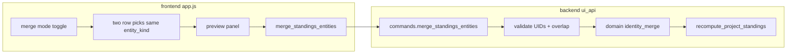

# F16: Standings manual duplicate merge — implementation plan

## Product alignment

- **Requirements:** R3 (identity across races), R6 (interactive override), R8 (German GUI).
- **Milestone:** M5 hardening / production readiness ([PROJECT_PLAN.md](c:/Users/andre/VSCode_Projects/stundenlauf/PROJECT_PLAN.md)).
- **Dependencies:** F03 audit model, F08 API, F10 correction UX pattern, F15 full Laufübersicht grid + `entity_uid` / `entity_kind` / Außer-Wertung ([queries.py `get_category_current_results_table`](c:/Users/andre/VSCode_Projects/stundenlauf/backend/ui_api/queries.py)).

## Locked product decisions (from F16 + one explicit choice)

1. **Overlap rule:** Category-scoped: only **ACTIVE** [`RaceEvent`](c:/Users/andre/VSCode_Projects/stundenlauf/backend/domain/models.py)s with `event.category.key == payload.category_key` participate in the overlap check. Build `events(uid) = { race_event_uid : … }` from entries where `participant_uid == uid` (Einzel) or `team_uid == uid` (Paar). Reject merge if `events(survivor) ∩ events(absorbed) ≠ ∅`.
2. **Eligibility (F15):** Use the **conservative** rule from the feature doc: after merge, the survivor is **Außer Wertung** for that `category_key` if **either** prior UID was excluded. Implementation: adjust that category’s exclusion set—remove `absorbed_uid`, then ensure `survivor_uid` is present iff `(survivor ∈ old_set) or (absorbed ∈ old_set)`. (Only the merge command’s `category_key` is in scope; cross-category duplicates remain out of scope per F16.)
3. **Survivor canonical fields:** Keep survivor’s `Person` / `Couple` as-is; operators use F10 afterward if display strings should match the absorbed side (optional v1.1 in F16).

## Architecture

- **Transactional command** (mirror [`update_participant_identity`](c:/Users/andre/VSCode_Projects/stundenlauf/backend/ui_api/commands.py)): `JsonProjectRepository.load` → validate → mutate document → `recompute_project_standings` → `repo.save`.

## 1. Domain layer (testable core)

Add a small module, e.g. [`backend/domain/identity_merge.py`](c:/Users/andre/VSCode_Projects/stundenlauf/backend/domain/identity_merge.py) (name can match command), containing:

- **`participation_race_uids_for_category(document, category_key, entity_uid, entity_kind) -> frozenset[str]`**  
  Iterate active events for that `category_key`; for each entry, if `entity_kind == "participant"` test `participant_uid`, else `team_uid`.

- **`assert_merge_preconditions(...)`**  
  - `survivor_uid != absorbed_uid`.  
  - Both UIDs exist in `people` or `couples` consistent with `entity_kind`.  
  - **Membership:** Both appear in the same standings universe as [`set_ranking_eligibility`](c:/Users/andre/VSCode_Projects/stundenlauf/backend/ui_api/commands.py): reuse [`_table_by_category_key`](c:/Users/andre/VSCode_Projects/stundenlauf/backend/ui_api/queries.py) / allowed `entity_uid` set (import from queries or extract a shared helper in `ui_api` if you want to avoid circular imports—prefer a thin `queries` helper or duplicate the allowed-set logic in the command only; **avoid** `domain` importing `ui_api`).

- **`merge_identities(document, survivor_uid, absorbed_uid, entity_kind) -> ProjectDocument`**  
  - **Rewrite entries:** For all events (or at least those referencing absorbed—scan `document.events`), set `participant_uid` or `team_uid` from absorbed → survivor. Use `dataclasses.replace` on `RaceEntry` / `RaceEvent` immutably.  
  - **Remap `matching_decisions`:** For every [`MatchingDecision`](c:/Users/andre/VSCode_Projects/stundenlauf/backend/domain/models.py), if `target_participant_uid == absorbed` → survivor; if `target_team_uid == absorbed` → survivor. (Replay path in [`backend/matching/workflow.py`](c:/Users/andre/VSCode_Projects/stundenlauf/backend/matching/workflow.py) resolves targets by UID; stale absorbed UIDs would break replay.)  
  - **Optional but recommended:** Remap `RaceEntryMatchMeta` on stored entries where `top_candidate_uid` or `candidate_uids` equals absorbed → survivor, so explainability JSON and review surfaces stay consistent.  
  - **Prune absorbed entity:** Remove absorbed `Person` or `Couple` from `document.people` / `document.couples`.  
  - **Orphan `Person` cleanup (Paar):** After team merge, remove `Person` rows that are no longer referenced by any `RaceEntry` (`participant_uid`) or any `Couple.member_*`, matching F16’s `collect_referenced_person_uids` idea. Be conservative: only delete if **zero** references remain.

Pure-function **unit tests** live beside existing domain tests (new file e.g. `tests/test_f16_identity_merge.py`): overlap empty vs shared race, singles vs teams, orphan cleanup, decision remapping.

## 2. `MatchingDecision` model + persistence

- Extend `MatchingDecision.kind` with **`"identity_merge"`** in [`backend/domain/models.py`](c:/Users/andre/VSCode_Projects/stundenlauf/backend/domain/models.py).
- Persist audit fields: follow F10’s pattern—set **`scope_series_year`** to the payload year; leave `race_event_uid` / `row_fingerprint` empty if no single race applies (same as [`identity_correction`](c:/Users/andre/VSCode_Projects/stundenlauf/backend/ui_api/commands.py)).
- **Survivor / absorbed encoding:** Prefer **one explicit optional field** on the dataclass, e.g. `merged_absorbed_uid: Optional[str] = None`, plus existing `target_participant_uid` **or** `target_team_uid` for the survivor (mirrors other kinds). Update [`backend/storage/schema_v2.py`](c:/Users/andre/VSCode_Projects/stundenlauf/backend/storage/schema_v2.py) `_matching_decision_to_dict` / `_matching_decision_from_dict` with backward-compatible defaults (`None` omitted on disk for old files).
- **Year-scoped timeline:** Extend [`_matching_decision_in_filtered_year`](c:/Users/andre/VSCode_Projects/stundenlauf/backend/ui_api/queries.py) to treat `identity_merge` like `identity_correction` when `scope_series_year` matches.

## 3. UI API command + service dispatch

- New method **`merge_standings_entities`** (name per F16; keep English identifiers).
- **Payload:** `series_year` (required), `category_key` (required), `entity_kind` (`"participant"` | `"team"`), `survivor_uid`, `absorbed_uid`, optional `rationale`.
- **Validation order:** Parse fields → confirm `series_year` matches year embedded in `category_key` via `_find_category` → verify both UIDs in standings allow-list for that category → overlap check → apply `merge_identities` → **reconcile `ranking_exclusions`** (conservative rule above; implement as a small function next to [`update_ranking_exclusions`](c:/Users/andre/VSCode_Projects/stundenlauf/backend/ui_api/ranking_display.py) or inline in command) → append `MatchingDecision(kind="identity_merge", …)` → `recompute_project_standings` → save.
- **Errors:** Use `validation_error` with **German** `details.message` strings (same pattern as other operator-facing validation) for: wrong kind mix, unknown UID, UID not in category table, overlapping races, etc.
- Register in [`backend/ui_api/service.py`](c:/Users/andre/VSCode_Projects/stundenlauf/backend/ui_api/service.py) like existing commands.

## 4. Frontend (Laufübersicht card)

- **State:** e.g. `standingsMergeMode` + `mergeSurvivor` / `mergeAbsorbed` (store `{ entity_uid, entity_kind, display snapshot }` from row).
- **Entry point:** Second card titled with [`STR.standings.perRaceTitle`](c:/Users/andre/VSCode_Projects/stundenlauf/frontend/strings.js) — add a **secondary** toggle next to or below the F10 correction control on the upper card, or on the Laufübersicht card header: “Duplikate zusammenführen” / “Modus beenden”, plus a **banner** hint (mirror `correction-mode-banner`).
- **Row interaction:** In merge mode, make **Laufübersicht** rows clickable (or add a minimal “wählen” control) to assign **Ziel (behalten)** vs **Zusammenführen**; enforce **same `entity_kind`**; show inline preview (names, YOB/club, list of race numbers participated—derive from `race_cells` where `distance_km != null` or use `contribution_by_race` if exposed; if not, client can infer from `race_cells` + headers).
- **Confirm:** Disabled until two valid picks + kinds match; `window.confirm` or a small inline confirmation with German copy; then `api("merge_standings_entities", { series_year: state.seriesYear, category_key, entity_kind, survivor_uid, absorbed_uid })`.
- **Refresh:** On success, `renderStandingsView({ preserveStandingsScroll: true })` like F15 eligibility checkbox.
- **strings.js:** All new labels, banners, confirm text, success/error toasts.

## 5. Historie / timeline (acceptance gap)

[`renderHistoryView`](c:/Users/andre/VSCode_Projects/stundenlauf/frontend/app.js) currently **drops** all non–`race_import` timeline rows. To satisfy F16 “Historie shows merge decision”, add a **second table** or expandable section listing `matching_decision` items from `get_year_timeline` filtered to `kind === "identity_merge"` (and optionally `identity_correction`), with columns: time, kind label, short German description (UIDs can stay internal or show truncated). Alternatively, append rows into the existing table with a distinct `event_type` label—minimal change is a subsection under the same card.

## 6. Documentation and project bookkeeping

- Extend [`docs/api/ui-api-v1.md`](c:/Users/andre/VSCode_Projects/stundenlauf/docs/api/ui-api-v1.md) with method contract, payload, response, error cases.
- Add regression tests in [`tests/test_f08_ui_api.py`](c:/Users/andre/VSCode_Projects/stundenlauf/tests/test_f08_ui_api.py) (happy path merge, overlap rejection, exclusions conservative rule, `decision_uid` returned).
- After implementation (per workspace workflow): update [F16 feature plan](c:/Users/andre/VSCode_Projects/stundenlauf/docs/features/F16-standings-manual-duplicate-merge.md) status, [`docs/ACCOMPLISHMENTS.md`](c:/Users/andre/VSCode_Projects/stundenlauf/docs/ACCOMPLISHMENTS.md), and [`PROJECT_PLAN.md`](c:/Users/andre/VSCode_Projects/stundenlauf/PROJECT_PLAN.md) delivery line for F16.

## Risk notes (from F16)

- **Paar orphan cleanup:** Only remove persons with no entry or couple references after rewiring.  
- **Replay:** Remapping `target_*` (and optionally match_meta candidates) is required so absorbed UIDs do not reappear on re-import.  
- **Performance:** Full-document scan is acceptable for operator-triggered merge; keep logic linear in events × entries.

## Out of scope (confirm no creep)

Fuzzy suggestions, cross-category merge, split/undo, member-level team surgery, Excel mutation—all explicitly excluded in F16.
