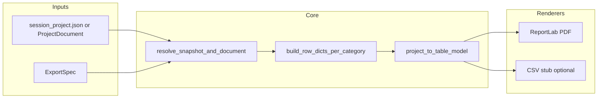

# F20: Standings multi-format export (implementation plan)

## Requirements mapping

- **[R5](PROJECT_PLAN.md)** — Rankings as durable, shareable artifacts (PDF bulletin/email/archival).
- **[R7](PROJECT_PLAN.md)** — Local file-based workflow; no cloud.
- **[M5](PROJECT_PLAN.md)** — Organizer-facing hardening / first production outputs.

Product rule from [F20](docs/features/F20-standings-multi-format-export.md): internal English identifiers; **German column headers / title block** where user-visible.

---

## Current codebase anchors (reuse, do not reimplement)

| Concern | Location |
|--------|----------|
| Domain snapshot + rows | [`backend/domain/models.py`](backend/domain/models.py) — `StandingsSnapshot`, `StandingsRow`, `RaceContribution`, `ProjectDocument` |
| Recompute / attach snapshot | [`backend/ranking/engine.py`](backend/ranking/engine.py) — `compute_standings_snapshot`, `recompute_project_standings` |
| JSON load/save | [`backend/storage/schema_v2.py`](backend/storage/schema_v2.py) — `from_dict` / `to_dict` |
| API row shape (display, yob, club, contributions, `team_members`) | [`backend/ui_api/queries.py`](backend/ui_api/queries.py) — `_table_by_category_key`, `_team_members_for_standings_row` + [`backend/ui_api/mappers.py`](backend/ui_api/mappers.py) |
| F15 eligible vs full | [`backend/ui_api/ranking_display.py`](backend/ui_api/ranking_display.py) — `ranking_exclusion_set`, `apply_ranking_exclusions_to_rows` |
| Legacy CSV (fixture) | [`backend/tools/fixture_session.py`](backend/tools/fixture_session.py) — `standings_snapshot_to_csv`, `entity_display_name` (overlaps `display_name_for_row`; consolidate when touching both) |
| PDF dependency | [`pyproject.toml`](pyproject.toml) — `reportlab` already present |

---

## Architecture

1. **Resolve document + snapshot** — Load JSON via `schema_v2.from_dict` when needed. Apply **standings source** rules (below). Apply **race filter** by building an **ephemeral** `ProjectDocument` copy (never persist) when the filter is not “all active races.”
2. **Build API-parity row dicts** — Same logical rows as `_table_by_category_key` + `apply_ranking_exclusions_to_rows` for `eligible_only` vs `full_grid`.
3. **Project to `StandingsTableModel`** — Pure structure: ordered `ColumnDef` (id, German header label, alignment), `rows: list[list[CellValue]]`, section metadata (title, footnotes).
4. **Render** — `Exporter` protocol + registry; v1 implements `pdf`; optional `csv` reusing the same model (proves extensibility per acceptance criteria).

---

## Standings source and race scope (precise semantics)

**Embedded vs recompute**

- `standings.source == "embedded"`: use `document.standings` when present; if missing, fall back to `recompute_project_standings(document)` (same as [`queries._table_by_category_key`](backend/ui_api/queries.py) line 71–72).
- `recompute == True` (or `source == "live"`): always `recompute_project_standings` on the (possibly race-filtered) document.

**Race filter vs embedded snapshot**

- `race_filter.mode == "all_active"`: embedded snapshot is valid for reproducibility when `recompute` is false and snapshot exists.
- **Subset modes** (`race_event_uids`, and optionally `up_to_race_no`): an embedded snapshot reflects the **full** active set; it is **not** valid for “Stand nach Lauf 3” style exports. **Rule:** when the filter is not `all_active`, always compute standings from an ephemeral document where events outside the filter are treated as non-active for ranking:
  - `replace(document, events=tuple(...))` where each `RaceEvent` not in the allowed set is copied with `state=RaceEventState.ROLLED_BACK` if it was `ACTIVE`, else unchanged.
  - Then run `compute_standings_snapshot` / `recompute_project_standings` on that copy (ignore embedded snapshot for that export job).

**`up_to_race_no` (if implemented in v1)**

- Define as: among `ACTIVE` events, include those with `race_no <= N` **and** matching the category being exported (category_key is per section). Document edge cases (missing race numbers, ties) in module docstring.

---

## Package layout

Add package **[`backend/export/`](backend/export/)** (name aligns with F20 “backend/export”; alternative `standings_export` is fine—pick one and keep imports consistent):

| Module | Responsibility |
|--------|------------------|
| `spec.py` | `ExportSpec` dataclass(es), JSON-serializable dict round-trip helpers, validation (known column ids, limits on column/row counts), preset bundles (`minimal`, `official_board`, `debug_uid`). |
| `resolve.py` | `load_project_document(path \| dict)`, race-filter ephemeral copy, choose snapshot per spec. |
| `projection.py` | `StandingsTableModel`, `ColumnDef`, `build_table_model(document, snapshot_context, spec) -> list[SectionModel]`. Column resolvers map logical ids → cell values from row dicts + event metadata. |
| `pdf_renderer.py` | ReportLab: page size, orientation, title/subtitle, repeated table headers, footer (ruleset + timestamp), font embedding for umlauts. |
| `registry.py` | `Exporter` protocol, `register_exporter`, `export(spec, dest_path)`. |
| `__init__.py` | Public entry: `export_standings(spec, dest: Path) -> None` (or return bytes). |

**Shared row builder (parity requirement)** — Avoid drift between export and GUI:

- Extract `_table_by_category_key` (and `_team_members_for_standings_row` if only used there) from [`queries.py`](backend/ui_api/queries.py) into a neutral module, e.g. [`backend/standings_view.py`](backend/standings_view.py) with a **public** function `build_standings_rows_for_category(document: ProjectDocument, category_key: str) -> tuple[meta_dict, list[dict]]` that preserves current dict keys.
- Update `queries.get_standings` / `get_category_current_results_table` to call the extracted function (thin wrapper). Export projection imports the same function, then applies `ranking_exclusion_set` + `apply_ranking_exclusions_to_rows` exactly like `get_standings` vs full grid.

This directly addresses F20 risk: *“Duplicating logic already in get_standings.”*

---

## Column model (v1)

- **Stable logical ids** (English): e.g. `platz`, `display_name`, `club`, `yob`, `punkte_gesamt`, `distanz_gesamt`, `ausser_wertung` (or `ranking_eligible` boolean), `entity_uid`, `entity_kind`, dynamic `points_race:<race_event_uid>` / optional shorthand `points_race_by_index` if you add L1/L2 headers from `race_no` order.
- **`points_per_race` bundle** — Expands to one column per included race (after race filter), ordered by `(race_no, race_date, race_event_uid)` consistent with [`get_category_current_results_table`](backend/ui_api/queries.py).
- **Teams detail** — Optional column `team_members` rendering as multi-line text under name or separate columns; reuse member structure from `_team_members_for_standings_row`.
- **Unknown column id** — Raise a clear `ValueError` or project-specific validation error with list of valid ids.

**German headers** — Central map in `projection.py` or `spec.py` (e.g. `Platz`, `Name`, `Verein`, `Jg.`, `Punkte`, `km`, `Außer Wertung`).

---

## PDF renderer (ReportLab)

- Use `reportlab.platypus` (`SimpleDocTemplate`, `Table`, `TableStyle`, `Paragraph` where needed) for pagination and **repeat header rows** (`repeatRows=1` on `Table` where supported, or split tables per section with consistent header).
- **Fonts:** Register a TTF that covers German glyphs (e.g. bundled DejaVu or Noto under `backend/export/fonts/` or load from known system path); document fallback in README/module doc if font missing.
- **Guards:** Max columns / max rows from spec defaults to prevent runaway tables; configurable.
- **Optional logo:** If `logo_path` set, `os.path.isfile`, resolve as absolute path only (no zip paths); skip silently or warn if invalid (document behavior).

---

## Testing

| Layer | What |
|-------|------|
| Unit — `projection.py` | Tiny in-memory `ProjectDocument` + snapshot: singles/teams, empty category, unknown column errors, column order, `points_per_race` expansion. |
| Unit — F15 parity | Build doc with `ranking_exclusions`; assert export `eligible_only` row `entity_uid` set matches `get_standings` for same `category_key` (call both in test). |
| Unit — race filter | Subset `race_event_uids` changes totals vs full season (recompute on ephemeral doc). |
| Integration — PDF | Render to `BytesIO`; assert no exception; extract text — add **`pypdf`** (or `pypdfium` / `pdfminer.six`) as a **dev** dependency if not already, then assert substring (participant name with umlaut from fixture) and ruleset string in footer when enabled. |
| Golden hash | Optional: only if font embedding and layout are pinned; otherwise prefer structural/text assertions (hashes brittle across ReportLab versions). |

Use **`uv run pytest`** per project convention.

---

## CLI (optional, F20 step 5)

- `uv run python -m backend.export.cli` — args: `--input session_project.json`, `--output out.pdf`, `--spec path.json` or inline JSON. Thin wrapper around `export_standings`.

---

## Documentation and “done” checklist

- Update [F20 feature doc](docs/features/F20-standings-multi-format-export.md) **Status** and link to modules when shipped.
- **`docs/ACCOMPLISHMENTS.md`** entry + **`PROJECT_PLAN.md`** delivery line for F20 when complete.
- **Defer** `docs/api/ui-api-v1.md` and GUI export until a follow-up (F20b) unless you explicitly bundle `export_standings` in the same PR.

---

## Risks (mitigations in code)

- **Wide tables** — Default PDF preset: landscape A4; document `official_board` vs `minimal` presets.
- **Unicode on Windows** — Bundled TTF + test with umlaut fixture.
- **Column explosion** — Presets + spec limits + docs.

---

## Rollback

New package + optional CLI only; no migrations. Remove package and any entry points to revert.
