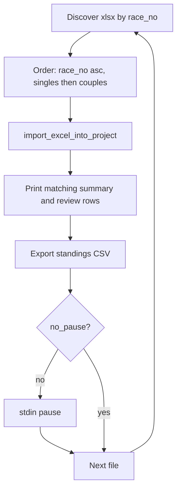

# Human-in-the-loop fixture import and standings export

## Maps to project goals

- [PROJECT_PLAN.md](PROJECT_PLAN.md) immediate next step: *KPI tuning on fixture set; golden-master standings vs legacy spreadsheets*.
- Requirements: **R1–R5** (import → merge → standings); milestone **M5** validation workflow.

## Constraints from the current backend

- **Import API**: [`import_excel_into_project`](backend/ingestion/service.py) already parses one workbook, merges every section into `ProjectDocument`, runs matching, recomputes standings, and persists via [`JsonProjectRepository`](backend/storage/repository.py). The CLI in [`main.py`](main.py) wraps the same entry point.
- **Couples vs singles**: Filename must contain `paare` (case-insensitive) for couples; otherwise singles adapter is used ([`import_excel_into_project`](backend/ingestion/service.py) lines 18–21).
- **Race number**: Parsed from filename via `Lauf <n>` in [`parse_race_no`](backend/ingestion/adapters/common.py).
- **Idempotency**: Re-importing the same file is a no-op (SHA256 in events). Starting fresh means using a **new or deleted** project JSON path.
- **Review semantics**: In [`_resolve_person` / `_resolve_team_row`](backend/matching/workflow.py), `route=="review"` still attaches the **top candidate** (`top.uid`); `review` means *human should verify*, not *unlinked*. Wrong links require **rollback + reimport** with a prior [`MatchingDecision`](backend/domain/models.py) of kind `manual_link` (replay path in workflow) — the script should surface fingerprints and candidate UIDs so you can author those decisions later; full “edit project and rollback” automation can stay out of scope for v1 unless you want it in the same script.

## Data layout note

- `*.xlsx` is gitignored ([`.gitignore`](.gitignore)), so **`example/` (or any folder) will not appear in git**. The script should take `--data-dir` (default e.g. `example`) and fail with a clear message if no files match.

## Proposed script behavior

**Location**: new module under `scripts/`, e.g. `scripts/fixture_import_session.py` (name can be adjusted), run via `uv run python scripts/fixture_import_session.py` per [.cursor/rules/python-uv-execution.mdc](.cursor/rules/python-uv-execution.mdc).

**Discovery and ordering**

1. Glob singles files: `*.xlsx` under `--data-dir`, exclude names containing `paare` (case-insensitive).
2. Glob couples files: `*.xlsx` with `paare` in the name.
3. Group by `parse_race_no(path)`; sort race numbers ascending.
4. For each race number: **singles file(s) first, then couples file(s)**. If multiple singles files share the same race number (unexpected), either error with a clear message or require an explicit `--manifest` (optional stretch).

**Per-file loop**

1. Call `import_excel_into_project(project_file=..., excel_file=..., series_year=...)`.
2. Print the same summary style as `main.py` (rows, events, matching aggregate).
3. **Review surfacing**: Scan **events created by this import** (or last N events) for entries where `match_meta` is `review` (and optionally `conflict_flags`). For each, print: category (year/duration/division), start number, raw row context if available via linked `participant_uid`/`team_uid`, top candidate UID, candidate list, and **identity fingerprint** (from [`identity_fingerprint`](backend/matching/decisions.py) / team equivalent) — computed by re-parsing the same logical row is non-trivial; **minimal v1**: print `entry_uid`, `race_event_uid`, candidate UIDs and names resolved from `document.people` / `document.couples` so you can cross-check ground truth. (If you need fingerprint strings without recomputation from Excel, extend slightly to store fingerprint on the decision record already written for that entry — optional follow-up.)
4. **Standings export for ground-truth comparison**: Read `document.standings` after import (or call `compute_standings_snapshot` / `recompute_project_standings` if you want a pure-compute path — import already recomputes). For each [`CategoryStandingsTable`](backend/domain/models.py), emit CSV rows: `category_key`, `platz`, `punkte_gesamt`, `distanz_gesamt`, plus a **display label** resolved from `entity_uid` via `people`/`couples` (same pattern as future UI).
5. **Human pause**: Unless `--no-pause`, call `input()` (or `input("Press Enter for next file…")`) so you can compare to external spreadsheets before continuing.

**Outputs**

- `--project`: path to JSON project file (default e.g. `example/session_project.json` or under `example/`).
- `--out-dir`: optional directory to write `standings_after_<sanitized_filename>.csv` or `standings_race_<n>_step_<k>.csv` for archival/diffing.
- `--series-year`: forwarded to import (required for correct [`RaceSeriesCategory`](backend/domain/models.py)).

**Testing**

- **Unit tests** without binary Excel: mock `import_excel_into_project` or test **pure helpers** — file discovery ordering (tmp dir with fake `Path` names), CSV formatting from a tiny in-memory `ProjectDocument` + `StandingsSnapshot`. Keeps CI green without committing `.xlsx`.
- Optional: one **local manual** run against your `example/` tree (not CI).

## Flow diagram

## Documentation (lightweight)

- Per workspace rules, map this to a short entry in [docs/features/](docs/features/) (e.g. a small `F06-fixture-hitl-script.md` or a subsection in an existing KPI doc) **only if you want it tracked as a feature**; otherwise a module docstring plus [docs/ACCOMPLISHMENTS.md](docs/ACCOMPLISHMENTS.md) line when done.

## Out of scope for first iteration (can split later)

- Automated diff against an uploaded “ground truth” CSV (manual diff is enough first).
- Full rollback/reimport wizard for wrong `review` links.
- Injecting synthetic typos for negative testing.
