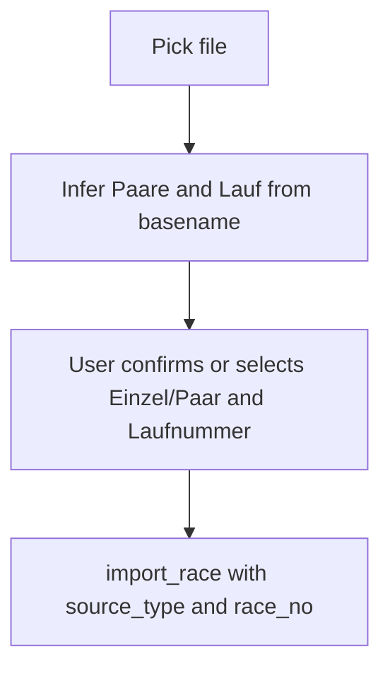

# GUI cleanup and import flow tightening

## Scope and requirements mapping

- Supports **[R8](PROJECT_PLAN.md)** (German GUI polish) and **[M5](PROJECT_PLAN.md)** ongoing UX work; aligns with the import/matrix direction already logged in [docs/features/F05-german-ui-and-review-workflow.md](docs/features/F05-german-ui-and-review-workflow.md).

## 1) Top navigation: bigger, more prominent tabs

**Where:** [frontend/styles.css](frontend/styles.css) (`.tabs`, `.tab`), optionally [frontend/index.html](frontend/index.html) if spacing classes are needed.

**Change:** Increase `.tab` padding, `font-size` (use or add a variable near existing `--font-small` usage), and optional `min-height` so the tab row uses the whitespace under the header more deliberately. Keep `.tab.active` and `.tab.subtle` behavior; ensure the “Saison wechseln” button still aligns (existing `margin-left: auto` on `.tab.subtle`).

## 2) Standings: remove duplicate “Lauf hinzufügen” CTA

**Where:** [frontend/app.js](frontend/app.js) in `renderStandingsView()` (both branches: no category selected ~lines 476–498 and with standings ~lines 541–582).

**Change:** Remove the `<button id="goToImportBtn" ...>Lauf hinzufügen</button>` blocks and their `addEventListener` hooks. Users already switch via the main tab.

## 3) Tab label: drop “Lauf hinzufügen”

**Where:** [frontend/index.html](frontend/index.html) — the `data-view="import"` tab.

**Change:** Replace the tab text with a short label that is not “Lauf hinzufügen”, e.g. **“Import”** (or **“Lauf importieren”** if you prefer full German). This matches your request to remove that phrase from the tab itself.

## 4) Import sidebar layout and file row

**Where:** [frontend/app.js](frontend/app.js) `renderImportView()` template (~691–730), [frontend/styles.css](frontend/styles.css) (`.import-controls-column`, new utility classes for a compact grid).

**Reorder (top → bottom):**

1. **Importierte Läufe** matrix (same `renderImportedRunsMatrix` as now) so it aligns vertically with the standings sidebar.
2. **File row:** `[Datei auswählen] | [readonly filename]` — no separate “Ergebnisdatei” label; drop the long hint paragraph or shorten to one line if still needed.
3. **Inference + Lauftyp + Laufnummer** (see §5).
4. **Primary:** `Lauf importieren` (enabled only when valid — see §5–6).
5. **Matching-Einstellungen** panel (unchanged behavior, moved below import as requested).

**Filename display:** Keep the **full path** in app state (new fields on `state`, e.g. `pendingImportPath`) for the `import_race` call; bind the text field to **basename only** (e.g. `path.split(/[/\\]/).pop()`), read-only.

## 5) Replace “Automatisch erkennen” dropdown with inference + explicit controls

**Client-side inference** (mirror backend rules so “what we guess” matches what import will do):

- **Einzel vs Paare:** Same as [backend/ingestion/service.py](backend/ingestion/service.py) — if `"paare"` appears in the lowercased **basename**, treat as **Paare** (`couples`); optional extra: treat explicit markers like `einzel` / `singles` as **Einzel** if you want a symmetric rule. If neither rule fires, treat as **ambiguous**: no default selection.
- **Laufnummer:** Same regex as [backend/ingestion/adapters/common.py](backend/ingestion/adapters/common.py) `parse_race_no` — `Lauf\s+(\d+)` on the basename (case-insensitive). If no match, **race number is unknown** until the user picks.

**UI:**

- After a successful `pick_file`, show a short **Erkennung** line, e.g.  
  - success: `Erkannt: Einzel · Lauf 3` / `Erkannt: Paare · Lauf 2`  
  - partial: explain what is missing (Lauftyp and/or Laufnummer).
- **Two mutually exclusive buttons:** `Einzel` / `Paare` — use `aria-pressed` or a shared CSS class for the active state; preselect when inference is confident; if ambiguous, neither active until the user chooses.
- **`<select>` for Laufnummer** below: options `1 … max` using the same span as the matrix (`buildImportedRaceInfo().raceColumns` — already `max(5, maxImported)`). Preselect inferred number when present; otherwise placeholder “Bitte wählen…” with disabled import until a value is chosen.

**Remove:** `<select id="sourceTypeSelect">` and the “Automatisch erkennen” option.

**State:** Persist selection on `state` across `renderImportView` re-renders (e.g. `importSourceType`, `importRaceNo`, `importFilePath`) so picking a file, toggling Einzel/Paar, or changing Laufnummer does not reset when the review queue refreshes.

## 6) Backend: optional `race_no` on `import_race`

**Why:** Today Laufnummer is **only** taken from the filename inside parsers ([backend/ingestion/adapters/singles.py](backend/ingestion/adapters/singles.py) / [couples.py](backend/ingestion/adapters/couples.py) via `parse_race_no(path)`). The new UI must be able to set Laufnummer when the filename does not contain `Lauf N`.

**API:** Extend `import_race` payload in [backend/ui_api/commands.py](backend/ui_api/commands.py):

- Optional `race_no` (integer `>= 1`). When present, pass into `import_excel_into_project`.

**Ingestion:**

- Extend `import_excel_into_project` in [backend/ingestion/service.py](backend/ingestion/service.py) with `race_no: int | None = None`.
- Extend `parse_singles_workbook` / `parse_couples_workbook` to accept `race_no_override: int | None`; when set, use it for every `ImportRaceContext.race_no`; otherwise keep calling `parse_race_no(path)`.

**Docs/tests:**

- Update [docs/api/ui-api-v1.md](docs/api/ui-api-v1.md) `import_race` section.
- Add/adjust tests in [tests/test_f08_ui_api.py](tests/test_f08_ui_api.py) (or ingestion tests) for: import with `race_no` overriding a basename without `Lauf N`.

**Frontend call:** In `import_race`, send `source_type: 'singles' | 'couples'` from the toggle and `race_no` from the dropdown once valid.

**`reimport_race`:** It delegates to `import_race` with the same payload — include `race_no` / `source_type` in the contract if the GUI ever passes them (optional for now).

## 7) Documentation / checklist (per project workflow)

After implementation (execution phase): run `uv run pytest` for touched areas; add a short entry to [docs/ACCOMPLISHMENTS.md](docs/ACCOMPLISHMENTS.md); add an increment bullet under the German UI doc [docs/features/F05-german-ui-and-review-workflow.md](docs/features/F05-german-ui-and-review-workflow.md) describing the new import UX and API field.

