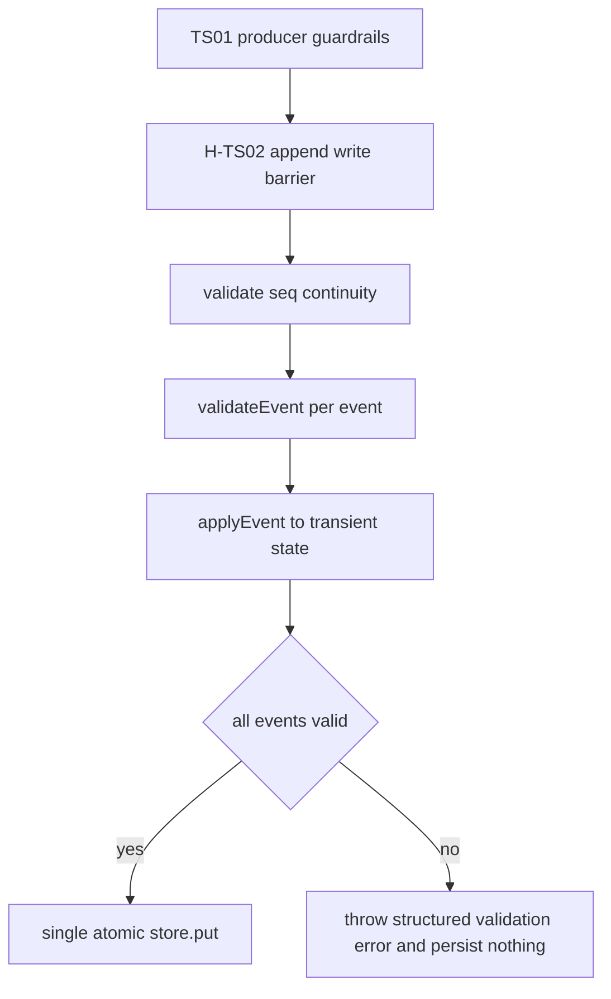

# H-TS02 Central Write Barrier Implementation Plan

## Scope And Requirement Mapping
- Hardening target: `H-TS02` (`R1`, `R3`, `R5`, `R7`, `M-TS1`) as defined in [packages/stundenlauf-ts/docs/hardening/H-TS02-central-event-validation-write-barrier.md](packages/stundenlauf-ts/docs/hardening/H-TS02-central-event-validation-write-barrier.md).
- This is a reliability hardening change (no schema redesign, no UI redesign), aligned with the existing event-sourced architecture in [packages/stundenlauf-ts/PROJECT_PLAN.md](packages/stundenlauf-ts/PROJECT_PLAN.md).

## Crossreference: What TS01 Already Solved (Do Not Re-implement)
- Last commit (`d3c3d1615d8b49b259ca90dfe354e7f225c54ff5`) hardened producer paths:
  - Team-first identity through matching/review in [packages/stundenlauf-ts/src/matching/resolve.ts](packages/stundenlauf-ts/src/matching/resolve.ts) and [packages/stundenlauf-ts/src/matching/workflow.ts](packages/stundenlauf-ts/src/matching/workflow.ts).
  - Manual review guardrail rejecting non-candidate links in [packages/stundenlauf-ts/src/import/review.ts](packages/stundenlauf-ts/src/import/review.ts).
  - Regression coverage in [packages/stundenlauf-ts/tests/matching/workflow.test.ts](packages/stundenlauf-ts/tests/matching/workflow.test.ts), [packages/stundenlauf-ts/tests/matching/resolve.test.ts](packages/stundenlauf-ts/tests/matching/resolve.test.ts), and [packages/stundenlauf-ts/tests/import/review.test.ts](packages/stundenlauf-ts/tests/import/review.test.ts).
- Result: TS01 reduced invalid `team_id` production risk, but does **not** create a central persistence write barrier.

## Remaining Gap To Close In H-TS02
- Current append path in [packages/stundenlauf-ts/src/storage/event-store.ts](packages/stundenlauf-ts/src/storage/event-store.ts) enforces only sequence continuity and duplicate batch checks before writing.
- It does not run semantic `validateEvent` from [packages/stundenlauf-ts/src/domain/validation.ts](packages/stundenlauf-ts/src/domain/validation.ts) for each event before persistence.
- Therefore, any future producer bug outside TS01’s scope can still persist invalid events.

## Implementation Approach
```42:70:packages/stundenlauf-ts/src/storage/event-store.ts
      if (firstNewSeq !== lastSeq + 1) {
        throw new Error(
          `Seq gap: existing log ends at seq=${lastSeq}, new events start at seq=${firstNewSeq}`,
        );
      }

      const batchIds = new Set<string>();
      // ... duplicate batch check ...

      await store.put({
        season_id: seasonId,
        events: [...currentEvents, ...events],
      });
```

- Add a canonical barrier at append time in [packages/stundenlauf-ts/src/storage/event-store.ts](packages/stundenlauf-ts/src/storage/event-store.ts):
  - Rebuild baseline state from existing log via `projectState`.
  - Validate each incoming event in order with `validateEvent`.
  - After each valid event, apply it to transient state via `applyEvent` so event `N+1` validates against post-`N` state.
- Keep append atomicity:
  - If any event fails validation, throw before `store.put`.
  - Persist only once after all events are validated.
- Standardize write-barrier error detail:
  - Include season ID, failing event index in batch, event `seq`, event `type`, and validator reasons.
  - Prefer a dedicated error type in storage layer for stable assertions and UI-safe messaging.
- Consolidate duplicate checks:
  - Keep cheap structural checks (`seq` continuity) early.
  - Rely on central validator for semantic duplicates/references to avoid divergent rule paths.

## Test Plan (Code)
- Add focused storage-boundary tests (new file recommended): [packages/stundenlauf-ts/tests/storage/event-store.test.ts](packages/stundenlauf-ts/tests/storage/event-store.test.ts).
- Minimum scenarios:
  - Valid append succeeds and persists.
  - Invalid single event append (unknown `team_id` in `race.registered`) is rejected.
  - Invalid middle event in multi-event batch rejects whole batch and leaves log unchanged.
  - Error payload includes `type`, `seq`, batch index, and reason text.
- Keep existing validator unit tests in [packages/stundenlauf-ts/tests/domain/validation.test.ts](packages/stundenlauf-ts/tests/domain/validation.test.ts) as rule-level coverage; new tests verify enforcement at the canonical write boundary.

## Integration/Regression Verification
- Add one import-path integration assertion in [packages/stundenlauf-ts/tests/import/pipeline.test.ts](packages/stundenlauf-ts/tests/import/pipeline.test.ts) or a dedicated integration test to ensure valid `finalizeImport` output remains append-compatible.
- Run package test suite (`vitest`) with focus first on `tests/storage` + `tests/import` + `tests/domain`.

## Documentation And Tracking Updates
- Update status/checklists in [packages/stundenlauf-ts/docs/hardening/H-TS02-central-event-validation-write-barrier.md](packages/stundenlauf-ts/docs/hardening/H-TS02-central-event-validation-write-barrier.md).
- Add completion entry in [packages/stundenlauf-ts/docs/ACCOMPLISHMENTS.md](packages/stundenlauf-ts/docs/ACCOMPLISHMENTS.md).
- Update hardening status/changelog in [packages/stundenlauf-ts/PROJECT_PLAN.md](packages/stundenlauf-ts/PROJECT_PLAN.md) when implementation lands.

## Execution Sequence

