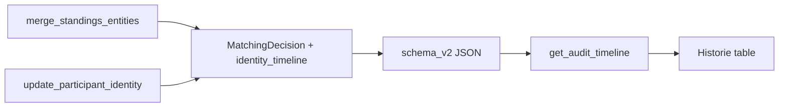

# Human-readable Historie for identity merge & correction

## Context

- Timeline rows come from [`get_audit_timeline`](c:\Users\andre\VSCode_Projects\stundenlauf\backend\ui_api\queries.py) / [`get_year_timeline`](c:\Users\andre\VSCode_Projects\stundenlauf\backend\ui_api\queries.py). For `matching_decision` events, only UIDs and kinds are returned today (see lines 484–497); `field_resolutions`, `rationale`, and any richer payload are **not** forwarded even though [`MatchingDecision`](c:\Users\andre\VSCode_Projects\stundenlauf\backend\domain\models.py) supports `field_resolutions` in storage ([`schema_v2._matching_decision_to_dict`](c:\Users\andre\VSCode_Projects\stundenlauf\backend\storage\schema_v2.py)).
- The Historie UI builds the audit table in [`renderHistoryView`](c:\Users\andre\VSCode_Projects\stundenlauf\frontend\app.js) (approx. 2474–2500): merge shows `keep ← drop` UIDs; correction shows a single target UID.

**Critical constraint:** after [`merge_standings_entities`](c:\Users\andre\VSCode_Projects\stundenlauf\backend\ui_api\commands.py) runs [`merge_identities`](c:\Users\andre\VSCode_Projects\stundenlauf\backend\domain\identity_merge.py), the absorbed participant/team is removed. The UI cannot later resolve `merged_absorbed_uid` to a name from the live document. Snapshots must be written **at merge time**.

Similarly, [`update_participant_identity`](c:\Users\andre\VSCode_Projects\stundenlauf\backend\ui_api\commands.py) overwrites canonical fields; **before** values must be captured before mutation.

## Approach

1. **Extend `MatchingDecision`** with one optional JSON-serializable field, e.g. `identity_timeline: dict[str, Any] | None = None`, documenting a small stable contract (no backward-compat burden for old files: field absent → UI keeps current UID-only lines).

2. **Populate at command time**
   - **`merge_standings_entities`:** Before `merge_identities`, the code already loads survivor/absorbed rows `rs`, `ra` from [`_table_by_category_key`](c:\Users\andre\VSCode_Projects\stundenlauf\backend\ui_api\queries.py) (rows include `entity_kind`, `entity_uid`, `display_name`, `yob`, `club`, and `team_members` for teams). Build `identity_timeline` with e.g. `kind: "identity_merge"`, `category_key`, `survivor: { uid, entity_kind, display_name, yob, club, team_members? }`, `absorbed: { ... }` (mirror the row payload needed for display).
   - **`update_participant_identity`:** From `old` / `target_old` and `updated_person` / `new_member`, set `identity_timeline` with e.g. `kind: "identity_correction"`, `member` (`null` | `"a"` | `"b"`), optional `team_display_name` (resolve from couple for context), `before` / `after` as `{ name, yob, club }` (club `""` vs `null` aligned with existing API conventions).

3. **Persistence:** Thread the new field through [`_matching_decision_to_dict` / `_matching_decision_from_dict`](c:\Users\andre\VSCode_Projects\stundenlauf\backend\storage\schema_v2.py) (omit key when `None` to keep files tidy).

4. **API surface:** In `get_audit_timeline`, add `identity_timeline` to each `matching_decision` item when present (same object as stored). Optionally also include `field_resolutions` / `rationale` for parity with disk — **only if** you want import-link audits richer too; scoped to identity rows is enough for this request.

5. **Frontend:** In `renderHistoryView`, if `item.identity_timeline` exists, render a multi-line detail cell (e.g. inner `
` with ` ` or block lines). Add German labels in [`strings.js`](c:\Users\andre\VSCode_Projects\stundenlauf\frontend\strings.js) (e.g. behalten / zusammengeführt, vorher / nachher, Mitglied A/B). Fallback: keep today’s UID-based text when `identity_timeline` is missing.

6. **CSS:** Light touch in [`styles.css`](c:\Users\andre\VSCode_Projects\stundenlauf\frontend\styles.css) for readable multi-line audit cells (line-height, small secondary text for UIDs if you still show them under the names).

7. **Docs & tests**
   - Update [`docs/api/ui-api-v1.md`](c:\Users\andre\VSCode_Projects\stundenlauf\docs\api\ui-api-v1.md) under `get_year_timeline` / `get_audit_timeline`: document `identity_timeline` shape for `identity_merge` / `identity_correction`.
   - Extend [`tests/test_f08_ui_api.py`](c:\Users\andre\VSCode_Projects\stundenlauf\tests\test_f08_ui_api.py): after `merge_standings_entities_merges_disjoint_singles` and `update_participant_identity_timeline_includes_correction`, assert timeline items contain expected `identity_timeline` content (names/yobs from seed data).

## Data flow (high level)

## Out of scope (unless you want it)

- Migrating old project files to backfill snapshots (impossible for absorbed identities).
- Enriching non-identity `matching_decision` kinds with the same treatment.
