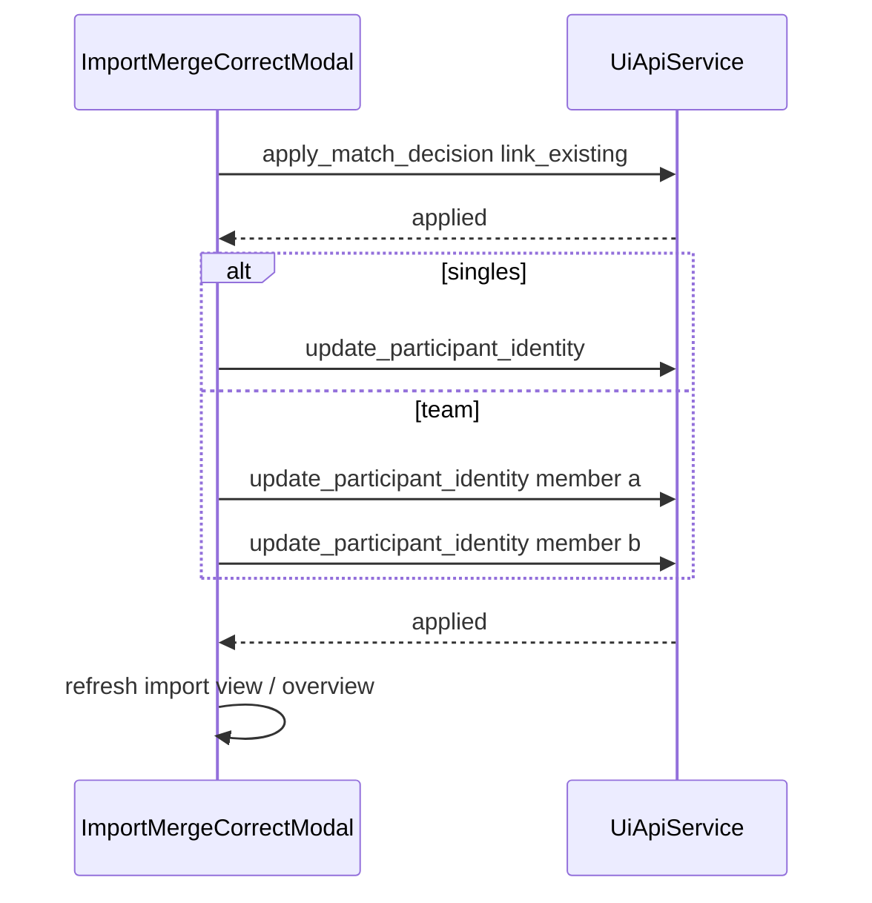

# Import review: “Zusammenführen und Daten korrigieren”

## Requirement mapping

- **[R6](PROJECT_PLAN.md)** interactive review/overrides; **[R8](PROJECT_PLAN.md)** German GUI.
- Distinct from **[F18](.cursor/plans/merge_and_correct_ui_c6a03dcc.plan.md)** (Laufübersicht duplicate merge via `merge_standings_entities`). This feature targets **`renderImportView`** in [`frontend/app.js`](frontend/app.js) — the queue from `get_review_queue` with incoming row on top and ranked candidates below.

## Current behavior (baseline)

- [`merge-actions-row`](frontend/app.js) (approx. lines 1773–1776): **“Mit ausgewählter Person/Team zusammenführen”** calls `apply_match_decision` with only `target_participant_uid` (lines 2089–2109).
- **Couples bug to fix in the same pass:** [`candidate_previews`](backend/ui_api/queries.py) use `kind: "team"` with a **team UID**; the API contract requires `target_team_uid` for teams ([`docs/api/ui-api-v1.md`](docs/api/ui-api-v1.md) §`apply_match_decision`). Sending a team UID as `target_participant_uid` corrupts `RaceEntry.participant_uid`. The new button and the existing accept handler should branch on `preview.kind === "team"` vs `"participant"`.
- Identity correction is already implemented as **`update_participant_identity`** ([`backend/ui_api/commands.py`](backend/ui_api/commands.py)); team previews already include `member_a` / `member_b` ([`_team_preview`](backend/ui_api/queries.py)), so **no backend change is required** for prefill data.

## Frontend implementation

**1. Shared payload helper** (e.g. `buildApplyMatchLinkPayload(review, targetUid, candidatePreview)` in [`frontend/app.js`](frontend/app.js)):

- If `candidatePreview?.kind === "team"`: `{ race_event_uid, entry_uid, target_team_uid: targetUid, rationale }`.
- Else: `{ race_event_uid, entry_uid, target_participant_uid: targetUid, rationale }`.
- Refactor **`acceptReviewBtn`** to use this helper (fixes Paarlauf review).

**2. New button** in the import review `merge-actions-row` (next to accept / new identity):

- German label suggestion: **“Zusammenführen und Stammdaten korrigieren”** (or align with F18 **“Zusammenführen und Daten korrigieren”** if you prefer identical wording to standings).
- Enable rules: same as accept — selected candidate required (`getDefaultCandidateUid` / `state.reviewSelections`).

**3. Reuse `#identityCorrectionModal`** ([`frontend/index.html`](frontend/index.html)) with an import-specific title and body:

- Add a small context object (e.g. `importMergeCorrectContext`) or extend the existing modal state so **F10 standings** and **import merge+correct** do not clobber each other.
- **Body layout:**
  - **Read-only Vergleich:** two columns — **Eingehend** (`review.entry_preview`) vs **Bestehend** (selected `candidate_preview`), reusing stacked name/YOB/club rendering where helpful (`renderMergeNameYobStackedHtml` / `renderMergeClubStackedHtml` or compact table).
  - **Editable form:** prefilled from **canonical candidate** values (same shape as F10): singles → one grid; teams → two blocks (Läufer A/B) from `member_a` / `member_b` mapped to `{ member: "a"|"b", name, yob, club }` like [`buildIdentityModalBodyHtml`](frontend/app.js).
- **Single primary:** e.g. **“Zusammenführen und speichern”** (plus Abbrechen / existing modal dismiss).
- **Validation:** reuse `identityYobBounds()` and the same checks as `saveIdentityParticipant` / `saveIdentityTeamMember` (inline error in modal).

**4. Submit sequence**

1. `apply_match_decision` with `buildApplyMatchLinkPayload(...)`.
2. On success, call `update_participant_identity` with `series_year: state.seriesYear`:
   - Singles: one call with `participant_uid: targetUid` and edited fields.
   - Teams: two sequential calls with `team_uid: targetUid` and `member: "a"` / `"b"` (send both after every successful merge, or only when values differ from prefill to reduce audit noise — either is acceptable; **prefer minimal diffs** if easy).
3. On full success: `closeIdentityModal()`, clear `reviewSelections[reviewKey]`, `state.reviewIndex = 0`, `loadOverview()` + `renderImportView()` (mirror accept handler).
4. **Partial failure:** if link succeeds but identity update fails, show API error in modal; user can fix via **Aktuelle Wertung** Korrekturmodus (document in feature note).

**5. Copy and styles**

- New strings under [`frontend/strings.js`](frontend/strings.js) `importView` (button, modal title, comparison labels, success/error status, optional `window.confirm` if you want an explicit “Link und Korrektur” confirmation — optional; default **no** extra confirm to reduce friction).
- Minimal CSS in [`frontend/styles.css`](frontend/styles.css) for the two-column comparison if existing `identity-field-grid` / cards are insufficient.

## Tests

- **API regression:** add one focused test in [`tests/test_f08_ui_api.py`](tests/test_f08_ui_api.py) that applies `apply_match_decision` with **`target_team_uid`** on a seeded team review row (pattern near [`test_get_review_queue_includes_member_yobs_for_team_previews`](tests/test_f08_ui_api.py)) and asserts the entry’s `team_uid` is set correctly. This locks the couples fix.

## Documentation / workflow artifacts

Per [`.cursor/rules/project-workflow.mdc`](.cursor/rules/project-workflow.mdc): short feature note in [`docs/features/`](docs/features/) (new file, e.g. import merge+correct), update [`docs/api/ui-api-v1.md`](docs/api/ui-api-v1.md) only if behavior is clarified (optional note that GUI must send the correct target field for teams), [`docs/ACCOMPLISHMENTS.md`](docs/ACCOMPLISHMENTS.md), and [`PROJECT_PLAN.md`](PROJECT_PLAN.md) if you track delivery there.

## Out of scope

- New atomic “link + identity” backend command.
- Changing `apply_match_decision` to accept a single generic `target_uid` (optional hardening for the future).
- **“Neue Person anlegen”** + correct in one step (different path: `create_new_identity` + possible follow-up edits).
