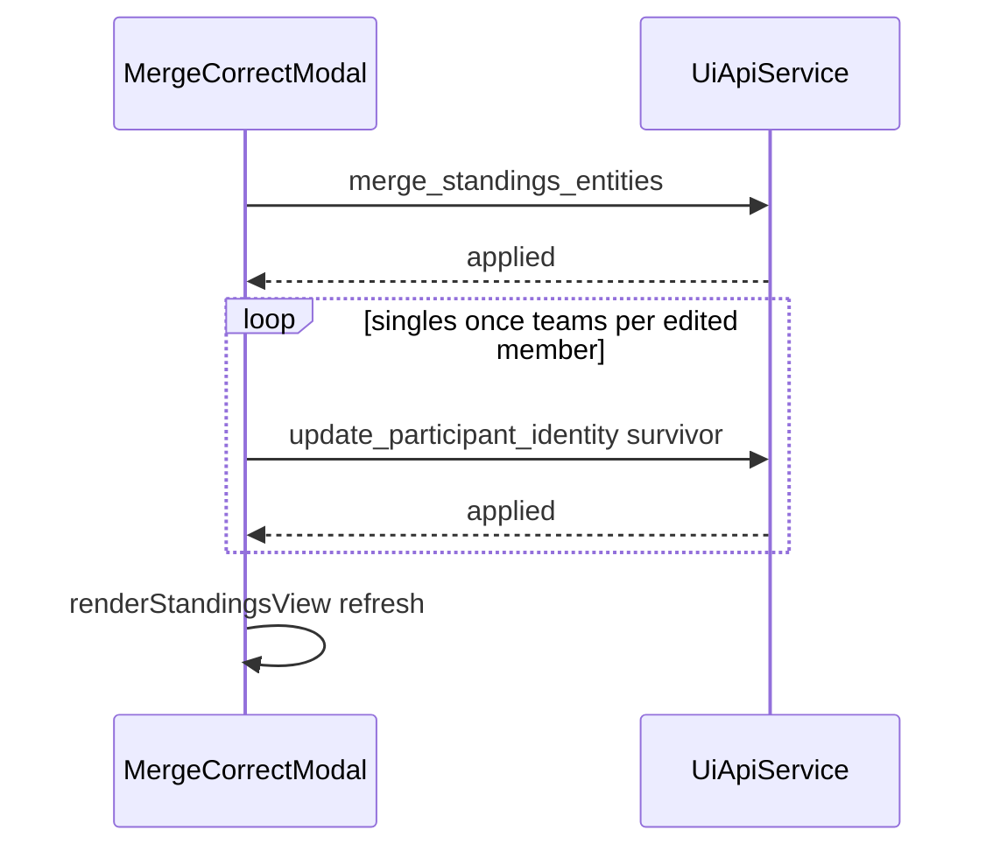

# Merge UI: “Zusammenführen & Daten korrigieren”

## Requirement mapping

- **[R6](PROJECT_PLAN.md)** interactive review/overrides; **[R8](PROJECT_PLAN.md)** German GUI.
- Builds on **F16** ([`merge_standings_entities`](backend/ui_api/commands.py)) and **F09/F10** ([`update_participant_identity`](backend/ui_api/commands.py), standings identity modal patterns in [`frontend/app.js`](frontend/app.js)).

## Current behavior (baseline)

- Merge mode in [`renderStandingsView`](frontend/app.js) shows a panel with reset + **“Zusammenführen ausführen”**; confirm runs only [`merge_standings_entities`](docs/api/ui-api-v1.md).
- Identity correction uses the same modal (`#identityCorrectionModal`) with [`buildIdentityModalBodyHtml`](frontend/app.js) + [`update_participant_identity`](backend/ui_api/commands.py).
- **Important constraint:** [`get_standings`](backend/ui_api/queries.py) returns **eligible-only** rows (`apply_ranking_exclusions_to_rows` → first tuple). The Laufübersicht uses [`get_category_current_results_table`](backend/ui_api/queries.py), which includes **all** entities (incl. Außer Wertung). So identity details for merge+correct **must not** rely only on `lastStandingsRows`.

## Backend (small, additive)

1. **Enrich `get_category_current_results_table` team rows** with `team_members` using the existing helper [`_team_members_for_standings_row`](backend/ui_api/queries.py) (same shape as `get_standings`: `member`, `name`, `yob`, `club`).
2. Update contract in [`docs/api/ui-api-v1.md`](docs/api/ui-api-v1.md) (`get_category_current_results_table` → optional `team_members` on `team` rows).
3. Add or extend a focused test in [`tests/test_f08_ui_api.py`](tests/test_f08_ui_api.py) asserting team rows include `team_members` and match `get_standings` for the same UID when both are visible.

No change to `merge_standings_entities` or `update_participant_identity` signatures.

## Frontend

1. **Cache per-race payload for lookups** in [`frontend/app.js`](frontend/app.js) (e.g. `lastCategoryResultsRows` next to `lastStandingsRows`), assigned inside `renderStandingsView` from `get_category_current_results_table` `payload.rows`. Use this map to resolve **both** merge picks (survivor + absorbed) by `entity_uid` so excluded rows still work.

2. **Merge panel:** In the `mergePanel` HTML (around [`standings-merge-actions`](frontend/app.js)), add a button **“Zusammenführen und Daten korrigieren”** (exact copy in [`frontend/strings.js`](frontend/strings.js) under `standings.merge`), same enable/disable rules as the existing confirm button (`canMergeExecute`).

3. **New modal content** (reuse `#identityCorrectionModal` with a distinct title/body builder to avoid duplicating dialog chrome in [`frontend/index.html`](frontend/index.html)):
   - **Einzel:** Read-only two-column **Vergleich** (Ziel vs. zu lösende Zeile): Name, Jahrgang, Verein from cached rows. Below, one editable form prefilled with **survivor** values (reuse validation logic from [`saveIdentityParticipant`](frontend/app.js)).
   - **Paar:** For each member slot `a`/`b`, show read-only comparison (Ziel vs. zu lösen) using `team_members` from both cached rows. Add a short **hint** that Läufer A/B order may not match between duplicates—operators align visually. Editable fields prefilled from **survivor** `team_members`; reuse per-member validation from [`saveIdentityTeamMember`](frontend/app.js).
   - **Footer actions:** Abbrechen (close), **Zusammenführen und speichern** (primary).

4. **Submit sequence** (same pre-checks as today: `series_year`, `selectedCategory`, kinds match, `window.confirm` with German copy explaining merge + correction):
   - `api("merge_standings_entities", { ... })` using existing payload shape.
   - On success, call `update_participant_identity` for the **survivor**:
     - Singles: once with edited `name`, `yob`, `club`.
     - Teams: up to two calls (`member: "a"` / `"b"`) **only for members whose values differ** from pre-merge survivor snapshot (or always send both if simpler—two idempotent corrections; prefer minimal calls to reduce audit noise).
   - If merge succeeds but identity update fails: show error status; user can fix via normal Korrekturmodus (documented risk, acceptable).
   - On full success: clear merge picks, exit merge mode (mirror current confirm handler), `setStatus` success string, `renderStandingsView({ preserveStandingsScroll: true })`.

5. **Styles:** Reuse existing modal and [`identity-field-grid`](frontend/styles.css) patterns; add a small comparison layout class if needed (e.g. two-column read-only blocks) in [`frontend/styles.css`](frontend/styles.css).

## Documentation / process (per [.cursor/rules/project-workflow.mdc](.cursor/rules/project-workflow.mdc))

- New feature note [`docs/features/F18-merge-with-identity-correction-ui.md`](docs/features/F18-merge-with-identity-correction-ui.md) (problem, scope, test plan).
- Entry in [`docs/ACCOMPLISHMENTS.md`](docs/ACCOMPLISHMENTS.md) and a short line under **Current Phase** / delivery bullets in [`PROJECT_PLAN.md`](PROJECT_PLAN.md).

## Test plan

- **API:** `get_category_current_results_table` includes `team_members` for couple rows; optional assertion vs `get_standings` for a fixture team.
- **Manual UAT:** Einzel duplicate merge+correct YOB; Paarlauf merge+correct one member; one row Außer Wertung still openable from cached results rows.

## Out of scope / follow-ups

- Single atomic backend transaction combining merge + identity (would need a new command); not requested—sequential calls match “use existing identity correction.”
- Automatic alignment of Paarlauf members between duplicates (domain-hard); UI hint only.
