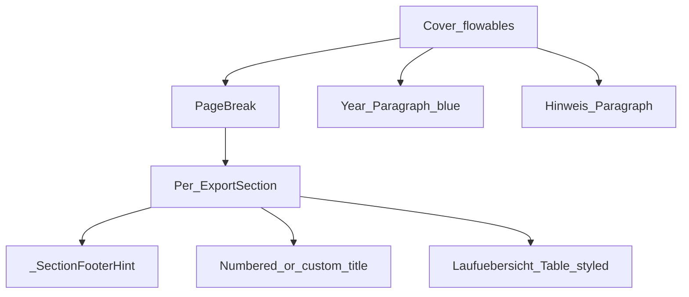

# PDF Laufübersicht styling plan

## Scope and milestone

This extends **F20** (Laufübersicht PDF) behavior already described in [PROJECT_PLAN.md](PROJECT_PLAN.md) and [docs/features/F20-standings-multi-format-export.md](docs/features/F20-standings-multi-format-export.md). **Flat** exports (`pdf.table_layout: flat`) keep the current title string (`export_pdf_category_title` in [backend/standings_display.py](backend/standings_display.py)) and generic grid styling unless you later ask to align them.

## Current behavior (relevant hooks)

- [backend/export/projection.py](backend/export/projection.py) `_build_laufuebersicht_sections` sets `ExportSection.title` to `spec.pdf.title` or `export_pdf_category_title(year, duration, division)` (e.g. `Saison 2026 — Stundenlauf Männer`).
- [backend/export/pdf_renderer.py](backend/export/pdf_renderer.py) `render_pdf` appends a centered `Paragraph` title per section, then builds a `Table` with `TableStyle`: header `BACKGROUND` = `lightgrey`, uniform `LINEAFTER`/`LINEBELOW`, podium fill via `_laufuebersicht_podium_fill` (yellow multiply on zebra).

## 1. First page: year + Hinweis (Laufübersicht only)

**When:** `spec.pdf.table_layout == "laufuebersicht"` and at least one section exists.

**Flow in `render_pdf` (before the section loop):**

- Optionally keep existing **logo** block first (unchanged).
- Emit an early `_SectionFooterHint(sections[0].season_year, "")` so the footer can still show **Saison {year}** (and organizer/timestamp) on the cover page the same way as later pages, matching current footer behavior.
- **Year line:** single `Paragraph`, centered, larger font than body (e.g. 22–28 pt), blue `textColor` (e.g. `#1565C0`), content = **plain calendar year** string only (e.g. `"2026"`), no “Saison” prefix on that line.
- **Hinweis:** one centered `Paragraph` using minimal inline markup: `<u>Hinweis:</u>` then a line break, then the long explanatory text exactly as you specified (escaped via existing `_para_text` / XML rules).
- **`PageBreak()`** so category sections start on the following page (dedicated cover page as requested).

**Spec override (recommended):** add optional `PdfStyleSpec` fields parsed in [backend/export/spec.py](backend/export/spec.py), e.g. `laufuebersicht_show_cover: bool = True` and `laufuebersicht_notice: str = ""` (empty = use the default German notice). Keeps CLI/GUI unchanged while allowing future customization without code edits.

## 2. Numbered section titles

**In** [backend/export/projection.py](backend/export/projection.py) inside `_build_laufuebersicht_sections`, enumerate categories with `enumerate(spec.categories, start=1)`:

- If `spec.pdf.title` is **non-empty**, keep today’s behavior: every section uses that string (preserves [tests/test_f20_export.py](tests/test_f20_export.py) `test_laufuebersicht_pdf_contains_headers_and_name` with `"Laufübersicht Test"`).
- If `spec.pdf.title` is **empty**, set `title` to **`{n}. {category_footer_label(duration, division)}`** (e.g. `1. Halbstundenlauf - Frauen`), reusing [category_footer_label](backend/standings_display.py) so wording matches your examples (full division words, hyphen spacing).

**Helper (optional):** small function in `standings_display.py` e.g. `laufuebersicht_section_title(n, duration, division)` to keep projection readable.

## 3. Table styling (Laufübersicht branch only)

All changes apply inside the existing `if sec.body_row_band_group is not None` styling path in [backend/export/pdf_renderer.py](backend/export/pdf_renderer.py), using `n_header == 3` and `ncols` derived from `len(sec.columns)` with **`n_r = (ncols - 5) // 2`** (matches `3 + 2*n_r + 2` Gesamt columns).

| Requirement | Implementation idea |
|-------------|---------------------|
| Header rows: slight **green** tint | Replace `colors.lightgrey` for `(0,0)–(-1,hdr_last)` with a pale green `HexColor` (e.g. `#E8F5E9`). |
| **1. Lauf**, **2. Lauf**, … **Gesamt** text **red** | `TEXTCOLOR` on row `0` at span anchor columns only: `(3+2*i, 0)` for `i in range(n_r + 1)`; leave cols `0–2` default black. |
| **Double** horizontal between header and body | For row `hdr_last` (2), use ReportLab’s extended line tuple (dash/cap/`linecount`) so the boundary below the last header row is a **double** rule; **skip** the generic single `LINEBELOW` for that row from `_laufuebersicht_line_below_row` to avoid double-drawing. ReportLab ≥4 supports extra line command fields (`linecount`, `linespacing`); verify tuple shape against the installed package when coding. |
| **Bold** vertical between **Verein** and **1. Lauf** | `LINEAFTER` column `2`, full table height, thicker weight (`_PDF_LINE_THICK` or similar). |
| **Dashed** vertical between **Laufstr.** and **Wertung** (each run + Gesamt) | `LINEAFTER` column `3+2*i` for `i in 0..n_r` with dash array in the extended line command. |
| **Double** vertical between last individual run and **Gesamt** | `LINEAFTER` column `3 + 2*n_r - 1` with `linecount=2` (after last race **Pkt.**, before Gesamt **Str.**). |
| Replace uniform `LINEAFTER` loop | Replace the current `for j in range(...): LINEAFTER` with a **per-column** loop that picks normal / thick / dashed / double per `j` as above. Keep outer `BOX` (or equivalent) for the frame. |
| Podium rows **blue** instead of yellow | Adjust `_laufuebersicht_podium_fill` (or add a sibling) to multiply zebra base with a light **blue** highlight instead of `(255,236,150)`. |

**Non-Laufübersicht tables:** unchanged (`GRID`, `lightgrey`, no new borders).

## 4. Tests and docs (after implementation)

- Update [tests/test_f20_export.py](tests/test_f20_export.py): `test_laufuebersicht_participant_two_races` expected `sec.title`; `test_laufuebersicht_pdf_default_title_uses_season_and_readable_category` should assert **year** on cover (`"2026"`), **numbered** title (`"1."` + division text), and **Hinweis** snippet (e.g. `Pokalwertung`) instead of `Saison 2026` inside the old single-line title.
- Run `uv run pytest tests/test_f20_export.py` (and full suite if quick).
- Per [PROJECT_PLAN.md](PROJECT_PLAN.md) / workflow: add a dated line to [docs/ACCOMPLISHMENTS.md](docs/ACCOMPLISHMENTS.md) and a short note in [docs/features/F20-standings-multi-format-export.md](docs/features/F20-standings-multi-format-export.md) describing cover page, numbering, and table rules.

## Risks / verification

- **ReportLab line tuples:** confirm extended `(LINEBELOW/LINEAFTER, …, weight, color, cap, dashes, join, linecount, spacing)` against the project’s `reportlab` version so double/dashed lines render reliably.
- **pypdf text extraction** may not reflect colors or underline; tests should rely on **strings** (year, Hinweis keyword, `1. Stundenlauf`) not on visual assertions.

