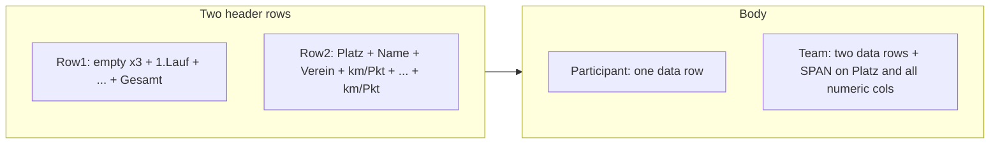

# PDF export: race-overview table layout

## Context (current behavior)

- [scripts/pdf_export_playground.py](scripts/pdf_export_playground.py) calls `export_standings_to_path` with `columns: ["official_board"]` → flat header, no per-race columns ([backend/export/spec.py](backend/export/spec.py) preset).
- [backend/export/pdf_renderer.py](backend/export/pdf_renderer.py) builds a ReportLab `Table` with **one** header row (`repeatRows=1`) and uniform font size 9.
- [backend/export/projection.py](backend/export/projection.py) can already expand `points_per_race` into per-race columns, but there is no combined km/points cell or multi-row header.
- Standings rows already carry **`distance_by_race`** / **`points_by_race`** (see [backend/standings_view.py](backend/standings_view.py)); the GUI “Aktuelle Wertung” table uses live `RaceEntry` results in [backend/ui_api/queries.py](backend/ui_api/queries.py) (`get_category_current_results_table`). For normal scored rows these should match; use the snapshot dicts for export (same source as existing `points_per_race` columns). Missing race → empty cell (optional: `—`).

**a.W. / eligible-only:** `rows.eligibility: eligible_only` + `apply_ranking_exclusions_to_rows` already matches “only people not marked a.W.” (same split as `get_standings`). No change to eligibility logic.

## Target layout

- **Header row 1:** cells 0–2 merged vertically (or blank on row 1, labels on row 2 only—implementation detail); then one cell per race with label `"{n}. Lauf"`; final cell `Gesamt`.
- **Header row 2:** `Platz`, `Name`, `Verein`, then under each race/Gesamt a single sublabel **`km / Pkt.`** (one column per race, compact—not four lines like the old sketch).
- **Body:** each race column shows **`{km} / {pts}`** using existing `_format_distance` / `_format_points`; Gesamt same pattern. **Name** column: `Name (Jg.)` when `yob` present (individuals: from row payload; teams: per `team_members` line).
- **Teams (Paarlauf):** two PDF rows: line A = member A name `(yob)` + club; line B = member B. **ReportLab `SPAN`:** vertically merge Platz and every race + Gesamt column across the two rows (content only in the top cell of each span; empty strings in covered cells).

## Design: extend `ExportSection`, not only column presets

The current model assumes **one** header row derived from `ColumnDef.header`. This layout needs:

1. **`header_rows: tuple[tuple[str, ...], ...]`** (length 2) with the same column count as body rows (`3 + N_races + 1`).
2. **`table_spans: tuple[tuple[tuple[int, int], tuple[int, int]], ...]`** for `TableStyle` `SPAN` commands, **in table coordinates** (including header offset). Generated only for team body rows.

Keep **`columns: tuple[ColumnDef, ...]`** for alignment metadata and width heuristics (add narrow logical ids for `race_cell` / `gesamt_cell`).

**CSV:** [backend/export/csv_renderer.py](backend/export/csv_renderer.py) currently writes a single header row. For sections with `header_rows`, emit those rows, then body rows. For teams, **duplicate** Platz and numeric values on the second line (no SPAN in CSV) so spreadsheets stay readable.

## Implementation steps

1. **[backend/export/projection.py](backend/export/projection.py)** (or a small helper module if it gets long)
   - Add a **new column preset** in [backend/export/spec.py](backend/export/spec.py), e.g. `laufuebersicht_board`, resolved to a fixed list of synthetic column ids: `platz`, `display_name`, `club`, then `race_compact:{race_event_uid}` × N, then `gesamt_compact` (not part of `KNOWN_COLUMN_IDS` if you prefer: handle only via preset expansion in `resolved_columns`, or register ids with a clear prefix).
   - In `build_export_sections`, when this preset is detected (e.g. by presence of `gesamt_compact` or a dedicated flag on spec—simplest: **detect preset name** before expansion or add explicit `layout: "laufuebersicht"` in `PdfStyleSpec` to avoid polluting CSV column validation—**recommend adding `pdf.table_layout: "flat" | "laufuebersicht"`** default `flat`; when `laufuebersicht`, ignore generic column list and build this section shape from races + eligible rows only).
   - Build **two header rows** as specified; build **body rows** with combined cells; for `entity_kind == "team"`, emit **two** body rows + span tuples for that row pair.
   - Reuse `_ordered_active_races_for_category` and the same eligible row list as today.

2. **[backend/export/pdf_renderer.py](backend/export/pdf_renderer.py)**
   - If `sec.header_rows` is set: `data = [list(r) for r in sec.header_rows] + [list(r) for r in sec.rows]`; `repeatRows = len(sec.header_rows)` (respect existing `pdf.repeat_header`).
   - Append `SPAN` style commands from `sec.table_spans`.
   - Use a **smaller body font** when `table_layout == laufuebersicht` (e.g. 7–8pt header 8pt, body 7pt)—expose optional `pdf.table_font_size` / `pdf.table_header_font_size` in [backend/export/spec.py](backend/export/spec.py) with sensible defaults so the playground can tune without code changes.
   - Extend `_table_col_widths` (or a parallel helper) so Platz / race / Gesamt columns stay **narrow** and Name/Verein take remaining width.

3. **[backend/export/spec.py](backend/export/spec.py)** + **`ExportSpec.from_dict`**
   - Add `table_layout` (and optional font sizes) under `pdf`.

4. **Tests** in [tests/test_f20_export.py](tests/test_f20_export.py)
   - Projection: one participant + two races → header row count, combined cell text, name includes `(yob)`.
   - Team: two body rows, span count > 0, member lines differ.
   - PDF smoke: extract text still contains key strings (ruleset/name).

5. **Playground** [scripts/pdf_export_playground.py](scripts/pdf_export_playground.py): set `pdf.table_layout` (or new preset + layout) and optionally smaller fonts; keep `rows.eligibility: eligible_only`.

## Docs / project hygiene (after implementation)

Per workspace rules: short entry in [docs/ACCOMPLISHMENTS.md](docs/ACCOMPLISHMENTS.md) and a line in [PROJECT_PLAN.md](PROJECT_PLAN.md) / [docs/features/F20-standings-multi-format-export.md](docs/features/F20-standings-multi-format-export.md) only if you want this tracked as shipped behavior (user asked not to expand markdown scope unless needed—**do this when you merge**, not as part of the exploratory playground-only phase, unless you want it documented immediately).

## Risks / notes

- **Very wide seasons** (many races): may still need A3 or further font reduction; layout flag keeps default export unchanged.
- **Snapshot vs GUI:** if an entry exists but snapshot is stale, PDF follows **embedded** snapshot (existing export contract); `standings.recompute: true` remains the fix.
