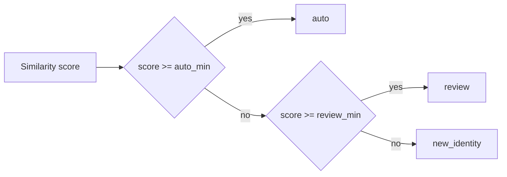

# Review vs new-identity threshold

## Answer: default “in review” floor

Matching uses two score cutoffs from [`MatchingConfig`](c:\Users\andre\VSCode_Projects\stundenlauf\backend\matching\config.py):

- **`auto_min`** (default **0.88** in the dataclass; the UI session overrides this via `_auto_min_setting` and “strict” modes)
- **`review_min`** (default **0.72**) — minimum similarity to land in the **review** queue instead of **new identity**

Routing is in [`route_from_score`](c:\Users\andre\VSCode_Projects\stundenlauf\backend\matching\score.py):

```93:98:c:\Users\andre\VSCode_Projects\stundenlauf\backend\matching\score.py
def route_from_score(score: float, config: MatchingConfig) -> str:
    if score >= config.auto_min:
        return "auto"
    if score >= config.review_min:
        return "review"
    return "new_identity"
```

So the **default threshold to put something in review** (as opposed to new identity) is **0.72**, unless other logic (e.g. strong name/YOB mismatch helpers in the same module) forces review below that score.

## What the merge GUI does today

- [`get_matching_config`](c:\Users\andre\VSCode_Projects\stundenlauf\backend\ui_api\service.py) **returns** `review_min`, but [`set_matching_config`](c:\Users\andre\VSCode_Projects\stundenlauf\backend\ui_api\service.py) does **not** accept it; `_build_matching_config` always copies `review_min` from the previous config (which never changes from the default **0.72** in practice).
- The **Lauf hinzufügen** panel in [`frontend/app.js`](c:\Users\andre\VSCode_Projects\stundenlauf\frontend\app.js) only wires slider/number + persistence for **`auto_min`** (German label around “Ähnlichkeit ab der automatisch zugeordnet wird”). The frontend does not reference `review_min`.
- Docs already list `review_min` as read-only in [`docs/api/ui-api-v1.md`](c:\Users\andre\VSCode_Projects\stundenlauf\docs\api\ui-api-v1.md); accomplishments noted a follow-up to make the review threshold user-adjustable.

## Implementation sketch (to adjust it in the merge GUI)

1. **Backend session state**: Add `_review_min_setting` (default `MatchingConfig.review_min` = 0.72), validate `0.0..1.0` and **`review_min <= effective_auto_min`** (or `<= _auto_min_setting` when fuzzy auto is on) so the review band stays coherent.
2. **`set_matching_config` / `_build_matching_config`**: Accept optional `review_min` in the payload; pass it into `MatchingConfig(...)`.
3. **Frontend**: After `get_matching_config`, show a second control (range + number, same pattern as auto threshold) in the matching section of the merge/import UI; include it in `saveMatchingConfig` calls; add strings in [`frontend/strings.js`](c:\Users\andre\VSCode_Projects\stundenlauf\frontend\strings.js).
4. **Tests**: Extend [`tests/test_f08_ui_api.py`](c:\Users\andre\VSCode_Projects\stundenlauf\tests\test_f08_ui_api.py) for get/set `review_min` and validation; optionally a small matching test that routing respects a custom `review_min`.
5. **Docs**: Update [`docs/api/ui-api-v1.md`](c:\Users\andre\VSCode_Projects\stundenlauf\docs\api\ui-api-v1.md) `set_matching_config` payload and behavior.


