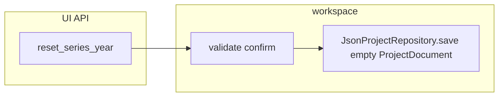

# Season hard reset (empty dataset, keep year)

## Goal

Let operators **clear all season data** (identities, imports, decisions, standings) while **keeping the same `series_year` and file path**, so the next import behaves like a brand-new season—addressing the “rollback leaves merge history” issue without full undo.

## Behaviour (contract)

- **In scope:** Replace stored document with `ProjectDocument(schema_version=SCHEMA_VERSION_V2)` exactly as in [`create_series_year`](backend/ui_api/workspace.py) (lines 105–106): empty `people`, `couples`, `events`, `matching_decisions`, default `project_uid`, no `standings` (or equivalent to a never-imported season).
- **Out of scope for this slice:** Selective reset (only identities), redo/undo stack, clearing files outside `session_project.json`.
- **Safety:** Same confirmation model as delete: `series_year` + `confirm_series_year` must match; unknown year → `NOT_FOUND`; mismatch → `VALIDATION_ERROR`.
- **Persistence:** Use existing [`JsonProjectRepository.save`](backend/storage/repository.py)—atomic write plus `.bak` of the previous file, so operators have a filesystem recovery option.

## Backend

1. **New function** `reset_series_year(workspace_dir, payload)` in [`backend/ui_api/workspace.py`](backend/ui_api/workspace.py)  
   - Mirror validation structure of `delete_series_year` (lines 125–139).  
   - If `project_file` missing → `not_found("series_year", ...)`.  
   - `JsonProjectRepository(project_file).save(ProjectDocument(schema_version=SCHEMA_VERSION_V2))`.  
   - Return e.g. `{ "series_year", "reset": true, "project_file" }`.

2. **Wire API** in [`backend/ui_api/service.py`](backend/ui_api/service.py): add `"reset_series_year": lambda payload: workspace.reset_series_year(self.workspace_dir, payload)` next to `delete_series_year`.

3. **Document** in [`docs/api/ui-api-v1.md`](docs/api/ui-api-v1.md): new method section (payload, response, errors, note that season directory remains and backup is `.bak`).

## Tests

Extend [`tests/test_f08_ui_api.py`](tests/test_f08_ui_api.py) (pattern from `test_delete_series_year_*` around lines 324–400):

- **Happy path:** `create_series_year` → add minimal data to project file (or use repository to save a doc with people/events) → `reset_series_year` with matching confirm → assert file exists, `season_dir` still exists, loaded document has empty collections and new `project_uid` behavior consistent with fresh create.
- **Mismatch / NOT_FOUND:** same as delete tests.

Optional: direct unit test on `workspace.reset_series_year` with tempfile if you want isolation without full `UiApiService`—not required if envelope tests cover it.

## Frontend (German)

1. **Strings** in [`frontend/strings.js`](frontend/strings.js) under `seasonEntry`:  
   - Labels/title for reset action, `resetConfirm`, `resetPrompt`, `resetInputMismatch`, `resetFailed`, `resetDone` (clear wording: data lost, year remains, recommend export first).

2. **Season table** in [`frontend/app.js`](frontend/app.js) `renderSeasonEntry`:  
   - Add a button per row (e.g. secondary or a distinct warning class—not the same red as delete): `data-reset-year="..."`.  
   - Handler: `confirm` + `prompt` with typed year → `api("reset_series_year", { series_year, confirm_series_year })` → `showSeasonEntry()` on success.  
   - **Stale UI edge case:** If [`state.seriesYear`](frontend/app.js) equals the reset year (user had opened that season, then used “Saison wechseln” to return to the list), call `resetImportDraft()` after successful reset so re-opening the same year does not keep old import wizard state. No need to call `loadOverview()` until they re-enter the shell.

3. **Styles** only if a new button variant is needed—reuse existing classes where possible ([`frontend/styles.css`](frontend/styles.css)).

## Project workflow artifacts

Per [`.cursor/rules/project-workflow.mdc`](.cursor/rules/project-workflow.mdc):

- New feature plan [`docs/features/F14-season-hard-reset.md`](docs/features/F14-season-hard-reset.md) (problem, scope, acceptance criteria, risks: irreversible except `.bak`/export, test plan).
- Update [`docs/ACCOMPLISHMENTS.md`](docs/ACCOMPLISHMENTS.md) and a short line in [`PROJECT_PLAN.md`](PROJECT_PLAN.md) current phase / changelog when done.

## Summary

| Area | Work |
|------|------|
| Risk | Low–medium (destructive but guarded; same pattern as delete) |
| Effort | ~0.5–1 day including tests and copy |
| Architecture | **No redesign**—one new workspace method + UI + docs |
