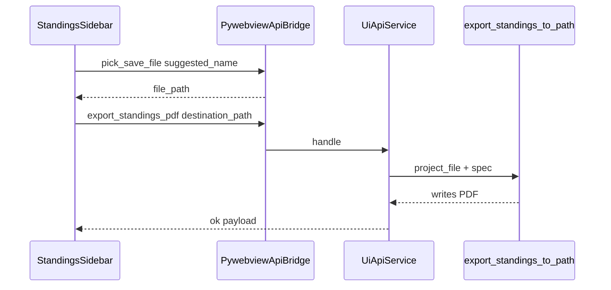

# Standings PDF export button (GUI)

## Context

- PDF rendering and spec shape already exist: [`backend/export/registry.py`](backend/export/registry.py) (`export_standings_to_path`), [`backend/export/spec.py`](backend/export/spec.py) (`sort_category_keys_for_export`, `laufuebersicht` layout).
- The playground script builds a fixed spec (all categories from JSON events, `laufuebersicht_board`, embedded standings, `all_active` races, eligible-only rows, landscape A4, page break per category) — replicate that **server-side** so the button stays a single action without passing a large spec from JS.
- File output pattern already used for season zip: [`frontend/app.js`](frontend/app.js) calls `pick_save_file` then `export_series_year` with `destination_path` (see ~388–410).
- [`backend/ui_api/service.py`](backend/ui_api/service.py) has no standings-PDF handler yet; [`PywebviewApiBridge`](backend/ui_api/pywebview_bridge.py) only special-cases `pick_file` / `pick_save_file`, everything else goes to `UiApiService.handle`.

## Backend

1. **Spec builder** (small, testable helper — avoid duplicating the dict in three places):
   - Add e.g. [`backend/export/gui_pdf_spec.py`](backend/export/gui_pdf_spec.py) with something like `laufuebersicht_export_spec_from_document(doc: ProjectDocument) -> ExportSpec`:
     - Collect `category_key` from **all** `doc.events` (same idea as playground’s `event_category_keys_from_json`).
     - If none: raise a clear `ValueError` (map to validation in the handler).
     - `categories = list(sort_category_keys_for_export(keys))`.
     - Build the same dict as in [scripts/pdf_export_playground.py](scripts/pdf_export_playground.py) lines 64–87 (`format`, `columns`, `standings`, `race_filter`, `rows`, `pdf` with `table_layout`, `page_break_before_each_category`, etc.).

2. **UI API method** `export_standings_pdf` (name can match doc; keep English snake_case per contract):
   - **Payload:** `destination_path` (required, non-empty), must end with `.pdf` (validate like zip suffix check in [`workspace.export_series_year`](backend/ui_api/workspace.py)).
   - **Behavior:** `project_file = self._require_active_project_file()`, load document via `JsonProjectRepository`, build spec via helper, `export_standings_to_path(project_file, spec, Path(destination_path))`.
   - **Response:** e.g. `export_file`, `bytes_written` (mirror season export ergonomics).
   - Wire in [`backend/ui_api/service.py`](backend/ui_api/service.py) `_dispatch` map.

3. **Contract + tests**
   - Document method in [`docs/api/ui-api-v1.md`](docs/api/ui-api-v1.md).
   - Add a bridge test in [`tests/test_f08_ui_api.py`](tests/test_f08_ui_api.py): seed minimal project (reuse existing helpers like `_seed_project_for_year`), `pick_save_file` not needed for the API test — call `export_standings_pdf` with a temp `.pdf` path, assert file exists and starts with `%PDF`. Optionally one test that empty events → `VALIDATION_ERROR` / clear message.

## Frontend

1. **Strings** in [`frontend/strings.js`](frontend/strings.js) under `standings`:
   - Section title: **Export** (user asked for this name).
   - Button label (e.g. “Laufübersicht als PDF …”).
   - Status strings: pick failed, export failed, export done (with path), optional “no data” if API returns validation.

2. **Layout** in [`renderStandingsView`](frontend/app.js) (~734–910): after the **Paare** `sidebar-section`, insert a new `sidebar-section` with `<h3>${st.exportSectionTitle}</h3>` and a full-width `secondary` button (reuse `.sidebar-top-action` from [`frontend/styles.css`](frontend/styles.css)).
   - Apply in **both** sidebar templates: no-category branch (~751–766) and main branch (~896–910) so the control is always visible.

3. **Click handler** (same pattern as season export):
   - `suggestedName`: e.g. `stundenlauf-${state.seriesYear}-laufuebersicht.pdf`.
   - `api("pick_save_file", { suggested_name })` → if no path, return.
   - `api("export_standings_pdf", { destination_path })` → `setStatus` on success/error.

   Attach the listener in the early-return branch (with category buttons) and after the main template render (e.g. loop `standingsView.querySelectorAll("button[data-export-standings-pdf]")` next to the existing `data-category-btn` loops, or one shared `wireStandingsSidebarExport()` called from both paths).

## Project workflow (after implementation)

- Per [.cursor/rules/project-workflow.mdc](.cursor/rules/project-workflow.mdc): run targeted tests (`uv run pytest tests/test_f08_ui_api.py -k export_standings_pdf` or similar), add a short outcome line to [`docs/ACCOMPLISHMENTS.md`](docs/ACCOMPLISHMENTS.md), and nudge [`PROJECT_PLAN.md`](PROJECT_PLAN.md) F20 “GUI wiring for standings export” from optional toward done.
- Optional: one-line extension to an existing F20 feature doc in `docs/features/` if you track GUI export there.

## Data flow (mermaid)

