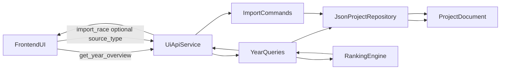

# Year-Level UI API Plan

## Requirement and Milestone Mapping

- Supports **R1, R3, R5, R6, R8** by enabling season-wide import/review/standings UX in German UI flows.
- Advances **M4** (German UI integration) and **M5** (hardening/usability) by reducing frontend orchestration complexity.
- Stays in scope with current architecture: additive extension to [backend/ui_api](backend/ui_api), no domain schema redesign.

## Current-State Baseline

- The domain already stores a season-spanning superset in `ProjectDocument` (`people`, `couples`, `events`, `matching_decisions`, `standings`): [backend/domain/models.py](backend/domain/models.py).
- Categories are canonical by `year:duration:division` and active-event standings are computed from all matching events: [backend/ranking/engine.py](backend/ranking/engine.py).
- Current UI API is category-centric (`category_key` required for standings/table views): [backend/ui_api/queries.py](backend/ui_api/queries.py), [docs/api/ui-api-v1.md](docs/api/ui-api-v1.md).

## Design Goals

- Keep **backward compatibility** for all existing v1 methods.
- Add year-oriented endpoints so UI can render a “season workspace” in 1-2 calls.
- Keep payloads frontend-friendly (labels + keys + counts + status), minimizing client-side joins.
- Preserve deterministic behavior using active events only by default (consistent with ranking and rollback semantics).

## Proposed API Additions (Additive v1)

- `list_categories`
  - Input: `series_year` (required)
  - Output: category cards for that year with `category_key`, `category_label`, duration/division, `events_active`, `events_total`, `review_queue_count`, latest import timestamp.
- `get_year_overview`
  - Input: `series_year` (required)
  - Output: year summary (`totals`, health indicators), available categories, and compact race-history groups per category.
- `get_year_timeline` (optional but recommended)
  - Input: `series_year` (required), optional `limit`
  - Output: merged import/rollback/decision timeline across all categories for that season.
- Add optional `series_year` filter to:
  - `get_project_state`
  - `get_audit_timeline`

## Import UX Hardening

- Keep current behavior but reduce coupling to filename heuristics by extending `import_race` payload with optional explicit source mode:
  - `source_type: "singles" | "couples"` (optional, fallback to existing detection)
- Ensure validation errors stay mapped to stable API codes in [backend/ui_api/errors.py](backend/ui_api/errors.py).

## Implementation Steps

1. Extend DTO surface and query logic
   - Add year-oriented DTO helpers and mapping utilities in [backend/ui_api/mappers.py](backend/ui_api/mappers.py).
   - Implement new query handlers in [backend/ui_api/queries.py](backend/ui_api/queries.py) using existing event/category/decision data.
2. Wire service dispatch
   - Register new methods in [backend/ui_api/service.py](backend/ui_api/service.py) without touching existing handlers.
3. Command payload extension (non-breaking)
   - Update [backend/ui_api/commands.py](backend/ui_api/commands.py) to accept optional `source_type` and preserve old behavior.
4. Contract docs update
   - Add endpoint specs, sample payloads, and compatibility notes in [docs/api/ui-api-v1.md](docs/api/ui-api-v1.md).
5. Test coverage
   - Extend [tests/test_f08_ui_api.py](tests/test_f08_ui_api.py) with:
     - year overview/category listing correctness,
     - filtered project/audit queries,
     - backward compatibility of existing category methods,
     - import payload compatibility with and without `source_type`.
6. Planning/docs sync
   - Update feature plan scope notes in [docs/features/F08-python-frontend-api-layer.md](docs/features/F08-python-frontend-api-layer.md).
   - Add completion entry in [docs/ACCOMPLISHMENTS.md](docs/ACCOMPLISHMENTS.md).
   - Update milestone/progress note in [PROJECT_PLAN.md](PROJECT_PLAN.md) when implementation lands.

## Data Flow (Frontend-Oriented)

## Risks and Mitigations

- Risk: payload bloat for large seasons.
  - Mitigation: keep overview compact; add `limit` and lightweight list payloads.
- Risk: duplicated logic between category and year views.
  - Mitigation: centralize category/year aggregation helpers in `mappers`/query helpers.
- Risk: accidental v1 breakage.
  - Mitigation: explicit backward-compat tests and additive-only doc policy.

## Test Plan

- Unit-level query tests for year aggregation helpers.
- API contract tests for new methods and optional filters.
- Regression tests proving unchanged behavior for:
  - `get_standings`
  - `get_category_current_results_table`
  - existing `import_race` payload format.

## Definition of Done

- New year-level read APIs available and documented.
- Existing v1 API consumers remain unaffected.
- Tests for new and legacy paths pass.
- Docs synchronized in feature/API/project/accomplishments artifacts.